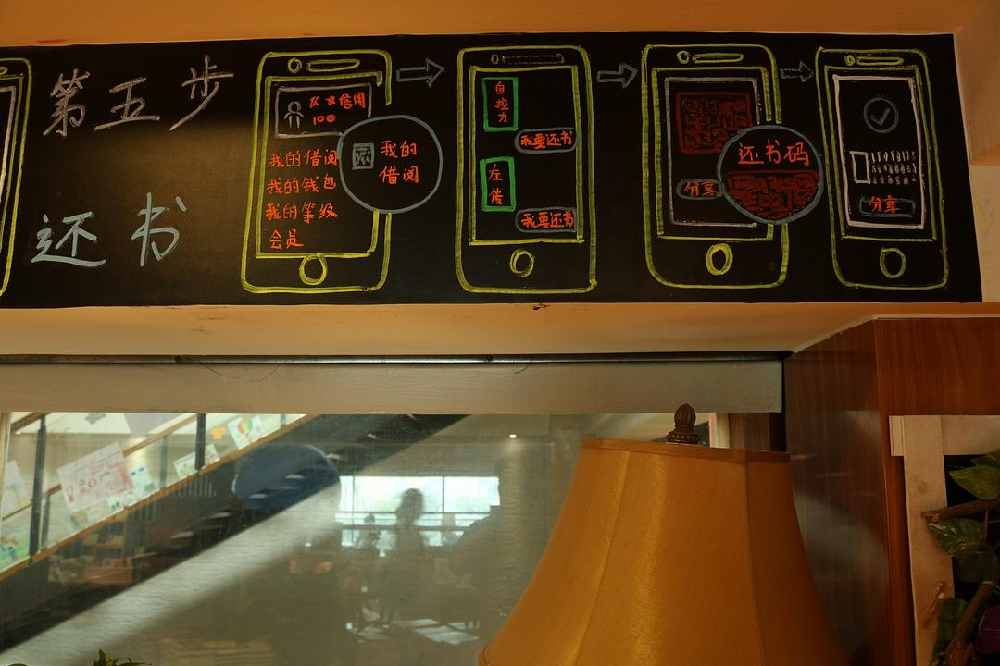
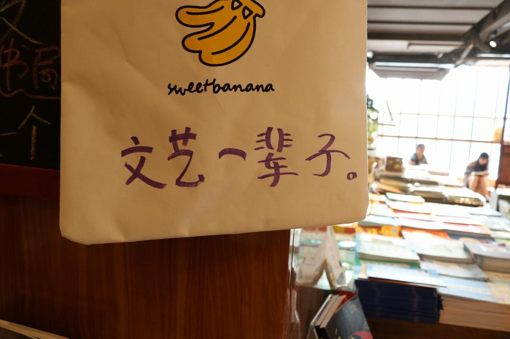
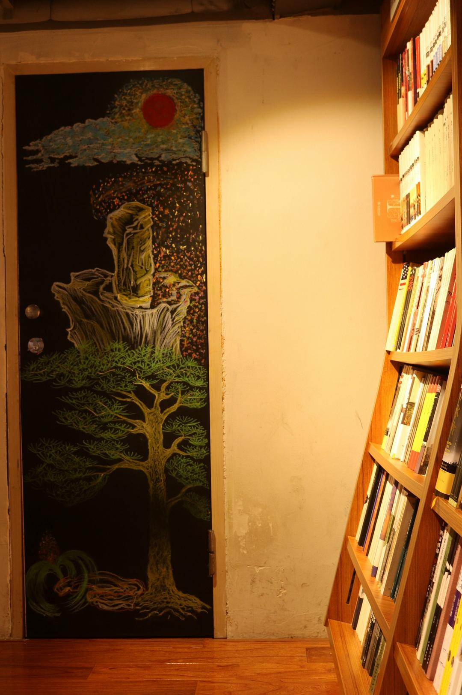

# 那些年的日志

​	这是彷徨随想系列的第34篇。

​	

​	不知不觉，这个系列已经到了尾声。连续一个星期都在放公式，果然印证了我自己最开始的设想，这个公号只是我自己的笔记。今天突然想起来自己之前在QQ空间和豆瓣上写过日志。我一直想要对自己进行一次“考古”，这些文字保留了一些资料。认识自己，从那些年的日志开始。

## QQ空间日志（2011-02-04）

 	总以为，写日志是件极无聊的事，而如今，我却鬼使神差的敲着键盘。

 	也许是因为有太多的事、太多的想法想要一吐为快吧!

 	去年回家，在火车上看见奔腾的赣江，看见不同于北方一马平川的江西高山，在客车上看见与家里极其相似的居民楼时，我是多么的激动啊!听见了久违了的家乡话，看见了久违了的家乡人，要不是碍于周围的人往人来，我真想大吼三声“我回家了！”。再等到看见父亲的面庞，听见妈妈的唠叨时，我才从兴奋当中惊醒：原来家里的一切都还没变！

 	今年回家，过程仍如去年，只是当初的那份感觉已荡然无存。今年回家，乡里人都说我变得有礼貌了，都说这是上了大学的好处。今年回家，天天干重活，才发现自己的体力竟然变强了许多，只不过还是很累!最烦的是家人总让我去喝各种各样的喜酒！

​	

​	喜宴上的菜不知是从何时传下来的，从未曾变过，依旧是各种肉！鸡肉，鸭肉，羊肉，牛肉，兔肉，鱼肉！又想起了学校里的土豆、豆腐，还有那惊人的胡萝卜炒白萝卜！看着满桌的肉，想起那黄色的土豆、豆腐、萝卜，我只能静静地敬自己一杯雪碧!今年回家，我疯狂的吃蔬菜。白菜，菠菜，艾菜，生菜，芹菜，芥菜！我要把去年该吃却没吃上的补回来，顺便为今年贮备一些维生素。吃着鲜绿的蔬菜，又想起了黄色的东北风味，于是突发奇想，做出一对联：                                        

​		千山叠岭，享无穷翠绿蔬果

​        一马平川，吃不尽鲜黄豆萝

 横批：        南北风情

 

​	一年没回家了，高三同学聚会，看见同学时觉得格外的亲切，说了说各自的经历，十分有意思，临别时我才知道什么是“依依不舍”。然而，初三同学聚会时，却是有一种强烈的陌生感，也许各自的生活改变了太多的东西吧！今年春节，村里又是格外冷清，经过赌桌时发现了激情下注的小学同学，心里一阵感慨：果然是长江后浪推前浪啊。

## 共享书店见闻（2017-08）

​	 第一次听说共享书店是将近一个星期以前，恰巧就在合肥，号称全球首家共享书店，无论如何也要来看一看是怎么回事，体验一下如何使用。       

​	 "共享经济"的概念已经不陌生，房间可以共享（airbnb）,办公室可以共（myspace），汽车，单车，电动车可以共享（滴滴，摩拜，享骑），如今，图书也可以共享。

​	在我有限的印象里，城市图书馆，高校图书馆对于提高一个城市的居民文化素质方面帮助寥寥。高校的图书馆有大量藏书，以科大为例，藏书中大量的老书，旧书，还有很大比例的教材，极度影响阅读体验。更要命的是，普通市民别说进图书馆，进校门都费劲。

​	新华书店中有大量包装精美的新书，完全市场化运营，如果开放借阅，书籍颜值上就有成为新时尚的可能。新一代的年轻人爱美爱玩爱健康，这是一个产品成为时尚的先决条件，新华书店的书满足两个条件，只是不知道能否"玩"起来。      

​	曾经有过地铁丢书的公益活动，有不少明星参与，终究只是一场活动，热度过后便淡出了公众视野。这让我想起了摩拜创始人在推广共享单车之初就没有考虑声势浩大的活动，而是从小处着眼，经过用户们社交网络上的口碑宣传，直到现在成为一种时尚。

​	我不知道共享书店会不会成为新的时尚，共享单车成为时尚是因为短距离出行是个痛点，借书有没有那么"痛"我不知道，同样是接受信息，游戏，电影，音频，各大手机信息平台碎片化的阅读，留给纸质书籍的时间还有多少我没有多少信心。 以下是我在合肥三孝口新华共享书店的见闻。

​	

