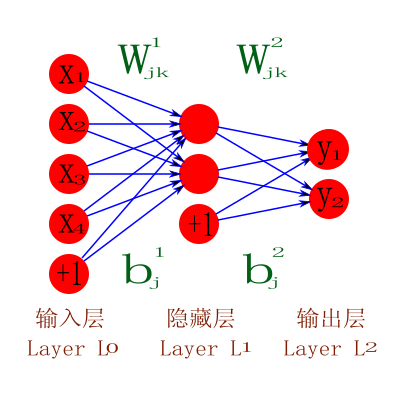

[TOC]
# 前言

自从申请到个人公众号，这一个月以来，一直想着找时间发第一篇文章。然而，越是慎重，越是拖延。就这样吧，自己的公号又不是为了写阅读100000+的推文，也不是为了积累粉丝。当然，不是不想，臣妾确实做不到。

​    回到初心，当然是为了满足自己的表达欲望。曾经在百度知道上回答过几百个问题，看着自己的公式和图表比别人的清晰就有一种快感。曾经建立一个内部交流的discus论坛，自己一个人发了几百个帖以后慢慢觉得心累，运行了快一年活跃度依然让人心酸。在CSDN和豆瓣上都曾发过一些小文章，确实只是"一些"，后来就没了动力。归根结底，表达需要有表达的对象。公众号的这些文章，希望写给身边的人看，这是我能够坚持下去的动力之一。

   以上算是开篇，内容会以自己的兴趣为主，摄影，linux，或是折纸，或者以后学的新东西。最后，放上小可爱去厦门给我带的小礼物，石敢当，愿心如顽石，敢作敢当。

# 告别妖艳的标题

我知道自己的调性，这也就注定我的这个公众号不会有太多观众。网络上有太多文章，其标题之妖艳以至于我都不想在此列举。在看了一篇教你如何给10万+爆款文章起标题的文章之后，我决定反其道而行之，以后我自己的文章标题要有以下几个不许：

1. **不许有！号**

   好好的标题，加什么惊叹号，哪有那么多值得“震惊”的事情。甚至于，最好不要有标点符号，影响自己的审美观感

2. **不许超过7个字**

   作为一个文艺青年，看不惯时下的长标题，那么就从自己开始，文章只用短标题。为什么是七个字？因为我已经设想好了直接用一些诗词作为标题，文章中就放自己拍摄的图片。

3. **不许骂街**

   作为新网络时代网名的基本素质。不仅标题不能有，文章的内容里也不能有。当然，以后的文章基本上逃不出兴趣爱好的范畴，不去针砭时事，不大可能把文字当刀使。

   

​    以后再想到什么新的内容再补充，目前就这三个，我想最难的是第二条，标题长度怼死了多少可能性，我甚至已经预料到以后会有不少文章的标题是“无题”。


  最开始的这几篇文章是为了定下公众号的调性，这个公号应该是我的朋友圈的延伸，不蹭热点，不评论他人他事，只表达自己的喜好。也许可以更加直白简单一点，公号里的文章是为了方便给自己的图片写评语。

  最后，放上去年在傍晚十分拍摄到的晚霞荷花，愿时光里总有这样静谧的时刻。

# 四年前的京西徒步

四年前的京西徒步，如今依然印象深刻，在笔记中翻出了当年写的感受。

\---------------------------------------------------------------------------------------------------------------

徒步京西·畅想今昔

 300公里徒步，徜徉在京西的崇山峻岭，这十天，远比想象中来得难忘。趁思路未冷，让感慨一吐为快。


## 01 关于旅途


  归根结底，这还是一场旅途，即便是苦旅。一号到北大，中午到畅春园吃了个“简单的”午饭，期待着晚上的欢迎盛宴，谁想中午与晚上的食谱差不多。错过了下午的攀树，不知道什么时候可以补回来了。二号开始团队破冰，讲究配合的同心鼓、海难逃生，晚上到达第一个营地，绿野队长猫叔（年纪一大把了，还在卖萌）给我们做了个精彩的急救知识讲座（脑海中浮现的场景是一群人幸灾乐祸地看着“浑身是伤”的吴一飞）。

三号是旅程的第一天，累计2500米的上升、将近48公里的全程折磨得大家欲仙欲死，晚上十一点半到达营地的时候，看见西瓜就像见了亲人一样，当然，与营地工作人员的一声声击掌似乎也敲散了一天的疲惫。四号相当轻松，难忘夜晚篝火晚会的一幕幕，桑吉令人心醉的歌声，莫西干的转碗，常歌的无节操脱口秀，未名行者们的燕园情，戴老师的潇洒武术表演，还有那“鲜草”和掌声……五号对我而言绝对是最难忘的，把北大的慰问团成员杨老师撞翻在地，撞得他满头是血（回校之后与他通话时倒也没那么尴尬，毕竟对我们彼此都是个不小的教训，这也算不打不相识了，很期待下一次和老杨的见面），自己轻伤，接下来的几天一边徒步一边养伤，再也不敢太过亢奋了。幽州峡谷的景色依旧迷人，最后途径北京的母亲河——永定河。当天夜晚，北大的徐、吕、王三位老师给大家开了个音乐会，徐老师的即兴编曲还有小威的情诗朗诵都让大家眼前一亮。每个队员都领到了专辑《青春戏》，个人最喜欢里面的那首《青春大概》。六号全程公路，穿过几个隧道，来到了行程的100公里处，最终到了大唐温泉酒店。当天夜里大伙在KTV里飙歌，依然难以忘怀北大志愿者妹子的韩语歌。七号正式进入门头沟区境内，经过几个户外遇难者的遇难处，驻足缅怀，众人都难掩悲伤之情。最终抵达东灵山顶（2303米，这个数字也忘不了），在云雾缭绕下抢拍裸照纪念。下山途中，邂逅了一群牦牛，然后到达客栈送别了两名队医和几个志愿者。接下来几天每天行程都超过30公里，晚上做完拉伸，基本上就直接入帐篷睡觉了，身体渐渐适应了这样的节奏。10号去百花山，京西的夏天，漫步在木栈道，仔细感受着周围野花们的啼笑，不时有微风掠过阳光，整个人就跟醉了一样。11号晚上的心得交流大会，依然记得关尔佳的引吭高歌、男神的突破自我。


## 02 把酒话别


12号完成了整个旅程，在潭柘寺门前集体合影，气氛已经有点跟之前不一样了。夜晚的聚餐，还是老地方——畅春园。酒桌难免喝酒，刚开始还很克制，后来越来越放得开，实在撑不住了就以汤代酒。最后头晕脑胀，见一个就拥抱一个，看着一张张熟悉的面孔，有的欢笑，有的流泪，心里五味杂陈。常歌、球球哭得跟个泪人似的，我对他们说：只要有缘，一切皆有可能。大家都还年轻，相逢即是缘分，怀着一颗真心，尽力追逐就是。最难忘的是找张平喝酒，她从口袋里拿出了两袋补液盐，千头万绪之下顿时她哭了，泪如雨下却笑靥如花。（我叫她给我一袋，本想留作纪念的，后来回到寝室之后实在忍不住，合着两包宝矿力用冰水泡着喝了，只是滋味不复当初。）最后迷迷糊糊地被昇哥送到了酒店房间，醉醺醺地给几个同学打电话、发语音信息，旁边的夏阳和进学已经睡得跟狗一样。13号早上见了几个同学，临出发前在北大东门还见了张珍师姐。晚上躺在归途火车的卧铺上，若有所思，若有所悟。离别总是如此的黯然销魂，兴之所至，在微信群里发了一篇离骚：

口袋里的补液盐叹息着离别

思念不愿被冲淡

谁还会在意被偷喝的宝矿力

也别惦记想做未做的大保健

苍莽之颠的朗朗高歌

璀璨之夜的窃窃私语

一切的一切

恍若一梦

愿大家安好

人生何处不晴天

​           

## 03 关于旅途

那些花儿。文艺安静又不失调皮的张平，来自三江源能歌善舞的藏族姑娘桑吉，犀利的曼哥，为了一个承诺的爽朗玉梅，强悍的颖哥，漫山遍野飙节操的一行，如繁花般的似锦，诗酒趁年华的魏伟，热情豪爽的满族姑娘关尔佳，时而温柔时而狂野的瑶瑶，，柔柔弱弱萌萌的遒遒，有点小低调、可爱的小灰灰，笑容很甜、努力坚持的张舒，性格不温不火还有点呆萌的李溪以及被幸福包围的小成姐。有她们相伴，至少路途并不虐心。

阳光下的少年。思念如烟、柔情似水的小威，步态销魂、步步惊心的黄斌，专业做女子大保健的山东大汉政印，同样山里长大的穿青族小伙天星，“正直”的邵力栋，潇洒玩转飞盘的杨金鹤，憨态可掬的大boss（据政委说我俩长得很像，我自己却死活找不到照镜子的感觉），总跟我室友搞在一起的进学，行为放荡的吴一飞，致力于背西瓜、热爱报警的王爽，被我狠掐肩膀的少雄（他也挺用力的…）……

诸位，渐行渐远，且行且珍惜。


## 04 浅谈教育

​    听老驴们聊天，三句话就会听到生命、灵魂、意志这样的字眼。仔细想想，其实也不难理解。当你背上行囊，走过峡谷、山脊、河流、山洞，在山顶上俯瞰群山，酣畅淋漓的同时总会有一种灵魂出窍的感觉。回到教育本身，其目的无非在于提升自我以及加强与他人的联系。户外运动尤其考验一个人的身体素质和意志力，在这一过程中培养的互助协作的精神也十分有利于打造一个优秀的团队，因而这种体验式的教育或许应当成为现代化教育模式的组成部分。对于我个人而言，我愿追寻极致的自我，但决不放弃团队，推崇在团队中磨练个人、个人的成长促进团队进步的理念。（个人看法，十分希望跟大家交流）


## 05 后记

蔡元培老先生说：“完全人格，首在体育。”毛泽东说：“文明其精神，野蛮其体魄。”至此，我才真正的有所领悟。

十天里，我几乎没洗澡（令人欣慰的是听野狼说他曾经一个月没洗过…），个人认为，既然去了野外，那就彻底地远离都市，尤其是那一套固定的生活轨迹和模式。

北大山鹰社又一次完成了雪山之旅，北大教职工徒步协会完成了乞力马扎罗山登顶，默默祝贺的同时也羡慕得很。

13号去找同学了，错过了北大、清华小伙伴们的款待，实为遗憾，尤其是看着照片里的大匹萨就直掉口水。

向曼哥道个歉，不是我故意凶你，是昇哥指使的，况且你还欠我半个拥抱呢。还有，唱了一路的小成子，你唱的歌我几乎全会，在此强烈鄙视。

感谢志愿者（老常、文君、萌萌、李锋……）、各位老师（钱老师、毛老师、戴老师……）、食堂工作人员、队医、体测人员（海瑞、悦宝宝……）的辛勤付出；感谢绿野救援队的给力领队（胡子哥、毒虫哥、谷子哥），虽然有时候也会后队变前队。

另外，感谢远在沈阳的几个小伙伴们的加油视频，虽然没有公开播放过（已回礼，说好的不计较的），但是值得收藏；感谢北京几位小伙伴们的盛情款待。

不知道我是不是第一个写完心得体会的，浙大的每人五千字又写多少了，说好的奖金什么时候发呀，都快揭不开锅了。

# 花花世界

芸芸众生，花花世界

小可爱送我插花，出乎我的意料，于是寂静无人的寝室有了一抹明亮。


尤其喜欢中间的绿菊，颜色是如此的与众不同。

## 01 鲜花之恋

  刚到手的是鲜花。

  从快递手中接过一筒长盒子，入手微沉。拆开后迎面扑来一股花香，然后才看到盒子中放了一束鲜花和一个花瓶。当我给花枝剪去多余的枝叶和茎干，当我给花瓶装上水，当我把花束放入瓶中，房间里瞬间明亮了起来。这样的奇妙怎能不用相机记录呢。


## 02 干花之念

  花总有谢的时候，我可不忍心她化作春泥，在自然风干的作用下，鲜花成了干花。没了水分，花朵不在那么艳丽，好在可以长期保存，小可爱送的我怎舍得乱扔呢？


愿生命中花开常在。

# 指尖哲思

“纸间的折痕，是指尖的哲思”

我们是平凡人，可总有些时候，我们希望自己是不凡的。所以，有一门兴趣爱好十分重要，最好可以伴随自己足够长时间，沉浸与热爱可以让一个人绽放光芒。我曾经不止一次地听人说，他们被外国朋友问到“what's your hobbie?”时一脸懵逼，或者是在填写简介时遇到“兴趣/爱好"这个项目时苦思冥想。通常人们希望成为有趣的人，我想有趣的标准是会点什么东西，不能是太没有门槛的，太多人在“兴趣”一栏中填上“旅行和阅读”，以至于我遇到这样的简介绝不会在心中对这个人留下多高的评价。张岱说“人无癖不足与之交”，我因此告诫自己一定要有些话题自己能够跟人聊得唾沫横飞，能够神采飞扬，这些话题就是通常所说的兴趣爱好。借用一下李笑来的话，“七年就是一辈子”，今天聊聊自己上辈子的兴趣：折纸。


## 01 我与折纸


2011年秋，无意间在L君的电脑屏幕上看到一张复杂的正方形图形，各种线条错综复杂地堆在一起。L君得意洋洋地对我说：“这是神谷哲史寄居蟹的折纸CP图！”。什么？折纸？难道除了用来给小朋友折出千纸鹤，还能干别的？经过一番搜寻，着实吓一大跳，天上飞的，地上跑的，水里游的，甚至各种玄幻生物，都可以通过一张正方形纸经过有限次的折叠得到。第一次的欢喜是奇妙的，一扇大门在向我打开。

经过一个月的努力，终于在教程的帮助下，完成了第一个较为复杂的模型---神谷的天马。总共120步左右，期间克服了各种细节上的困难，印象深刻的是当时把教程图片放在一个5寸电阻屏MP4上，遇到问题往往折腾一两天时间。就这样，磕磕绊绊地，那一个学期时间我完成了好几十个模型。一开始的热情逐渐退却，再加上当时是大三上学期，开始考虑未来的计划，不再有那么多的时间，折纸被我慢慢放下来。当然，另外一方面，随着技巧越来越熟练，不够复杂的模型已经没有挑战，超级复杂的又找不到教程可以实现，慢慢地便放弃了。

直到大四下学期，去向已定，开始有两三个月时间可以花，学了七阶魔方并且放出豪言壮语“给我足够时间，可以解决任意阶魔方的复原问题”（有点着魔了）之后，开始重新捡起一年多以前没有完成的一些折纸模型。那是2013年，从那过后再也没有花费一两个月时间专门折腾一两个折纸模型，时间不多，自控力也不够，总有更加紧迫或者更加新鲜的事情要做。

当然，也有一个比较深层的原因，我想设计自己的折纸模型，不想再跟着别人的路走。大概在2014年，我知道了折纸模型的设计可以通过算法辅助，然而并没有充分的时间去研究算法，这一耽搁就是到了现在。

从2011到2018，七年时间，这期间发生过很多事情，有小成功，也有大失败，每隔半年时间都会找出一点时间静静地折纸，这是一种很好地跟自己相处的方式，我以后还会坚持吧，这是为数不多的初心之一。但我知道这五年多我都没有找出足够多的时间去研究设计算法，我以后也不会找到这样的时间，除非我改变思路，不寻求一整块的时间而是每周找出一点时间去研究，这样才更有实践意义。

学习折纸我不后悔，但是我有一个最大的遗憾是没有找到一个同样痴迷折纸的好朋友，虽然现在学校里有折纸社团，但是两次活动参加下来发现跟他们不是一路人。

## 02 我的折纸

最早的作品已经找不到图片了。那时候还没有喜欢上摄影，甚至也不会想到有一天自己会痴迷上摄影，同样也没有足够的文字记录，以至于自己对那时候的生活和精神状态都没有太大的印象。以下的图片来源于去年的一些成果。

目前为止最擅长的可能还是玫瑰，这种玫瑰可能折了两三百个？具体没有统计过。


除了玫瑰之外，其他的花会的不多，因为大多数需要多张纸组合，总不是很喜欢这种折纸方式。以下的莲花是用八张小纸条组合成的，背景是电脑屏幕上放的壁纸。


折过的马倒也不少，有带翅膀的，也有不带翅膀的，但是大多被我丢掉，纸张这种东西不容易保存。以下的作品是第一次参加折纸社团活动做的，鬃毛部分没有处理好。


学会了摄影之后，以前会的折纸就有了全新的展示方式。通常折纸作品都比较小巧，配合一些背景或者其他折纸，可以拍出一些有点意思的图片。


折纸中的昆虫门类通常比较困难，因为昆虫有三对角，有时候会有触角，通常都很细，然而在折纸实现中这些地方会重叠好几层，很难处理得很细。以下的天牛不算很成功。


去年R君来找我，一起逛了地质博物馆。等他走后便想送他一个小礼物，他喜欢骑行，于是决定送他这个“天马骑士”。


以前不会摄影，大多数成品都没有图片留下来，尤其可惜的是以前通过组合的方式折过一整个霸王龙骨架，但是现在这只能在自己的回忆里。以下是去年的作品集合。中间那个鬼东西原形是迪迦奥特曼当中的怪兽的巴尔坦星人，据说日本人害怕小龙虾，这个怪兽的原型就是小龙虾。


## 灵机一动

   愿自己独处时，除了手机之外，还有别的。

# 骑行

对自行车是有一种好感的，所以当时听摩拜创始人胡玮玮讲她对自行车的牵绊时深有同感。初三开始骑车上下学，风雨无阻，真是年轻气盛，越是大雨倾盆，越是喜欢骑着单车在雨中徜徉，就不怕被雷劈吗？想到这里倒有点怀念那时候的自己，不羁放纵爱自由，哪怕是全身湿透，也丝毫不掩快乐。

14年去徒步三百公里，15年底徒步50公里去一个古镇，步行太慢，于是就想着买一辆自行车吧，周末可以骑行到周边的一些地方。于是入手了一辆山地车，花了一个下午时间安装完毕。同时，买了一个小驼包，方便放衣服和食物。

有自行车之后，着实去了不少地方。刚有车的两个月时间，骑行超过1000公里，最拼的一次一天骑行180公里，最后在凌晨一点的时候到达学校附近，在一家麦当劳吃汉堡。

最值得说道的经历有两个：

一个是骑行遇到其他骑友，一般会通过各种方式打招呼，有些伸手示意，有些热情的会大声呼喊，顿时觉得：吾道不孤！另一个就是自己穿着骑行服，尤其是经过一个乡镇或者农村时，总有小孩围观，老爷爷老奶奶时不时送来诧异的目光。我是可以坦然面对的，十分荣幸能够通过这种方式成为一道风景。当然也有很尴尬的时候，有好几次停下来喝水休息，老奶奶过来搭话，说着完全听不懂的方言，这时只能装作听懂的样子微笑地听老奶奶说，听一会儿赶紧骑车上路。

路途总有惊喜，有时候也有惊吓。又一次把脚踏板踏断了，断了，断了...... 那时的心情是崩溃的，只能收拾下支离破碎的心情，一只脚骑行上路。


## **沿途风光**

有几次路过一些池塘，通过合影的方式承包了。。。 


向往朝阳，当晨曦初露之时，心中无限遐想。


暮色下的风光也不错的


**灵机一动**

  愿生命不息，折腾不止


# 动物与自由

学习摄影以来，图片的风格偏好经历了很多次变化，最开始喜欢对称构图，喜欢拍摄水天相接的场景；后来看了众多文章之后刻意用三分之一构图。拍摄内容方面一开始痴迷天空的风景，云或者晚霞；后来拍过建筑，拍过花草，小痰盂入手后喜欢用大光圈拍摄美食和小物件。这些东西都是死的。于是我一度认为自己的图片没有温度，没有太大“意思”。要想拍出有温度的作品，必须要尝试拍活物，拍人最佳，但是苦于找不到合适的、愿意配合的模特，于是拍摄了不少动物。

今天要讲讲这几年拍摄的一些动物。

## 01 跳不出的樊笼


小时候想去动物园看动物，这或许是大多数小朋友的愿望之一，希望去看小象长不长蛀牙，长颈鹿怎么做眼保健操。然而整个童年都没有去过动物园，随着年龄增长，去动物园的想法也随风消散。第一次去动物园是跟D君（此君吹牛B着实一绝），具体为什么去已经记不清楚，没有想到的是自己竟然童心未泯，看得不亦乐乎。当时并没有开始学摄影，用手机拍摄的图片简直不能看。

印象最深的是第三次去。当时带着长焦，拍下了一些画面，顿时对于这些动物的处境十分同情，丝毫没了在动物园里闲逛的心情。在后来整理图片素材的过程中，特地将图片处理成黑白，不管别人评价如何，这一组图片是我自己十分满意的。我觉得这是我自己第一次不再执着于炫酷的色彩，并且希望通过图片去表达对自由的渴望。


当时看见这只黑猩猩时，悲情的同时不禁脑洞大开，不知道是否有另一个维度的生命在看着他们饲养在地球上的可怜生命。


看到鸵鸟时，心情更加沉重，栅栏内十分脏，鸵鸟的全身毛发沾满了各种黑色颗粒，密集恐惧症顿时发作，浑身起鸡皮疙瘩。


个人最喜欢这张照片，不知道小猴子在想些什么呢？拍摄这张照片时，这只猴子不知道为什么兴奋，在护网上跳来跳去，惹得老人小孩哈哈大笑，当时应该拍一个全景，人们哈哈大笑，小猴子眼神木然，画面也许更有冲击力。


我不知道人类是否可以读懂动物们的眼神。我那时候才知道眼神是画面的焦点，所有的情绪都通过眼神传达。圈栏里的小可怜们了无生气，无精打采，与此相对应的眼神不会是开心吧。真希望有一天去非洲大草原见识真正的动物。

## 02 自由的夺目光彩


见过了身在樊笼中的无趣动物之后，我才发现能够自由奔跑飞翔的动物是何其精彩。

有呆萌的海豹


有温柔的猫咪


有优雅的天鹅


有慵懒的呱儿子


还有自带嘲讽表情的中华田园汪


最后，最欣赏这只神骏的雄鹰。


不自由，毋宁死。

## **灵机一动**

愿追求自由的贼心不死。

# 与时间做朋友

自认为这几年最大的变化在于逐渐相信时间的力量，这种变化很可能是受到罗振宇和罗辑思维的影响。以下是这几年在坚持做的事情：

坚持记录每天各个时刻在做的事情188天

登录Reddit 239天

学习机器学习方法349天

坚持记账364天

学习摄影901天

坚持使用印象笔记记录笔记 995天

学习linux 1399天


这些事情当中影响最大的一定是使用印象笔记，至少这段时间开始更新个人公众号绝对是从记录笔记开始的。一开始只是简单地写几句话，后来开始写一些段落，写到4000条的时候干脆购买了初级会员。目前的表达欲是这样一点一滴的培养起来的，我不愿做一个糊涂的人，我希望若干年后依然可以知道此时此刻自己的心情和状态，这些我都会用笔记的方式记录下来。


目前的笔记数量是12952条，大概有一百万字左右。相比两年前，自己的写作水平有一定进步，但是这一年来的进步是不明显的，原因在于自己缺乏长文字的掌控能力，这也是自己决定更新个人公众号的初衷。


世界上聪明人很多，拼智商自己显然没有太大优势，只能凭借笨功夫，日积月累，希望以后能有自己的独特创造。


最后，奉上自己这一年以来最喜欢的自拍，美其名为“星空骑士”，告诫自己沮丧的时候可以去看一看星空、银河，这是世间风景的极致。


# 科大的风花雪月

我不是科大土著，来到科大对自己而言是一个不小的挑战。研一的时候学了微分流形，研二的时候学了高等量子力学，对于本科学化学的我来说，其中的挑战可想而知，哪怕一直对数学十分感兴趣。科大的本科生创造了不少“佳话”，诸如熬夜推公式、连续几个月时间奋战吉米多维奇数学分析题之类的，甚至有男生因为嫌弃女生不够“学术”而分手的，种种奇观都绕不开校歌里“理学交融”四个字。与那些普林斯顿、加州伯克利的大神相比，我是“渣渣辉”，在渣渣的眼里，科大是有“风花雪月”的。


## 01 风里的花


每年三月底是科大晚樱盛开的日子。虽然没有武大的有名，可着实吸引了不少市民的微观。周末的白天，樱花大道人头攒动，从四楼俯瞰花树下的人来人往，别是一番滋味。与白天相比，我更喜欢夜樱，于是有了如下的短视频，其中包含了两个三秒中的延时摄影。


## 02 月下的雪


2017年11月，正是合肥的初冬，十点半的夜晚，独自在郭沫若广场拍摄月光。


2018年元旦，合肥迎来了08年以来的最强降雪，风雪覆盖下的校园有着别样的风光。

公号里的视频是看不了的，可以试试如下链接: https://mp.weixin.qq.com/s?__biz=MzUyMjc4OTM2Nw==&mid=2247483849&idx=1&sn=9852305dc5e8693a20b38cbc15ebbfaa&chksm=f9c7c951ceb0404750e570fc47d051d7b47184a2db6d8299d348741d91c7627df4cf43c76012&token=92977254&lang=zh_CN#rd

# 百度知道问答一

这几年在百度知道的问答上着实花费了一些功夫，每次看到自己敲的公式比别人的文字描述更加清晰，心里莫名地畅快。解决一些小数学题是有瘾的，难度不太大，但又不十分容易，还可以帮助到别人，一举多得。恰逢这几天不知道自己的个人公众号应该写些什么东西，不妨从自己这些做了哪些事情出发，把一些自己花费的功夫整理成文是有点意义的。这个百度知道系列不知道不会太长，值得整理的问答能有二十个？或者更多，也许下一篇心血来潮把所有值得分享的答案都放在一篇文章呢。不做多想，今天试水，放两个有点意思的问题（或者没什么意思）。

## 1.

已知点A(3,0),B(0,3根号3),C(-3,0),△ABC外接圆为圆D,圆D方程x²+(y-√3)²=12
设直线L1:y=根号3m(x+3)与直线L2:y=根号3(nx-1)的交点为P,且点P在圆D上
若m>0,n>0,求证：mn+m-n为常数。

并求出该常数。


答案就以一张图片呈现


## 2. 

问题如下图


最喜欢这种简单粗暴的解方程问题了，看着这些毫无章法的数字大概可以猜测使用解析推倒不大可能，只能通过计算机解决，图示如下：


这是第一篇，接下来应该还会有几篇。这一系列结束之后或许会写一写初高中时候曾经痴迷的一些数学问题。

# 百度知道问答二

开始百度知道问答系列的第二篇。昨天的第一篇十分失败！ 最后一张图片由于是在自己的回答里down下来的，十分模糊，而且提问者给的图片也十分模糊，十分影响阅读。从今天开始，非文字描述的问题会是我自己做的图片，而不是提问者上传的原图。开始今天的问答，每一个问题后会写几句自己的吐槽，别是一番滋味。


## 一、


解答如下：


大部分积分的计算是为了求解面积、体积之类的，求解一个定积分即可，值得注意的是不同坐标系的公式不同，与之相对应的几何形状也不一样。比如，直角坐标系下是一个带弧的梯形，极坐标下则是一个扇形。


## 二、


解答如下：


有人说（三流文艺片的惯用开头。。。），数学是“邱比正楠”公主（多么难听的名字。。。）。谐音“求比证难”，相比不知道答案的求解问题来说，证明总是更加容易的，想办法凑吧。


## 三、已知平面两点A,B，在AB连线上有C点，AC长度已知，求C点坐标公式


解答如下：


这不仅仅是个初等几何问题，还是个初中几何问题，放在这里只不过想说图画得不太难看。


## 四、一个行列式求解问题（问题即在答案中）


大一下学期学习线性代数，着实在行列式求解上花费了一番功夫。矩阵是一个神奇数学符号。海森堡在没学矩阵的情况下为自己的量子力学理论建立了一套符号体系，称之为“表格”，其导师估计跳起来给了他一巴掌，“这tm是矩阵”。另外，华罗庚曾骄傲得说自己的矩阵运算使用起来跟四则运算一样熟练。从两个大牛身上，我们看到了矩阵是多么重要的一个概念。


## 五、四阶行列式如何转化为三阶行列式？


老胡说，“怕什么真理无穷，进一寸有一寸的欢喜。”

以上!

# 百度知道问答三


上图是Euler公式，号称最美丽的数学公式，以此开篇。

这是百度知道问答系列的最后一篇，关于百度知道问答的所有整理到此为止，问题过于简单，对自己的进步帮助不大，只能当做是消遣。作为这一系列的结束，鄙人精选了如下两道自认为最精彩的解答（不喜勿喷。。。 ） 。


## 一、一道解码问题（题目在解答中）


题目在上图的左边： 两张带有蓝色小方块的10X10方格，两个图形分别对应一个长度为10的数字编码，也就是途中的B码。解法十分简单，但是画图费了不少功夫，事实上用文字描述就两句话：奇数行从左往右数，偶数行从右往左数（从0开始数）。


## 二、Ramanujan极限问题


这个问题其实是Ramanujan（有关Ramanujan的传奇故事和神奇公式或许以后有机会单独说道说道）极限问题的一个拓展，看着复杂，事实上使用简单的代数方法就可以求解。具体方法如下：


最终的答案是285，这个数很容易验证，等式两边平方，285的平方减去2013得到79212，正好可以被276整除，并且商为287，依次类推，这个极限是成立的。


开始这个系列纯属偶然，前几天开始纠结接下来该写什么东西，纠结来纠结去偶然看到自己在知道上的回答，于是干脆花时间整理从前的问答。这个系列结束之后，更多的想法也由此产生，数学是一个大块，曾经自己也很痴迷，但是一直停留在求解几个定积分的水平，对于现代数学的流形，拓扑等领域一知半解，希望自己以后可以花时间去学习这些知识，不求全部掌握，但求知道个大概。

预告下明天的文章：一元三次方程根式求解！ 这是个高三就会的问题，将近十年时间，明天的文章应该会有点意思。

# 一元三次方程

高一的时候见识大涨，当时每周去图书馆里翻旧书，尤其是各种未解之谜，百慕大三角的飞机失踪，尼斯湖水怪还有神农架的野人，看得如痴如醉。与此同时，对于数学的痴迷不减，不满足于教科书，甚至有时做一些现在看来毫无意义的尝试。比如，计算100的阶乘。100乘以99乘以98，一直乘到1，最后的结果是一个158位数。100个数分成十个部分，依次计算1到9的乘积，11到19的乘积。。。 以及91到99的乘积和10,20,30到100的成绩，最后将各部分的结果汇总。整个过程不使用计算器，完全使用纸和笔，在写满了十几二十张草稿纸的正反面之后，终于，我得出了一个错误的答案！ 在现在看来，当时可不仅仅是年轻气盛这么简单，对于数学的认识是肤浅的，当时的我认为，越“复杂”的东西越“高级”，比如100个数字相乘就比1+1来得高级，殊不知真正的“高级”指的是思维方式和工具的彻底升级。比如，从四则运算到微积分，从欧式几何到微分几何，从简单代数到群论，无一不是真正的数学思想革命。

跟自己其他的“naive”想法相比，对一元三次方程的推导求解不仅满足了当时的自己对“复杂”公式的追求，同时也给自己揭开了数学大世界的一角。对数学的热爱与敬畏也许都是从那个时候开始的。

闲话少说，开始今天的问题。

初中学过一元二次方程的解法，其公式和推导并不复杂。事实上，我们是通过“凑”成一个平方将二次方程转化为两个一次方程求解的。

二次方程的解


那么，自然而然地我们就会想在求解更加高阶的方程的过程中，能否使用这种理念，将高阶“降阶”为低阶方程进行求解？至少上三次、四次方程的问题上，答案是肯定的。

一元三次方程


问题来了？如何降阶！ 根据代数理论，三次方程有三个解（有时候可能会有重根），这里介绍一个简单但不是那么直观的求解方式。事实上，最开始三次方程的根式形式不是通过这种方式得到的，但是现在我们对代数方程理论有了足够清楚地理解，通过假设方程的根有如下形式我们可以很快地得出答案。

三次方程根的预解式


以上的预解式形式上和二次方程的根形式如出一辙，分子中都含有-b，分母是2a和3a，分别对应各自的阶数。接下来的推导是顺理成章的，根据韦达（François Viète，十六世纪法国数学家）定理，代数方程的根与方程系数的关系如下：

三次方程根与系数的关系


注意，预解式中的omega是一个常数，根据以上的第一公式可以计算出具体是多少，过程如下：

常数omega


更进一步，剩下的两个公式分别将预解式代入，得到如下的形式


经过简化，y1和y2满足如下的方程

两个参数y之间的关系


胜利的曙光已在前方，上述公式显然是y的三次方满足的一个一元二次方程，我们想要的降阶目的在此达到，一元二次方程的形式如下


接下来就是用一元二次方程的公式轻松惬意地求出两个y的表达式，具体如下：

y的根式表示


上述的公式太过于复杂，为了简洁考虑，可以将其中部分表达式定义成一些新的参数，这样操作以后y的表达形式得到大大的简化。

三次方程的根式形式


总算是将一元三次方程的根式解讲清楚，从2009到2018，将近十年时间，隔三四年都会把这些公式重新推导一遍。当然，随着时间的推移，我掌握的工具越来越丰富，得到结果的速度越来越快。以前用纸和笔，不惧繁琐的代数细节，后来使用一段时间maple（商业软件，用于公式推导和部分数值计算），改用linux系统以后用上了maxima（开源代数推演程序，用lisp写的）。工具在变，乐趣不变。

一元三次方程对于我自己来说可以彻底划上一个句号了。以前通过各种形式的记录全都不知所踪，通过公众号文章的形式以后再也不怕找不到。明天，继续写一元四次方程！


最后，献上bling bling的三次方程表达式大图。这是用blender做出的3D渲染图片，刚开始学，还很粗糙。


# 一元四次方程

昨天是一元三次方程，今天是一元四次方程，明天是不是要介绍一元五次方程？还真不是，代数方程的一般根式求解到四次就到头了。一元五次方程还可以用椭圆函数表示，更高阶的方程一般只能用计算机求解。

闲话少说，开始正题。

一元四次方程的求解可以参照三次方程的方法，用三个未知数表示方程的四个解，利用韦达定理给出未知数的数量关系，最后得到一个三次方程，求解这个方程之后也就解决了四次方程的问题。

从四次方程的形式开始。


跟三次方程一样，给出预解式。


接下来是韦达定理。


这里开始变得有点复杂，好在这些推导都是用maxima完成的。


十分顺利，得到了三个参数的关系式。


以下三个参数的计算是比较重要的，有了这三个参数，可以解出三个参量对应的三次方程，因此用bling bling的方式放在下方。


这五天时间介绍了一些简单数学，这个系列暂告一段落，明天开始游记系列，不再那么烧脑。

# 西安行

总共去过两次西安，前后相隔两年，一次是2015年，一次是2017。2015年8月，正是全国各地最热的时候，我选择了去西安，这是一次预谋已久的旅行。当年留下了一点点时候的记录，如下所述。


八月长安


从西安回来已经一周有余，思绪还没有从旅行当中扭转回来，作息时间依然不规律，想干的事情一件都没干成。倒是升级fedora系统花了十天时间，如今又出问题了，重新编译了3.19的内核之后发现KDE桌面很卡，于是 一不做二不休卸掉了KDE，安装了XFCE，还不会用。扯远了，说说这会去西安的前因后果和所见所闻吧。

早在六月末，诸多心事无处宣泄的时候，就想着找一个陌生的地方待一段时间，翻来覆去地确定了西安——这个令人魂牵梦绕的千年古都。后来无意中看到一个好友在微信上分享了西安一个完全由残疾人开的青年公寓，于是更加坚定了要去西安的决心。

一直到七月末，这段时间内由于选了一门台湾老师开的高等量子化学的课程，两天一次的作业加上自己的越发严重的拖延症搞得自己焦头烂额。每次交作业的那个晚上都需要熬到很晚才能够完成，一方面我低估了作业的难度，另一方面我高估了自己的水平，前前后后七八次都拖到了凌晨两三点才上交自己的作业，有一次甚至到了凌晨5点，现在回过头来想想是为了什么呀，越来越没有时间观念了，前一天的熬夜成了第二天早上不起床的借口，造成了下午的无精打采以及晚上的精神抖擞，似乎构成解不开的恶性循环。这样过去了三个礼拜，本来想着一定要在去西安之前能把《鸟哥的Linux私房菜》的后半部分可以啃下来，结果拖拖拉拉，还是一点都没看，不知不觉到了七月末，票还没买，还没想好去什么地方玩。

仔细想想也没什么好想的，最重要的其实就是打算花多少钱，在此基础上的吃饭、住宿都好解决。

终于到了八月二号，前一天又是很晚睡觉，睡到了中午，睁眼醒来的时候，脑袋里空空的，一晚没关窗，暑期的窗外格外安静，单人间的博士公寓一如往常的凌乱。痛思痛地起床，看了一会儿小说，联系了一下一个月前就很想去的慧灵旅社，结果电话是个空号，当时就为自己捏了一把冷汗，网页是通过微信进行支付的，幸亏通过电话联系了，否则把钱打过去之后估计就是打水漂了。于是匆匆忙忙又在网上找了一个前年旅社，看了一下评价好几条都说老板是一个人很好的大叔，我就果断打了一个电话过去，电话打通了，说话的是一个中年男人，声音很平静柔和，三两句就把事情办妥了。这个时候已经是下午四点，离晚上九点火车出发只剩下了五个小时。又拖延了一两个小时，已经六点了，饭还没吃，钱还没取。匆匆忙忙取了钱，买了块西瓜，洗完澡后狼吞虎咽地吃了点西瓜，量太大了真的不打吃得下，但是为了不浪费，还是全吃完了，吃得太饱让我接下来尝到了苦果。

等火车的时候已经七点二十了，票还没取呢，我是有点担心来不及。曾经就有一次从合肥回家的时候，春运期间十分拥挤，提前半个小时才到火车站，结果自助取票机临时取不了学生票，我就去窗口，实在来不及了，我就只能向陌生的旅客说明情况插队取票，还是好人多呀，出了突发情况别人还是可以理解的总算在发车前十分钟进了候车室。但是这一次时间总的来说还算宽裕，离火车出发还有将近一百分钟，赶不上的情况没出现，却出现了别的情况——我晕车了。因为吃得太饱，加上公交车里气氛太差，而且司机走走停停，一路上颠簸的很，在车上好不容易忍住了，一出车门，高温尾气从地面蒸腾而上，立刻就受不了了。还好离垃圾桶就两三步，我匆忙几步向前，头昏脑胀，胃里翻江倒海，红色的秽物夺口而出，一波又一波不断地呕吐出来，直到最后吐光了，只能干呕。这不是我第一次吐了，曾经在上大学的时候，从学校去火车站的路上在车上吐了，从福州火车站去汽车站的时候刚下车也吐了，我不知道这是不是旅行焦虑症的症状之一，不过找我的经验看来应该是过饱或过饿导致的。

总算到火车站了，顺利上了车，这一个路段是我之前从未做过的。之前走的铁路都是在中国东部，福建、江西、安徽、河北、山东、北京、辽宁这些个路段我很熟，河南、陕西路段我可是只在高中地理的教科书上看到过。一路上没什么波澜，快到了的时候出了点问题，昨天下暴雨，有些铁轨无法通过，于是火车晚点三个小时，我到西安的第二天更可怕，陇海线灞桥段一辆北京到西安的列车脱轨，这也导致接下来的两三天不少列车停运，不过这与我都没什么关系了。晚上六点，终于，可算到了西安，千年古都，我来了！


这是到达西安之前的经历，可谓是十分狼狈，奇怪的是关于在西安去了什么地方只字未提，不知道当年怎么想的。当时没有相机，没有记笔记的习惯。当时的手机前年已丢失，总之，一切只能凭借回忆。不幸的是，鄙人关于自己以前的经历一向健忘，个中滋味就让它随风去吧。模模糊糊地还能记起一些事情，原因是因为加了青旅老板儿子的微信。这哥们梳着脏辫，浑身上下一股摇滚的气息，并且开了一家纹身工作室。这几年还能时不时地在他朋友圈，看到一些他自己的作品。我还记得，回民街15块钱的牛肉夹馍，还记得兵马俑景点前想忽悠我坐车的一个小哥，还记得没有看到的音乐喷泉。尤其还记得，当时坐在回民街的广场上听人唱摇滚。一边独唱“一直往南方开”然后吹着口哨，另一边两个哥们唱着“我不是一块石头。。。”，脑海里挥之不去的是主唱旁边的胖鼓手胸前背着手鼓，满头大汗地敲打。

为了写这篇文章，竟然真还可以记起一些事情。西安的经历还是十分美妙的，晚上在青旅和一群爱旅行的小伙伴萍水相逢，一起打桌游，相互聊着各自的旅行经历，气氛分外融洽。临走的时候，在青旅的墙上留下了自己的记号。写了什么彻底忘了，时间过去了三年，不知道那家青旅还在不在，更别说那个记号了。

当年还没有开始学习摄影，着实可惜。以下的照片是2017年拍的，相比第一次，这次的经历十分寡淡无味。来回高铁，住的是五星级酒店，再也没有当年14个小时硬座和40块一晚青旅的味道。

图片还是要发的。


那天广场上一群小可爱吹泡泡，赶忙抓拍几张。


回民街的“珍宝”。。。


陕西历史博物馆中的珍宝，不愧是历史积淀下来的宝贝，跟回民街从义务批发的妖艳货就是不一样。


拍摄这组十二生肖花了不少功夫，五张合成的全景，算是“全家福”。


以后或许还会去西安吧，不过会是很久以后，毕竟西北还有更多没有去过的地方。

# 小司机的成长

学车半年以来，受罪颇多，尤其是第二次练习科目二的时候被教练骂到怀疑人生。还好，最终顺利拿到驾照，荣升小司机，文明驾驶，安全第一。今天总结一下自己的学车黑历史，颇有意思。

## 学车大事记

2017.10.13，驾校报名

2017.10.20，通过体检

2017.11.15，第一次科目一挂科（丢脸）

2017.11.27，通过科目一

2017.11.30，第一次练习科目二

2017.12.27，通过科目二

2018.03.05，第一次练习科目三

2018.03.22，第一次科目三挂科

2018.04.18，通过科目三和科目四

2018.05.09，拿到驾驶证

2018.05.12，第一次开车上路

以上是流水账，值得说的有那么几件：

## 1. 第一次科目一挂科。

科目一的一次通过率在95%左右，不幸的是我成了那5%。考试前几天刚出差回来，整理了出差期间的图片，考试的事情没太在意。结果，考试之前没有去驾校做模拟，考试的操作和手机上的操作完全不一样，考试前和考试中都十分紧张。做到最后一题时已经错了10题，最后一题决定着我能否通过科目一，十分不幸，我做错了，成绩是88，之前不知道什么地方还漏了一题。不够熟练，怨不得人。

## 2. 第二次考科目一谨慎很多，狮子博兔，亦用全力。

考试前三天一直在手机上刷题，考试前一天花一下午时间去驾校的考试系统上刷题。果然，这次考试轻松很多，考了100。

## 3. 科目二的血泪史

科目二一共有五个项目，倒车入库，侧方位停车，曲线行驶，直角转弯，坡道定点停车。第一次练习只是熟悉下方向盘，第二次开始练习项目，第一个项目是侧方位停车。教练说了一遍要点之后完全记不住，教练一下子就发火，猪脑子，智商有问题，书读那么多有什么用等等刺激人的话一股子冒出来，从小到大何曾见过这种场面，偏偏还不知道怎么反驳。车还是要练的，脸皮厚一点就是了，教练可是收了钱的，总不至于不教。

总算，到了考科目二的时候。考试前三天，教练家里临时有事，让我去另一个教练去带了一天，考前一天教练才风尘仆仆地赶来。考试前一天去考场练习，四个人里面就我练得最差，教练又是一阵发火。第二天进考场前还单独找我聊，说没有驾照生活还是可以过的，二十多年不都过来了嘛。然而，我过了，出奇地顺利，一次100分通过。反而是另外两个练习得十分顺利的女生挂了科，一个被协考气得不行，一个还把身份证弄丢。

科目二已过，驾照已经向我招手，按照以往的经验，科目三会比科目二简单很多。可惜，事实并非如此。

## 4. 科目三第一次挂科。

科目二到科目三，因为中间过年，隔了两个多月时间。一开始是交给另一个教练带的，脾气好而且比较有耐心。然而他带的学生过多，忙不过来，正好之前的科目二教练转到科目三，好死不死地我又到了他的手上。练得还不错，但是考试很严，通过率只在50%左右。

科目三挂了一次，中途发车，两次都死在直线上。滨湖考场一共有四条路线（见最后的四张路线图），具体在哪条路线只有进了考场在LED显示屏上才能看到。通常，会有三四个人在一辆车上，默认情况下第一个考试的学员在起点发车，如果中途挂科，那么协考会将车开到最近的临时发车点重新开始考试。这里面有一个潜规则，由于平时都在起点发车练习，中途发车很容易出问题，可以花钱购买起点发车这样通过率会高不少。驾校行业一直很黑，哪怕是经过了十几二十年发展已经规范很多，依然有不少漏洞。

第一次没有购买起点，在我前一个考试的学员，中途挂科，第二次通过。到我这里中途发车，途经直线行驶的时候挂科。协考坏得很，当他让我下车并且开车掉头回去的时候，我心里就凉了一截！在直线路段前面发车，意味着起步变道之后马上就要直线行驶，短时间内要调整车方向，要加速挂挡，果不其然，又挂在直线上。

考前十分紧张，挂科之后反而轻松很多，给教练打电话说挂了，教练一副意料之中的口吻，想起来就气。当时教练手底下参加科三考试的四个全挂，拿不到奖金也够他喝一壶的。

## 5. 终于，第一次挂科后的将近一个月，通过了科目三和科目四考试。

这次学聪明了，硬着头皮购买了起点发车，而且幸运地在下午两点考试。考试的时候路上车很少，当语音播报说通过直线行驶之后，我知道我这次要过了。考过下车之后整个人都跳了起来，半年时间的折腾总算是有了一个好结果。然而，我并没有停下脚步，接着去参加科目四的考试。科目四只是习惯性叫法，官方上叫“科目三安全文明驾驶知识考试”，依然属于科目三，因此通过了科目三路考之后可以直接参加科目四考试。考科目三前一天做了几遍模拟，感觉自己有点把握，就算没通过也没有什么损失。结果十分顺利，科目四得了94。参加完宣誓之后，整个人屁颠屁颠地打的回去。接下来就是等着拿证。

## 6. 终于拿证，第一次上路。

这里面有个小插曲，当时考完科目四走得太急，没有拿科目四成绩单，等到教练帮我去拿的时候车管所的人不给。就这样僵持了三个星期，当驾校的人通知我可以拿证的时候，内心已经毫无波澜。拿到驾照的第三天，火烧火燎地开着共享汽车上路，一路上有惊无险，算是完成了小司机上路的第一课。

多一项技能总是好的，会开车之后很多事情会方便很多。去年骑自行车去拍星空，累死人不说，也去不了那么多地方，正在计划着开车去拍星空，这将是全新的体验。


科目三的路线图，根据教练发的版本重新制作的清晰版。


# 安庆行

作为安徽曾经的省会，也许很多国人都不知道有安庆这个城市。当年顺治帝大笔一挥，将富庶全国的江南省一分为二，“江南右”取江宁（今南京）、苏州各一字，是为江苏省；而“江南左”取安庆、徽州（今黄山）各一字，是为安徽。又因为毛主席说合肥为皖之中，“自古以来”就是安徽省会的安庆便逐渐不为人所知。

相隔不到半年，两次去安庆，目的是出差，没有去过很多地方，值得称道的有两个，一个是振风塔，一个是黄梅戏。

## 01 振风塔

塔高60米上下，位于长江边迎江寺内。地方不大，进了寺门，走过前大厅，穿过一扇门就能找到佛塔。


从佛塔顶层窗口向外望去，市区尽收眼底，长江就在脚下。塔上没有护栏，而且楼梯很窄，上下的人又不少，相当恐怖。


## 02 黄梅戏

黄梅戏不同于京剧，京剧都讲述帝王将相的风流韵事，黄梅戏讲述民间疾苦，儿女情长，因为是传唱最为广泛的戏曲。


进场之前看到的黄梅戏玩偶，生动可爱。


舞台效果可圈可点，两边有字幕，有些唱词有一定的喜剧效果。


部分黄梅戏的曲目也有帝王将相的故事。


年轻人也许不再听戏了，但第一次听过之后确实有惊艳的感觉，至于这“国粹”何去何从留给专业人士去努力吧。


这几年其实越来越开始学着去欣赏小地方的魅力，也许这些地方没有北京、上海、杭州等大城市的现代化魅力，但是往往更有独特魅力和不一样的故事。

# 杭州行

两度去过杭州，而且几乎是同一时间，一次是2016年的五月初，一次是2018年的五月初。巧合的是，鄙人正好五月初过生日，因此对于杭州的印象更为深刻。

说起杭州，一定会提起西湖。然而很多去过西湖的人总是失望的，真实的西湖风景很难让人想起“杏花烟雨江南”。这就是了，西湖是文人景观，人们早已习惯了诗词里的“西湖”，“接天莲叶无穷碧，映日荷花别样红”，“欲把西湖比西子，淡妆浓抹总相宜”..... 面对真实的景色，人们难免会失望。当然，还有更多撩骚的句子，这也就提醒了我自己，下次去西湖一定要做足功课，比如西湖十景分别有哪些诗词？最好是濛濛细雨，和心上人撑着伞，吟诵着数百年前的句子，岂不快哉？

## 傍晚的西湖东岸


## 夜色下的龙舟


来杭州总是要去西湖，不懂诗词没关系，退而求其次，逛吃逛吃。2016年5月去了西湖，第一天沿着西湖走了一圈，同行的小伙伴叫苦不迭。接下来那几天总是下雨，在下沙那附近，确实找不到杭州的感觉。2018年5月又去了杭州，这次去的地方多一些。同样的季节，同样的天气，时而下雨，时而放晴。冒着小雨游西湖，在西湖东岸的柳浪闻莺驻留了一会儿。在岸边的小餐馆花38块钱买了一杯清茶，权当是躲雨和欣赏雨景的门票了。在小伙伴的带领下去周边一个银泰城里吃喝，饭馆名为新白鹿。几道菜着实不错，唯独西湖醋鱼，不是所有人都能接受的。酸甜不算什么，不放丝毫的葱姜蒜，鲤鱼的腥气十分明显。没想到的是，竟然吃完了，我们都是不挑食的好宝宝。


这一小块一小块的中间是豆腐，裹了一层蛋黄油炸出来的，外酥里嫩，吃完后唇齿留香。


东坡肉一枚，脑补着苏东坡满嘴油腻地吟诵“老夫聊发少年狂”。。。


## 传说中的西湖醋鱼


这次在杭州的滨江区，放眼望去皆是令人望而生畏的高楼大厦，即便如此，杭州还是会再来的。


# 记一次采访

鄙人喜欢凑热闹，对话题感兴趣一定去掺和。前几年在杭州西湖，遇到一个记者采访。同行的小伙伴理都不理，我独自一人跟记者聊如何想来西湖今日终于得偿所愿。学校里遇到过几次跟人尬聊的情况。一次是遇到一家三口和一群人在草坪上弹着尤克里里唱歌，果断过去跟着听，而且还玩了他们的手鼓。女主人弹着尤克里里唱着歌，男主人跟着唱。我不熟练地打着鼓，小男孩伴舞，十分惬意。还有一次在去吃午饭的路上遇到一个哥们，问我能否来个“English Free Talk”。当然可以，于是用自己蹩脚的英语尬聊半个小时。末了还不忘祝福一下新生“enjoy their university life”。有感兴趣的话题与陌生人聊天是十分愉快的，今天要写的这次采访同样畅快。

事情的经过是这样的。五月底的一个中午，吃完后不想马上干活，猫在大梧桐树下的环形凳子上看手机。这时候走过来一男一女，女生拿着单反拍摄视频，男生拿着话筒说要采访我。他们是一个自媒体，最近想做一期关于LGBT的采访，自己对这方面有过一些了解，借着这个机会那就聊聊。

## 问： 有没有了解过LGBT？

答： 了解过一点，指的是男同，女同，双性恋还有性别转换者吧。看过一些同性题材的电影，接触过一些新闻，也看到相关方面的演讲，而且身边也有这样的例子。

## 问： 如果室友想要出柜，但是又害怕别人不理解，他来找你要意见，你怎么和他说？

答： 首先，我会跟他说这是正常的，我会支持他，但是我不建议他跟父母或者其他亲戚讲，老一辈是很难接受和说服的。

## 问： 室友像你表白怎么说？

答： 我是异性恋，没法接受，希望你找到更合适的。

## 问： 有什么想要对这个人群说的？

答：我觉的平常心很重要，异性恋也好，同性恋也罢，是不是个有趣的、有价值的或者高尚的人与性取向无关，这是其一。其二就是，希望可以找到自己合适的另一半，好好享受生活。

## 问：如果自己以后的小孩出柜，你会怎么处理？

 答：我还是认为保持一颗平常心很重要。首先事实是不可改变的，再怎么样他（她）都不会变成异性恋，随她去吧，让她大胆去追求，开心就好。希望自己可以做到这一点，不要让上一辈父母的无知与独断在自己身上重演。


最近几年越来越发现好好聊天的重要性，新想法，新观点都可以聊，视野开阔了，对于一些事情就会有更全面的看法。比如LGBT问题，本来是别人家的事情，与己无关，不必刻薄，社会正在变得越来越包容，学着去接受又有何不可呢？

# 摄影916

今天是学习摄影的916天，早就想写一篇关于自己与摄影的故事，从碰到什么都想拍，到图不惊人死不休，再到现在克制自己的发图数量，这期间有很多话想说。

## 长焦

从什么地方开始说起呢？就从怎么接触单反说起吧。正式开始学习摄影之前，曾经接触过几次单反。一次是大学毕业，有些小伙伴有单反或者卡片机，借用他们的装备玩过一些时间。当时没有什么感觉，对于图片没有感觉，对于需要用图片记录的经历同样没有什么感觉。我一直说自己很健忘，到了新地方就忘了老地方，对于老地方的人和事都已淡忘，这里面很大一方面的原因是因为没有足够的照片留下来，记忆又从何谈起呢？总之那是灰暗的从前，当时发生了什么事？当时的自己什么状态？年少的酸甜苦辣，一切全都不得而知，青春埋葬在遥远的过去，连个墓碑都没有。


不论愿与不愿，时光行走到了2015年。2011年学习了折纸，2012年学习高阶魔方，2013年学习物理，数学和编程，2014年开始接触linux，2015年要学什么新东西？记得很清楚，2015年12月12日，独自一人徒步到离市区40公里的一个古镇。这不是我自己突发奇想，而是“蓄谋已久”，在此之前已经在市区内徒步过好几次，更别说14年在京西徒步过300公里。那一路下来，磕磕绊绊，中途走错方向，徒步11小时到达终点。从天微微亮到天黑，从精力充沛到浑身散架，沿途的风景和人尽在脑海，突发奇想：为什么不去买个相机记录一下？恰好当时是双十二，果断买了一个长焦，摄影正式进入自己的生活。


路边的小花，风中摇曳的月季，呆傻的灰喜鹊，天空中飘摇的云朵与地面上憨逗的小狗，黄昏时徐徐坠落的夕阳与夜幕中缓缓升起的圆月，一切都是值得记录的。来年的春天买了一辆自行车，于是开始用相机记录自己的长途骑行，有了单车，有了相机，就有了世界。于是不在乎晚上七点在路边一户人家门前平台上啃面包。夜色中除了来往车辆行驶的声音，就只剩下主人家小狗的狂吠，仿佛在嘲讽一个独行的浪子。时间不断往前，第一次用相机记录下了荷塘从 一览无余到荷叶葱葱，直至花开遍地。在同一个地方坚持拍，时间总会留下有趣的故事。

## 单反

长焦拍了一万三千多张照片，当时确实饥不择食，只要相机在手，能看到的绝不放过。后来这些照片被我删除了大部分，剩下几百张自己觉得还不错的，现在想来有点可惜，自己的成长都在那些“破”照片里。长焦到手之后，想买单反的念头就没有停过，甚至经常和不同的人说自己从来没有一个时候如此地想买一件东西。俗话说的好，世上无难事，只要肯借钱！于是，向未来的自己借钱买了一个Canon 760D。我总在想，只要有可能就一定要去尝试，一个小契机总会不断成长，成长路上承受痛苦的同时，一定不断地会有惊喜，折纸如此，linux如此，摄影同样如此。就这样，自己算是真正踏上了业余摄影之路。


种一棵树最好的时间是十年前，其次是现在。拥有第一部单反的自己已经25岁“高龄”，好在未来还有那么长，还有很多美好的瞬间值得自己记录，学习从来都不会太晚。这几年留下的记录是之前二十多年都没有的，当然这是因为时代的进步给予了充分的条件，这些记录就是我自己道路上的参照点。五年十年乃至于二十年以后的自己，回过头来再看那些时候，也许会说一声自己蠢，但是绝对也会在脸上浮现一抹笑容：当年的自己是这样一步一步过来的。


关于摄影，以后还会有很多故事，好的生活意味着总有好的期待，我期待以后的惊喜。

# 骑行里程记录

张爱玲说“如果不能忘记一个人，要么时间不够长，要么现任不够好”。同样，如果觉得自己的文字没有力量，要么写得不够好，要么记录的时间不够长。鄙人有自知之明，写得确实不够好，然而这两年下了一点笨功夫，记录下骑行路上的标志性里程，总结以后发现略有味道。


| 序号 | 日期       | 时间  | 里程/公里 | 地点                   |
| :--- | :--------- | :---- | :-------- | :--------------------- |
| 1    | 2016.03.05 | 18:14 | 100       | 华润五彩城             |
| 2    | 2016.03.09 | 22:50 | 129.72    |                        |
| 3    | 2016.03.19 | 15:13 | 250       | 金寨路                 |
| 4    | 2016.03.20 | 11:56 | 300       | 科大东区               |
| 5    | 2016.03.26 | 11:09 | 400       | 环巢大道 ，巢湖西南侧  |
| 6    | 2016.03.26 | 20:49 | 500       | 巢湖北边花集乡         |
| 7    | 2016.03.31 | 22:55 | 564       |                        |
| 8    | 2016.04.04 | 10:14 | 600       | 繁华大道应流集团门口   |
| 9    | 2016.04.10 | 10:16 | 700       | 合六路                 |
| 10   | 2016.04.10 | 17:59 | 800       | 肥西，合六路           |
| 11   | 2016.04.30 | 09:38 | 900       | 接近滨湖森林公园       |
| 12   | 2016.04.30 | 21:01 | 1000      | 裕溪路,大兴加油站      |
| 13   | 2016.05.16 | 21:58 | 1080      |                        |
| 14   | 2016.05.17 | 21:24 | 1100      | 肥西路与黄山路交叉口   |
| 15   | 2016.05.23 | 09:03 | 1118.5    |                        |
| 16   | 2016.06.05 | 15:55 | 1220      | 杏花公园               |
| 17   | 2016.06.23 | 07:29 | 1300      | 南二环路               |
| 18   | 2016.08.13 | 22:07 | 1400      | 翡翠湖                 |
| 19   | 2016.08.28 | 23:58 | 1444.4    |                        |
| 20   | 2017.02.18 | 15:06 | 1600      |                        |
| 21   | 2017.02.25 | 11:35 | 1701      | 肥东县龙泉路石桥       |
| 22   | 2017.02.26 | 10:45 | 1800      | 肥东梁园镇建材公司门口 |
| 23   | 2017.03.18 | 08:33 | 1900      | 肥西县上派镇谢塘村     |
| 24   | 2017.04.02 | 14:13 | 2000      |                        |
| 25   | 2017.04.23 | 11:43 | 2100      | 徽州大道               |


时间是奇妙的，记忆有些淡去，只要记录还在，当时的所作所为都是以后可以回味的念想。有一段当时的文字挺有意思，那是2017年4月23号从袁家山骑行归来的时候写下的：

终于到达宿舍楼下，现在鼻尖依然缭绕着，袁家山村头的样槐树香。

看到这段文字，我的脑海里浮现的是自己脸上一脸陶醉。、这就是路上遇到的惊喜，有了惊喜路上遭受的罪都可以忽略不计。


PS：骑行的经历还有不少可以写，但是文字和照片还是不够多，恨不得有个无人机跟拍的一路行程。2017年的几次骑行还顺带了露营，一个人在野外露营，有点刺激，这一段经历得好好看看当时的笔记，过去了一年时间，细节都忘了。

# 骑行里程续

两天不更新公众号，总感觉一天下来有事情没做，心里总在念叨。这篇作为之前骑行里程的续篇，文章里的图片本来应该在上一篇文章放的，公众号文章又不能撤回，只能在此补上。

开始正文。突然觉得生活中的有些小细节总结过后别有一番风味，比如手机照片的时间戳命名。通常人们不会关注这样的小设计，但是如果把不同时候相同主题的图片放在一块儿的时候，文件的名字本身成了一个标记，它冰冷地记录那个时刻，却能温暖此刻的自己。以下就是前一篇文章没放的里程的图片。


**2016.03.20 11:55:41**


**
**

**2016.03.26 11:58:58**


**2016.03.31 22:56:53**


**2016.04.04 10:14:37
**


**2016.04.10 10:15:44
**


**2016.04.30 09:37:47
**


**2016.05.17 21:22:47
**


**2016.06.23 04:42:20
**


科大有个院士叫做吴奇，鄙人对他的实验室主页上一句话印象极深：“于无奇寻奇”。妙哉！一句话不仅藏入自己的名字，更表达了一个科学人的使命。关于这位吴奇院士，曾听过他的一次学术报告，提问环节有人问他的下一步计划是什么，这位年过花甲的老先生说自己已经功成名就，下一步想要游山玩水。骑自行车游山玩水了解一下？

不调侃老先生了。于无奇寻奇，骑行路上总会遇到意外的惊喜。日出日下，月升月落，十里野花，本是最常见的风景，骑行疲惫时偶然抬头看到，那一瞬间满脸欢喜。


2018年以前曾三次来过北京。

第一次是2011年过年后，去北京转车。中午两点到达北京，晚上七点的火车要走，剩下的五个小时时间十分尴尬。寻找路线，问路花了半个多小时，去故宫的路上花了一个多小时，在故宫门口溜达一会儿，马上坐一个半小时公交回北京站坐火车，紧赶慢赶地进站。当时坐的还是L打头的慢车，正是返城高峰期，卫生间都堆满了行李，还是站票，蹲在车厢连接处，面对着卫生间里的一大堆行李，十一个小时时间就这样过去。

第二次是2013年国庆节。国庆节去北京真是有想法，是想看看中国有多少人吗？住在昌平一个小伙伴宿舍，每天来回市内需要坐四个小时地铁，对于北京的印象一直是地铁里的白色灯光和长城烽火台前的人山人海。

第三次是2014年7月，去北京门头沟区参加比赛。50个小伙伴还有一群后勤人员，在山里呆了十天，这一次对北京的印象是山花烂漫的百花山，是穿梭在百花丛中木栈道上悠悠访客，是北京母亲河永定河的潺潺流水。

第四次，也就是这一次，2018年7月，去清华听报告。白天时间在听报告，主题是机器学习与物理。绝大部分报告是关于量子体系，量子多体波函数，量子纠缠的。

当然，我与北京的纠缠只能在黄昏以后了。跟前几次不一样的是，这次带了相机，有那么几张照片留下来。以下是此次北京行流水账式的记录。

7月3号，第一天

四个半小时的火车来到北京，拖着小伙伴的行李箱从北京南站到清华校园东边的一个酒店。搞笑的是下了地铁要转一趟公交，拖着行李箱饶了好远的路才发现公交站就在地铁站的正对面。到酒店收拾完毕后已经下午三点，计划好的故宫之行又泡汤了，这本来是五年前的遗憾，没曾想时隔五年依然是个遗憾。在六道口找了一家餐馆吃麻辣香锅，实在太饿，早上喝了点鲜奶，火车上粒米未沾，一路颠簸早已饥肠辘辘。

居住的酒店，面积很小，消费不便宜


下午四点钟，饭后一阵满足，租了一辆共享汽车去颐和园闲逛。到那之后没地方停车，车后来了一排车，被停车场管理员大叔一阵鄙视“小年轻，来开车还是练车的”。好吧，看你说我年轻的份上不和你追究，无奈又原路开回，四环外四点的北京，道路普遍较窄，车辆繁多，就这样一路开到清华东南门附近的停车场。

晚上是约好的本科同学聚餐。五点多先去中科院同学的实验室，进门扑面而来一股刺鼻的化学试剂味，嗯，还是熟悉的配方。北京太大，离得太远，各自有各自的事情，最后是三个人在五道口购物中心六楼露天广场吃烧烤，聊着曾经的同学们，来北京的第一天就这样过去。。。。

7月4号，第二天

白天开会。

晚上有理论物理所的小伙伴请客。去年在安庆认识的一群小伙伴，十分有缘在北京还能重逢。

饭后和一个小伙伴去后海寻找酒吧一条街，最后在后海一个小卖铺门口的桌椅上喝着听装的啤酒，后海午夜的暖风熏人欲醉。

7月5号，第三天

白天开会。

巧合的是有两个师兄也在北京，约着晚上一块儿吃饭。

五道口购物中心的一家台湾菜馆


7月6号，第四天

白天开会。

晚上去了簋街，每过五十米都能看到同一家小龙虾馆的分店，排场不可谓不嚣张。接着去了王府井，在边上一个小吃店吃驴肉火烧（后来才知道是河北的小吃。。。），一股腥味儿难以下咽。赶着最后一班地铁从王府井到五道口，已是午夜十一点半以后，跟着身边的小伙伴去了旁边的小酒吧。酒吧像是个世界花园，穿着大胆的妹子们人比花娇。一杯长岛冰茶下肚，小伙伴不过瘾，又是一瓶啤酒，因为约好了过几个小时开车去天安门，我自己滴酒未沾。看着五颜六色的灯光闪过，我猛地吸了一口橙汁，或许我不该出现在这里。。。


7月7号，最后一天

凌晨三点起床，就睡了两个小时，开车去天安门，闻着车里的一股酒味儿上路。

下车后吓一大跳，凌晨四点的北京还下着小雨，此时怕是有几千人朝着天安门的方向走。人潮涌动，各色导游在喇叭里吼着集合，小学生们胸前的红领巾迎风飘扬，人挤人以至于后来安检都临时放弃了。只见一群人跑的跑，快走的快走，撒欢似的奔向巨型的头像。共和国的红旗升起，心里的石头落下，多少个屏幕里的画面终于在眼前呈现。

凌晨五点的天安门


五点尚早，找到天安门附近前门的小吃街，小笼包就着豆浆，似乎从老板的聊天中听出了安徽口音。。。


五天时间匆匆而过，没进去故宫也没有遗憾。清华，后海，王府井，天安门，这是喧嚣嘈杂热闹非凡的北京，也是气派恢宏气势辉煌的北京。北京，北京，期待下一次的相遇。

# 生命科学五十讲

人类历史上最恐怖的故事是科学家讲出来的。无论是黑暗宇宙中幽灵般的黑洞，还是瞬息之间夺去百万生灵性命的原子弹，科学家在发现和制造“神奇”上从来没让我们失望过。几百年的科学史让我们知道了很多，无论是天文地理还是物理化学，从万有引力定律到元素周期表，从量子化学理论到电弱统一理论，我们能够知道的已知和未知已经很多。

然而，生命是什么? 一句“生命以负熵为生”总是不够过瘾?我们想知道人体内有多少细胞？多少蛋白质？多少个化学过程？蛋白质之间如何相互作用共同实现某一生物功能？为什么有“我”？碳氢氧氮磷怎么堆出自由意志？我们有自由意志吗？大脑如何工作?人类寿命的极限是多少？癌症如何治愈?

生命科学跟我们是零距离的!我们想知道的很多很多，然而我们能知道的很少很少。这就是我为什么毫不犹豫地订阅了这个得到专栏，生命科学五十讲。生活大爆炸中的几个主角大概就是科学家和工程师的本来面目，他们不讲人话(自己也该警惕)，玩弄着瓶瓶罐罐和代码符号，前赴后继地把一门门学科推向了绝大数人都无法理解的地步。所以一个讲人话的科学家是难能可贵的，浙江大学的王立铭教授就是这样的一个家伙。他在一席上有一个演讲，内容大意是利用生物学帮助人类完成探索太空的使命，值得一看。

在这个专栏当中，王立铭老师从物质，能量，自我复制，细胞，分工，感觉，学习，社交，自由意志这几个角度层层递进地讲授了整个生命科学的框架，深入浅出，趣味横生。以下是每篇文章末尾的知识卡片（呜呜呜。。。 顺序完全弄乱了。。。 ）


# 这些年看的电影

曾经看电影是一件奢侈的事情，一张电影票七八十，直到团购的兴起，电影票才会有15、20一张的亲民价。说出来丢人，大四的时候才第一次去电影院看电影，临近毕业看了致青春，十分应景。这些年看了不少电影，总结如下（部分数据丢失，比如15年不大可能那么少）：

2014年22部电影，2015年15部电影，2016年27部电影，2017年45部电影，2018年33部电影（截止2018.08.05），一共143部电影。其中，72部电影在沃美观看的（没办法，离得最近），金逸影城，银泰城和华联橙天嘉禾分别是17、13和8部，其余影城比较零散，总共看过22家影院，包括合肥的18家，福州、西安、巢湖、杭州各一家。

所有电影如下：


2014-2018在电影院看过的电影

| 序号 |           电影           |     影城     |
| :--: | :----------------------: | :----------: |
|  1   |          风语咒          |   橙天嘉禾   |
|  2   |         小偷家族         |   安粮国贸   |
|  3   |        西虹市首富        |   沃美影城   |
|  4   |     狄仁杰之四大天王     |   金逸影城   |
|  5   |         摩天营救         |   金逸影城   |
|  6   |         邪不压正         |  武里山华谊  |
|  7   |        我不是妖神        |     左岸     |
|  8   |         龙虾刑警         |    万象城    |
|  9   |       侏罗纪世界2        |     左岸     |
|  10  |      哆啦A梦金银岛       |   金逸影城   |
|  11  |        超时空同居        |   金逸影城   |
|  12  |         寂静之地         |    宝利丰    |
|  13  |       复仇者联盟3        | 海上明珠影城 |
|  14  |         幕后玩家         |   橙天嘉禾   |
|  15  |          犬之岛          |   金逸影城   |
|  16  |         狂暴巨兽         |    银泰城    |
|  17  |           湮灭           |   沃美影城   |
|  18  |          起跑线          |     安庆     |
|  19  |         花滑女王         |     左岸     |
|  20  |         头号玩家         |     左岸     |
|  21  |     古墓丽影源起之战     |     左岸     |
|  22  |         水形物语         |    银泰城    |
|  23  |           黑豹           |     左岸     |
|  24  |         金钱世界         |              |
|  25  |         捉妖记2          |   丁丁影城   |
|  26  |       西游记女儿国       |   安粮国贸   |
|  27  |       唐人街探案2        |   橙天嘉禾   |
|  28  |         红海行动         |    银泰城    |
|  29  |         无问西东         |     福州     |
|  30  |         马戏之王         |   安粮国贸   |
|  31  |        解忧杂货店        |    银泰城    |
|  32  |         神秘巨星         |     万达     |
|  33  |    勇敢这游戏决战丛林    |   金逸影城   |
|  34  |          妖玲玲          |    银泰城    |
|  35  |           芳华           |   沃美影城   |
|  36  |         奇门遁甲         |   沃美影城   |
|  37  |     至爱梵高星空之谜     |    银泰城    |
|  38  |        帕丁顿熊2         |     左岸     |
|  39  |        寻梦环游记        |   金逸影城   |
|  40  |         正义联盟         |    银泰城    |
|  41  |           狂兽           |   金逸影城   |
|  42  |      东方快车谋杀案      |   金逸影城   |
|  43  |         七十七天         |   港澳广场   |
|  44  |          雷神3           |   港澳广场   |
|  45  |         银翼杀手         |    之心城    |
|  46  |         全球风暴         |    银泰城    |
|  47  |         蝴蝶公墓         |   金逸影城   |
|  48  |     王牌特工2黄金圈      |    银泰城    |
|  49  |         天才枪手         |   金逸影城   |
|  50  |        缝纫机乐队        |   橙天嘉禾   |
|  51  |        羞羞的铁拳        |     巢湖     |
|  52  |         王牌保镖         |    银泰城    |
|  53  |       看不见的客人       |   金逸影城   |
|  54  |          声之形          |     万达     |
|  55  |      蜘蛛侠英雄归来      |   金逸影城   |
|  56  |         敦刻尔克         |   金逸影城   |
|  57  |           银魂           |    之心城    |
|  58  |         黑白迷宫         |    银泰城    |
|  59  |      十万个为什么2       |     万达     |
|  60  |     星际特工千星之城     |   金逸影城   |
|  61  |        杀破狼贪狼        |   金逸影城   |
|  62  |          二十二          |   安粮国贸   |
|  63  |          心理罪          |   金逸影城   |
|  64  |     三生三世十里桃花     |    之心城    |
|  65  |          战狼2           |     1912     |
|  66  |         建军大业         |   橙天嘉禾   |
|  67  |         绣春刀2          |    银泰城    |
|  68  |          大护法          |     西安     |
|  69  |          悟空传          |    银泰城    |
|  70  |         反转人生         |   橙天嘉禾   |
|  71  |        变形金刚5         |   沃美影城   |
|  72  |   加勒比海盗5死无对证    |   沃美影城   |
|  73  |    摔跤吧爸爸（二刷）    |   沃美影城   |
|  74  |        摔跤吧爸爸        |   沃美影城   |
|  75  |        金刚骷髅岛        |   沃美影城   |
|  76  |         决战食神         |   沃美影城   |
|  77  |         乘风破浪         |   沃美影城   |
|  78  |         功夫瑜伽         |   沃美影城   |
|  79  |        西游伏妖篇        |   沃美影城   |
|  80  |           长城           |   沃美影城   |
|  81  |      神奇动物在哪里      |     国购     |
|  82  |       海贼王剧场版       |   沃美影城   |
|  83  |        湄公河行动        |   沃美影城   |
|  84  |     星际迷航超越星辰     |   沃美影城   |
|  85  |        谍影重重5         |   沃美影城   |
|  86  |        爱宠大机密        |   沃美影城   |
|  87  |         封神传奇         |   沃美影城   |
|  88  |         大鱼海棠         |   沃美影城   |
|  89  |        忍者神龟2         |   沃美影城   |
|  90  |           魔兽           |   沃美影城   |
|  91  |        X战警天启         |   沃美影城   |
|  92  |        美国队长3         | 杭州哥纳影城 |
|  93  |         奇幻森林         |   沃美影城   |
|  94  |         荒野猎人         |   沃美影城   |
|  95  |      火影忍者博人传      |  康乾银泰城  |
|  96  |        疯狂动物城        |   沃美影城   |
|  97  |     卧虎藏龙青冥宝剑     |   沃美影城   |
|  98  |          叶问3           |   沃美影城   |
|  99  |        澳门风云3         |   沃美影城   |
| 100  | 西游记之孙悟空三打白骨精 |   沃美影城   |
| 101  |          美人鱼          |   沃美影城   |
| 102  |         云中行走         |   沃美影城   |
| 103  |        功夫熊猫3         |   沃美影城   |
| 104  |      最后的巫师猎人      |   沃美影城   |
| 105  |        唐人街探案        |     国购     |
| 106  |     星球大战原力觉醒     |   沃美影城   |
| 107  |        万万没想到        |   沃美影城   |
| 108  |          寻龙诀          |   沃美影城   |
| 109  |        移动迷宫2         |   沃美影城   |
| 110  |        夏洛特烦恼        |   沃美影城   |
| 111  |     碟中谍5神秘国度      |   沃美影城   |
| 112  |       终结者创世纪       |   沃美影城   |
| 113  |          捉妖记          |   沃美影城   |
| 114  |      西游记大圣归来      |   沃美影城   |
| 115  |         道士下山         |   沃美影城   |
| 116  |        侏罗纪世界        |   沃美影城   |
| 117  |         末日崩塌         |   沃美影城   |
| 118  |         明日世界         |   沃美影城   |
| 119  |   复仇者联盟2奥创纪元    |     左岸     |
| 120  |         万物生长         |   沃美影城   |
| 121  |    霍比特人3五军之战     |   沃美影城   |
| 122  |        智取威虎山        |   沃美影城   |
| 123  |         匆匆那年         |   沃美影城   |
| 124  |         星际穿越         |   沃美影城   |
| 125  |         移动迷宫         |   沃美影城   |
| 126  |         黄金时代         |   沃美影城   |
| 127  |          亲爱的          |   沃美影城   |
| 128  |        银河护卫队        |   沃美影城   |
| 129  |         心花怒放         |   沃美影城   |
| 130  |     猩球崛起黎明之战     |   沃美影城   |
| 131  |      四大名捕大结局      |   沃美影城   |
| 132  |          绣春刀          |   沃美影城   |
| 133  |        驯龙高手2         |   沃美影城   |
| 134  |    秦时明月之龙腾万里    |   沃美影城   |
| 135  |      龙之谷破晓奇兵      |   沃美影城   |
| 136  |         暴力街区         |   沃美影城   |
| 137  |    白发魔女之明月天国    |   沃美影城   |
| 138  |     幻影车神魔盗激情     |   沃美影城   |
| 139  |         后会无期         |   沃美影城   |
| 140  |         分手大师         |   沃美影城   |
| 141  |    变形金刚4绝地重生     |   沃美影城   |
| 142  |         沉睡魔咒         |   沃美影城   |
| 143  |         同桌的你         |   沃美影城   |


有时间也去总结下在电脑上看过的电影，这会是个更加庞大的工程。

# 入手kindle

很早之前就听说过kindle的大名，但是迟迟下不定决心入手，直到两个星期以前痛定思痛，入手kindle paperwrite3。

入手之后果断下载了五六十本书的样章，读过之后绝大部分都不感兴趣，只花了三块钱购买一本唐诗宋词元曲的合集。这几年来总会偶尔翻出唐诗宋词看看，当然是为了装X。但是本人一直相信一句话，任何事情装得够久就成真的了。唐诗宋词为什么重要？不为了别的，只为了在别人看到美景说“真TM好看”时，你会说“大漠孤烟直，长河落日圆”；在别人看到美女说“真TM好看”时，你会说“云想衣裳花想容”。相比唐诗，其实更喜欢宋词，“碧云天，黄叶地，西风紧，北雁南飞”，宋词比唐诗更加优美。合集末尾的原曲则要“糙”得多，毕竟是戏曲的词。

kindle商店虽然五花八门的书都有，但是毕竟不可能囊括所有，至少我自己想看的一些在网页中，tex文件中或者markdown文件中的内容不可能有。于是学会了格式转换程序pandoc和calibre的使用。

pandoc的作用是将txt, html，tex，等格式的文件转化为epub文件，然后通过calibre将epub文件转化为mobi或者azw3格式，后两者才是kindle原生系统支持的阅读格式。根据这两个程序成功将htk book（htk是一种音频处理工具，htk book是其说明书，描述十分详尽）转化为azw3格式。

网络上能够直接下载的电子书不是很多（mobi格式），而pdf格式直接转化成的mobi文件排版惨不忍睹，现在尚且没有很好的办法。

kindle的待机时间十分给力，每天使用半小时的情况下可以坚持六个星期。于是一有空就会打开kindle读几段唐诗，或者看一段小说，好不自在。

# 入手macbook

上图是Mac OS命令行终端的截图


上一次发帖是因为入手了Kindle，这一次发帖是因为入手Macbook，由此可见这段时间之所以没有坚持每天更新文章，纯粹是因为太穷，没法天天剁手。入手Macbook两天时间，感受是四个字：真是好用。 苹果的产品卖这么贵，不是没有道理的，一直弄不明白为什么苹果手机卖那么贵，还有人排队买，甚至苹果能成为有史以来第一个超过万亿估值的公司，使用了macbook才两天时间就从内心里认同这家公司的价值。以下是这两天以来在macbook上的操作：


1. 作为一个完全使用linux系统四年的linuxer而言，入手macbook的第一件事情就是配置好一个自己熟悉的命令行界面。设置字体，设置背景，使用zsh作为shell。shell指的是字符交互管理程序，跟最近几十年计算机发展的速度相比，这是一种骨灰级的程序。字符虽然没有图形炫酷，好处是简单直接，而且足够装X，以至于大量的美国科幻片都能看到一个猥琐油腻的黑客大叔，发了疯似的敲着各种命令的画面。常见的shell程序有sh，bash，tsh，csh等等，zsh算是其中最炫酷的，命令补全，错字纠正等功能都十分好用。

2. 有了zsh，当然要有oh-my-zsh，这是与zsh配套的一系列参数配置。shell的字面意思是“外壳”，一系列的参数配置就是外壳上的装饰。

3. shell搞定了，但是最常用的vim还需要配置。vim是字处理程序，同样是骨灰级的程序，功能简单，只能用来编辑和输入文字，没法看图片也不能看视频，相比office word这样的青龙偃月刀而言，vim像是一把小匕首，但是足够小巧，并且通过一堆配置文件可以定制成自己最想要，最适合的模样。远程复制台式机上的.vim和.vimrc即可，这里面装满了自己调配好的配方，放到macbook这锅汤里，熟悉的芬芳扑面而来。
4. 接下来即使各种程序了，照着自己的性子安装就是了。先是office，安装文件1.6G大小，安装完成后需要7，8G硬盘，活脱脱一个500斤的大胖纸一屁股坐到了硬盘里。然后是印象笔记，qq，微信，网易云音乐，然后是lyx，敲数学公式必不可少的神器，各种上下标，各种长相奇特的数学符号，lyx全都能拿下。

5. 触摸板满分好评，一个手指，两个手指，三个手指，四个手指各种界面切换，比之前的linux系统好用太多。

6. 硬件一般，但是够用，又不打游戏，只为办公，写程序。

7. mac OS下大部分命令跟linux是一样的，文件系统也大同小异，区别还是有的，比如mac的用户数据在Users，linux的在home目录下

8. 也不是没有问题，app store下载极慢，而且经常下载到一大半的时候崩溃


以上是目前为止的使用心得，学习linux这么多年，之前学到的linux知识几乎可以无缝地用在mac上，再加上各种方便的操作，使用macbook工作有一种久违的上瘾感觉。

# Lion的希望

## 谁是Lion

​	一直很想写一写老家的一些故事，总是迟迟找不到下笔的地方。在一个小乡村度过了生命中最开始的十几年，在菜地里撒欢，在小河里祸害蛙鱼蟹，就这样走过了最懵懂的那些岁月。那里的世界小，故事也就少，翻来覆去地倒是想起了这么一个人，印象中那手舞足蹈的背影难以忘记。

​	 按照目前的知识面来看，印象中的他应是先天性的小儿麻痹症患者，这种病使他关节畸形，走起路来凌乱扭曲，村里人喊他瘸狮，真名不详。人们对农村有两种极端的认识，有人说农村人淳朴友善，有人说农村人愚昧顽固。真实的农村没那么好，但也没那么差。“瘸狮”这个称呼绝不是什么好词，他受到了什么样的屈辱外人无从得知，给他这个称呼的人绝不善良。小时候跟其他小孩一起嘲笑过他，笑他步态扭曲活脱脱像个狮子，笑他说话的窘迫。我替当时的自己道歉，我冒昧地送给他起一个名字吧，Lion。希望Lion的灵魂是一头雄狮，哪怕被装在了一个不合身的皮囊里。

## Lion之死

​	Lion死了。

​	初冬，村里发生了一件大事，一座老房子被烧了个精光，就在我家老宅子的后门。一个老汉死里逃生，一个中年人被烧死在屋里。被烧死的是Lion，逃生的是Lion的老父。没人知道起火的原因，事后表明火是从Lion卧室烧起的。大家推断是Lion轻生，自己点的火。据一个住在边上的村民回忆，得知Lion烧死之后，死里逃生、惊魂未定的Lion老父在冷风中瑟瑟发抖。死的终究是自己的骨肉呀。


烧毁后的残垣断壁


死里逃生的还有两株香葱

## 后记

​	一直好奇一个问题，有史以来诞生过多少人类？500亿？又有多少人被人记录了呢。五年十年内或许还有身边人记得，等身边的人也都故去了呢？江湖上再也没有了痕迹！以前的历史只记录帝王将相，一开始是因为山洞不多，后来是因为青铜太少，再后来是因为纸张太贵。从原始人的壁画，到商代的青铜祭器，再到太史公的笔墨和宣纸，从来没有平凡人的一席之地。年少的时候我嘲笑过Lion，我为Lion写了这篇文章，为我的年少无知说句抱歉。Lion至少被我记录下来了，千百年后或许会有人看到这篇小文章，还有人知道Lion在这世上挣扎过，或许享受过。

​	本来，想把这篇文章的名字起作《绝望的瘸狮》，仔细想过之后觉得有点残忍，我毕竟从没有和他聊过，也没有和他身边人聊过，估计也很难沟通。以上的大部分内容只是我自己的臆想，何不想好一点呢？就叫《Lion的希望》吧，给他一个名字。Lion一定有希望的，只是没有人能够听懂。真的希望技术能够做点什么，希望大脑可以直接沟通，扯远了。。。 

​	走好，Lion！


（PS: 封面图来自网络，截自蒙克的《呐喊》）

# 阿婆说

2016年2月16日，农历大年初九，阿婆停止了说话。

“奶奶”在福建方言里是“阿婆”，爷爷则是“阿公”。一直以来，我对对祖父一辈没有足够多的印象。外婆在我两岁的时候去世，阿公在我五岁的时候去世。外公2015年去世，享年83岁。与外公的交流同样不多，只记得外公的生日是农历的小年。外公耳背，说话要很大声他才能听到。我自己出门在外，见面机会不多，最后一面也没有见到。

唯一见过最后一面的是阿婆。大年初九，2016年2月16日晚上九点四十分，阿婆没了心跳。所有人都在沉默，大姑父哭出声来。从小到大没怎么听大姑父说过话，这也是第一次看到他哭。我竟然在心里强迫自己不要哭，不知道自己在想什么。。。自己的泪点一直很低，看电影都不吝啬眼泪，却要在这个时候压抑自己的感情。

时间回到自己的小时候。有一段时间，大概是我上小学一年级的时候。爸妈带着弟弟在外干活，我被丢给阿婆照料。阿婆脾气不大好，有时候会打人。阿婆烧的青菜总是黄色的，盖上锅盖后焖黄了。我不喜欢吃，阿婆就打我，我一边吃一边哭。再后来就没有更多与阿婆交流的机会，初中、高中住在学校。上了大学以后更是一年回一次家，见面的机会少之又少。去世的前三四年，阿婆开始卧病在床。身子日渐消瘦，生活不能自理。有时候会在床上大小便，一切交由两位姑姑收拾。每次进阿婆的房间，都能闻到一股异味儿。一天到晚躺在床上，有时候会看到阿婆从床上爬到门前，我去扶她，她不让。闽东乡下老式的木屋，屋子的进门处有一个三四十公分的门槛。阿婆坐在屋子的门槛上晒着太阳，有时候自言自语，有时候骂骂咧咧。

或许对于阿婆来说，生活是苦的。多久没有见过她笑了，没听过她讲自己的开心事，伤心事，烦恼事。 跟大多数乡下妇女一样，她这一辈子，上山砍柴，下田插秧，收秋谷，藏冬粮。后来精神状态一直不好，常常一个人自言自语，偶尔骂骂咧咧。别人不管，我自己也不知道怎么交流，哪怕她是我的阿婆。

家乡习俗大年初十以内不发丧，遗体第三天送到火葬场火化。坐着租来的公交车去火葬场，在车上的时候看到越来越近的火葬场的烟囱。灼热的黑气飘向天空，我不禁问自己：“会有灵魂在其中吗？”。生物学告诉我们没有，童话故事却跟我们讲灵魂去了天堂，或是变成了天上的星星。学科学的我，此刻更愿意相信童话。阿婆的遗体放在纸棺里，火化工熟练地将纸棺推入火炉，升腾的气焰散发着黄光，直到火炉门关上。

阿婆去世的时候我在床前，卧床三四年的阿婆走了。家乡习俗当晚烧纸钱守夜，当时我整个人是木的，脑子里一团浆糊。第三天去火葬场，遗体送进火炉的瞬间，两个姑姑抱头痛苦，我自己眼角湿润。二十分钟的时间，骨灰从炉里取出，不是想象中的那种粉末，是大小不一的小碎块，有些还带有黑色的部分。骨灰放进了骨灰盒，盒子放到了火葬场的一间屋子里。当天的天上下着点小雨，把骨灰盒放到屋子的路上，老爸拿着骨灰盒，我给老爸打伞。下台阶时，老爸对着骨灰盒说：“阿母，小心台阶。”，这是当地习俗，是亲人对逝者最后的关怀。屋里很窄，四周架子上放满了骨灰盒。目光所及，我看清楚了几个盒子上的基本信息。上面写着姓名，性别，年龄，好几个都非常的年轻，有十几岁，二十几岁的。我思绪万千，甚至在脑补他们健康活泼的身影，虽然眼前的他们在盒子里。

阿婆去世前几天，我给她拍了照片，没有想到后来成了她的遗照。阿婆去世的第二天，我去照相馆拿遗照的相框和照片。就这样，一个人，手上提着相框，在县城中心的十字路口，我看着车来车往。印象里的阿婆没怎么去过县城。她也许不会想到有一天，她会在县城中心，只不过，躲在一个相框里。乡下人并不十分忌讳谈死亡，见过许多传统木房子的门后摆满了一排棺材。得知消息的周围邻居笑着说，“你阿婆藏起来了？她也轻松，你们当后辈的也轻松”。苏格拉底会死，阿婆也会，定律面前，人人绝望，希望永远只是绝望沙漠里的一株小草，为了呵护它，我们奋斗一生。

张首晟教授的去世，有无数人惋惜，无数人为他在物理学上的成就惊叹。阿婆走了，她只是芸芸众生的一员，在世间结婚生子，养儿育女，乡村妇女的情感是没有人关心的。可他是阿婆，她来过，她走了，留下了痕迹。好在，没有留下遗憾，或许没有遗憾。

# 我的订阅专栏


图片来自Pexels网站，CC0 Liscence 

最近两三年时间，互联网知识付费开始兴起，知道的就有罗辑思维，网易云音乐，极客时间，喜马拉雅等等。

信息越是爆炸，信息的筛选越是重要，百来块钱买不了吃亏，买不了上当（被洗脑了。。。）

道理都是简单的，简单的道理需要从各种各样的角度和活生生的例子中解读，需要配合自己的输出才能加深理解，思维习惯的形成需要潜移默化。

名家的远程讲解虽不是最好的方法，可总比没有强，大多数人都是普通人，身边没有那么多大神。听君一席话，胜读十年书是对的。

听过了十几个专栏，今天试试用一句话说说自己最大的收获。

## 混沌研习社，20160306 

见识各行各业的做事心法

## 前哨王煜全 ，20160620

讲解大众视野里外的黑科技 

## 通往财富自由之路 ，20160802

注意力大于时间，时间大于金钱 

## 香帅的北大金融学课 ，20180121

 金融是百姓之学

## 吴军的google方法论 ，20180420

人生与计算机思维

## 王立铭生命科学五十讲 ，20180521

极简生命科学史

## 冯仑的房事夜话，20181013 

房地产老兵的经验之谈

## 白话法律42讲 ，20181024

IT从业者的法律扫盲 

## 极客时间，AI内参， 20181126

机器学习算法与项目落地

## 极客时间 ，小程序的研发 ，20181201

微信小程序研发的一般过程

## 王立铭 众病之王的解决方案，20181205

癌症医疗攻坚的探索之路

## 前言科技之脑机接口，20181215

大脑与机器互联并非遥不可及

## 何帆报告 2018-2019（1/30），20181223

发愿用三十年观察中国经济面貌

## 卓克的密码学课  ，20181224  

阴谋、安全与数学 ：波诡云谲的密码学世界，

## 武志红的心理学课 ，20181227

细思极恐的自己

# 最近的想法

## 1.概率屠宰场

通过罗辑思维知道老喻这个人，他的公众号名为“孤独大脑”。诸多思考十分精彩，比如概率屠宰场。赌场通过概率设计屠杀赌徒，这个说法十分新奇，十分符合自己希望通过数学或者物理的视角看待问题的方式。

## 2. 太平洋大屠杀

这个案件已经发生了七八年时间。2011年，一艘远洋捕鱼船上的11名船员陆续杀害了另外22名船员，抛尸大海。在没有光、没有人看到的阴暗角落，滋生的罪恶是常人难以想象的。以此为主题的一篇报告文学写得十分精彩，看完之后，在开着暖气的房间里，后背发凉。

## 3.公众号文章计划

去年5月25号更新第一篇文章, 直到现在，2019.01.07，更新的文章数量不到30篇。写文章是需要动力的，不求商业利益，那就求内心的满足。更新文章的难度还是超出了自己的想象，平均一周更新一篇文章也算是对自己初步有个交代。接下来对于更新频率也没必要那么执着，但是对于感兴趣的话题，比如机器学习方法这块内容，尽快找时间更新出来。暂时就这样，所有文字都有一个假想的读者，我自己的文字的假想读者就是自己。我自己想随意一些，话题和形式不必拘泥，可能会写诗，偶尔装一装文艺。

# 密码学思维

这段时间在听卓克的密码学思维课，收获颇多。几千年来，密码学经历了三个阶段。原始阶段，经典阶段和现代阶段。原始阶段的密码学简单粗暴，就是用物理的方式藏起来。比如，想向别人传递隐秘信息怎么办？可以把头发剃光，写在头皮上。等到头发长出来之后，用双腿给对方传递，头发遮蔽信息，可以躲过中间的哨岗。听着中二，实际上的效果可能不差。

  有了文字，有了纸张之后，对文字进行加密成为了可能。有一种简单的方法叫做“替换法”，就是用别的字母对原有的字母进行替换，原信息瞬间变成没有意义的随机序列。比如，用g代替h，h代替e，k代替l，i代替o，   hello变成ghkki。这种方法虽然简单，却在密码学界统治了两千多年。

  最后是现代密码学，跟经典密码学泾渭分明。计算机的出现使得所有内容都变成0101的比特序列，现代密码学大量使用数学方法进行加密，复杂度是空前的。

  当我们想到“密码”时，总可以联想到“间谍”，“特工”，“特务”，“黑客”，“战争”等旖旎而阴暗的词汇。究其原因，也许是因为二战。有了无线电之后，人们传递信息的手段高明太多，然而无线电很容易被截获，信息的加密十分重要。最典型的例子是二战，德国大量使用ENIGMA机进行文本加密，得信息者得天下，对于情报密文的解密直接影响到战局。于是有了大家熟知的大神图灵破解ENIGMA机的故事，一般人不知道的是来自波兰的三个密码学家做了出色的前期工作，包括研制出了用于解密的机器“炸弹”。

  到了互联网时代，密码学才真正地大放异彩，银行密码，网站密码，乃至于十年时间增长了几十万倍的比特币，背后都有无数台服务器运行着各种加密算法。未来，量子加密也许会成为主流，如果真可以低成本实现的话，那是密码学的终极解决方案，理论上不可破解。当然，方法总是人在用，人会放错，人会受诱惑，算法没有bug，人有。


以下是在课程中的课后思考：


## 波兰三杰的贡献

这段历史真的是非常精彩，有三个收获:

1. 恐惧是第一动力

2. 重复是密码的天敌

3. 寻找不变量是重要的数学思想

解释如下:

1. 波兰的恐惧不是杞人忧天，夹在苏联和德国之间，随时有被灭国的危险(后来也确实被德国占领)。波兰政府的高度重视和全力支持才有了波兰三杰做出了出色的工作。

2. ENIGMA机显然的重复是每段电报的独立密钥是重复同一个主密钥生成的

3. 罗杰夫斯基主要工作是证明了独立秘钥的字母加密循环序列的个数和序列长度是不变量，不随连线顺序的变化而变化。这个结果大大减小了解密的工作量，ENIGMA机的复杂度来自于一万七千多种主秘钥组合，六个转子顺序组合和一千亿个连线组合，这个结果使得原先的一亿亿种组合变成了十万多种。而十万多种组合的穷举已经在可操作范围内。

## RSA算法

不仅部分钥匙公开的，破解方法也是公开的，但是求解出私钥的过程近乎无限长。不过RSA算法受到了量子计算机的挑战，1994年出现了Shor算法。在电子计算机体系下，一个长达n位的大数分解需要的步骤数是n的指数量级，然而在量子计算体系下分解步骤只剩下平方量级，分分钟吊打RSA。当然，真正意义上的量子计算机还在研发当中，目前的前沿进展当属中科大的潘建伟教授，用光学量子操控装置实现了15=3x5的质数分解。

## 香农的贡献

  信息用熵量度。统计物理学家玻尔兹曼提出熵的概念，当时不被主流接受，以致于用自杀的方式结束自己的生命。然而在后世，熵的概念得到发扬光大，信息总量是熵，生命以负熵为生，甚至有时间箭头是熵的说法。

  做研究之前，我们总是痴迷于公式的优美和推导的简洁，寥寥几行推出狭义相对论公式，质能方程，香农公式，并且沾沾自喜。做研究之后，我们挂在嘴边的口头禅是“这不物理”，更讲究图像而不是公式，更讲究逻辑推理而不是计算，更讲究综述性的对待问题而不是孤立地欣赏公式。

  重要的科学发现无不是人类庞大知识网络中的重要节点，意味着会有诸多新发现以此为出发点，也往往意味着新学科的诞生和迭代。牛顿第二定律之前的物理学是松散的，进化论之前的生物学只是博物学，香农之前只有信息传输而没有信息学。

# 动物庄园


来自福州盒马鲜生的一个模型

动物庄园（Animal Farm）是乔治·奥威尔的一本反乌托邦小说。一群农场动物发动起义，赶走了人类，试图建立起一个动物自治的国度。然而，统治者由人换成了“猪”之后，普通动物们命运并没有变化。故事的最后，动物国度的统治者“猪”们人立而起，谁是猪，谁是人，无从区分。

有几个讽刺的细节：

1. 故事的开头，年迈的智“猪”Major控诉着人类的贪婪和动物们的悲惨境遇，唯有反抗才能摆脱桎梏。最终，“动物主义”依然没能让动物们走向自由。人类统治和动物自治并无不同。
2. Animal Farm的统治者叫做Napoleon。
3. Major对老马Boxer说：“Jones will sell you to the knacker, who will cut your throat and boil you down for the foxhounds”. 经历了动物自治，Boxer为心中的“动物主义”奉献了所有力气，终于，Boxer被“统治者”送去了屠夫（knacker）手里。
4. 在动物庄园成立之初，约定了“No animal shall kill other animal”.终于，这条约定被改成了“No animal shall kill other animal WITHOUT CAUSE”.
5. 在农场主Mr. Jones 时代，农场名为“Manor Farm”，动物们当家做主后改名“Animal Farm”. 在Napoleon和一班狗腿子的带领下，农场重新改名“Manor Farm”。原文是：“Henceforward the farm was to be known as 'The Manor Farm' --- which, be believed, was its correct and original name.”


下一个目标是看《1984》，这是乔治·奥威尔最著名的反乌托邦小说。 

# 五十音图


  即将成为一名语音语言算法工程师，除了在算法方面逐渐积累之外，实在按捺不住对各国语言的好奇。于是斗胆看了好几个国家的语言文字，比如越南的语言是一种包含五个音调的拼音语言,韩语一共19个元音，21个辅音。相比而言，日语算是比较简单的。

  世界上的大部分语言属于拼音语言（或者称为字母语言），拼写和发音通常一致，最典型的代表当属世界语。汉语完全不存在拼写和发音的对应关系，英语是拼写和发音最不一致的语言。至于日语，平假名和片假名类似于字母，发音和拼写完全一致。虽然，日语中依然使用一千多个汉字（かんじ，KanJi），其发音部分与汉字发音类似。

## 五十音图

所谓的五十音图是日文中所有平假名和片假名的字形和发音的对应表格。日语中只有五个元音和9个辅音，总共是50个发音（考虑其中有五个重复的，事实上只有45个发音）。五个元音分别是a,i,u,e,o,9个辅音分别是k,s,t,m,n,h,r,y,w。五十音图如下：

 元音  a  i  u  e  o 

\-----------------------

 |发音| a  i  u  e  o 

-|平假| あ い う え お

 |片假| ア イ ウ エ オ

\-----------------------

 |发音| ka ki ku ke ko

k|平假| か き く け こ

 |片假| カ キ ク ケ コ

\-----------------------

 |发音| sa si su se so

s|平假| さ し す せ そ

 |片假| サ シ ス セ ソ

\-----------------------

 |发音| ta ti/chi tu/tsu te to

t|平假| た ち つ て と

 |片假| タ チ ツ テ ト

 |发音| ma mi mu me mo

\-----------------------

m|平假| ま み む め も

 |片假| マ ミ ム メ モ

\-----------------------

 |发音| na ni nu ne no

n|平假| な に ぬ ね の

 |片假| ナ ニ ヌ ネ ノ

\-----------------------

 |发音| ha hi hu he ho

h|平假| は ひ ふ へ ほ

 |片假| ハ ヒ フ ヘ ホ

\-----------------------

 |发音| ra ri ru re ro

r|平假| ら り る れ ろ

 |片假| ラ リ ル レ ロ

\-----------------------

 |发音| ya i  yu e  yo

y|平假| や い ゆ え よ

 |片假| ヤ イ ユ エ ヨ

\-----------------------

 |发音| wa i  u  e  wo

w|平假| わ い う え を

 |片假| ワ イ ウ エ ヲ

\-----------------------

   值得注意的是，日语中没有汉语中“r”的音，日语中“r”念作“l”，因此日（ri）念作力（li）。

## 浊音与半浊音

  跟众多语言一样，日语发音中同样有浊音和半浊音，相应字形是在原有基础上在右上角加上两点。浊音的变化原则是k变成g，s变成z，t变成d，h变成b，半浊音的变化原则是h变成p。一共25个音如下：

​       a  i  u   e  o 

\-------------------------

 |发音| ga gi gu ge go 

g|平假| が ぎ ぐ げ ご

 |片假| ガ ギ グ ゲ ゴ

\-------------------------

 |发音| za ji zu ze zo 

z|平假| だ ぢ づ で ど

 |片假| ザ ジ ズ ゼ ゾ

\-------------------------

 |发音| da ji zu de do 

d|平假| ざ じ ず ぜ ぞ

 |片假| ダ ヂ ヅ デ ド

\-------------------------

 |发音| ba bi bu be bo 

b|平假| ば び ぶ べ ぼ

 |片假| バ ビ ブ ベ ボ

\-------------------------

 |发音| pa pi pu pe po 

p|平假| ぱ ぴ ぷ ぺ ぽ

 |片假| パ ピ プ ペ ポ

\-------------------------

## 坳音

 坳音是一种双元音，只能是i列（ki,si,chi,mi,ni,hi,ri,gi,ji,bi,pi）和ya行(ia,ie,io)拼读构成，一共是33个（11乘以3）发音。

​    ia  ie  io

\----------------------

 |发音| kia  kie  kio

k|平假| きや きゆ きよ

 |片假| キや キゆ キよ 

\----------------------

 |发音| sia  sie  sio

s|平假| しや しゆ しよ

 |片假| シや シゆ シよ 

\----------------------

 |发音| tia  tie  tio

t|平假| ちや ちゆ ちよ

 |片假| チや チゆ チよ 

\----------------------

 |发音| mia  mie  mio

m|平假| みや みゆ みよ

 |片假| ミや ミゆ ミよ 

\----------------------

 |发音| nia  nie  nio

n|平假| にや にゆ によ

 |片假| ニや ニゆ ニよ 

\----------------------

 |发音| hia  hie  hio

h|平假| ひや ひゆ ひよ

 |片假| ヒや ヒゆ ヒよ 

\----------------------

 |发音| ria  rie  rio

r|平假| りや りゆ りよ

 |片假| リや リゆ リよ 

\----------------------

 |发音| gia  gie  gio

g|平假| ぎや ぎゆ ぎよ

 |片假| ギや ギゆ ギよ 

\----------------------

 |发音| jia  jie  jio

j|平假| じや じゆ じよ

 |片假| ジや ジゆ ジよ 

\----------------------

 |发音| bia  bie  bio

b|平假| びや びゆ びよ

 |片假| ビや ビゆ ビよ 

\----------------------

 |发音| pia  pie  pio

p|平假| ぴや ぴゆ ぴよ

 |片假| ピや ピゆ ピよ

\----------------------

## n

在以上的103个基础发音之上，还有一个尾音“n”，可以跟任意一个以上发音配合，如ka（咖）加上n之后是kan（看）。其平假片假分别是ん和ン。


以上就是最简单的日语入门。

# 彷徨随想（一）

快一年没有更新公众号，其实想写的东西有很多，只是“欲辨已忘言”。今天准备开一个全新的系列，彷徨随想。我自己上本科的时候，“随想”是mp3里的一个歌单。开始使用印象笔记时，“随想”是第一个笔记本。如今，随想之余，多了彷徨。这个系列不知道会写多长，这是最后一篇也不一定。但是，我还是给自己定下一个小目标，36篇，
以下是2016年4月份写的一份骑行计划，足足过去了三年半，计划早已泡汤。现在早已看不出当时的“随想”，只有“彷徨”。
昨晚太兴奋，想了好几个计划，权衡之下，定下目标： 

1. 华东骑行  路线： 合肥 ——》 南京 ——》常州——》苏州——》上海 ——》嘉兴——》杭州——》宁国——》芜湖——》合肥 
   路程分别为:170，130，90，93，100  86，154，116，140公里，途径八个城市。全程将近1100公里，总需要花两个礼拜 ，一天花销在100块钱左右，需要花费1500块钱。这些城市，尤其是南京，苏州，上海，杭州都相当不错 
2.  经济发达的地区总会有更多机会去到，所以我突发奇想，不如去一趟河南，毕竟之前有那么多同学都是河南人，让我对河南的印象有很大的改观（该死的刻板印象），计划如下： 
   豫南骑行 路线：合肥——》淮南——》宿州——》亳州市——》商丘市——》开封市 ——》郑州市——》洛阳市——》平顶山市 ——》驻马店市——》信阳——》潢川县 ——》金寨县——》合肥市。
路程分别为100，135，127，67，143，66，125，135，138 ，105，98，115，140 公里。全程1500公里，途径12个市县，除了开封、郑州、洛阳之外，基本上没什么名气 在郑州和洛阳各玩一天，总共耗时两个礼拜，途中经过两个县，不知道有没有青年旅社。每天花销一百，总共花费1500块钱，与计划1差不多 。
# 彷徨随想（二）
这是36篇的第二篇。
我现在都能感觉到自己昨天的热情，号称自己要更新36篇。然而，我现在的心情已经有些奔溃，开始绞尽脑汁地想写点什么。所以试着写一些零碎的东西，可能是新知，可能是感想，也可能是愤青式地言语。
1. 关于git
   这一段时间重新学习了git。
   git是个好东西，说它是代码版本管理工具，我觉有点太简单。我觉得它是现代化的多人协同工具。
   所以git的意义不仅仅在于提供了一个开源的版本管理工具，更多意义在于提供一个便捷的平台，让一个团队的智力成果能够融合在一起。
   全面学习了git之后，我用git管理自己的代码，文章，文献还有ppt，再也不同一堆堆的目录去保存版本。甚至，我觉得，版本的演进就是思考的过程，git保留的是思考过程。
2. 初中几何教材改用公理化描述吗？
   今天在知乎上看到一条答案，说是作者认为初中数学教材中的几何部分过于经验化，学生无法学到公理化体系的严谨几何。
   对于这个问题，我的看法是这种想法太理想化。初中教材的编写是一项系统性的工程，描述这个学科本身是一方面，考虑初中这个年龄段的接受能力是另一方面。
   但我觉得更本质的考虑是教育的公平性，教材要考虑最广大的学生尽量能够跟得上进度，那么采用最直观的方式讲解几何定理是最容易被接受的。毕竟数学很多时候有点反常识，否则不会有人建议高考不考数学。
3. 诈骗是一门专业，任何人都可能上当。
   惭愧地很，鄙人在街边被人骗过500块。第一反应是这不是真的，一时之间难以接受。直到时过境迁，给几个亲近的人说明之后，才渐渐释怀。
   从那以后，我一听说有人被骗，再也不敢说受骗者蠢了。术业有专攻，上当受骗不是因为智商低下，是因为专业战胜了业余，是因为诸如贪婪、羞耻这些人类本能被骗子利用了，而已。
   作为上当者，我们应该积极面对，该诉说诉说，该报警报警。而作为上当者的亲属，不要冷嘲热讽，陪伴是最有效的安慰。
   
   #### 我们依然生活在丛林里，当我们轻易地听到猎物的嚎叫时，通常，那是我们成为猎物的开始。
   
# 彷徨随想（三）
这是36篇的第三篇。

这是寒冷的星期一，正是感叹秋裤果然有用的最佳时候。

1. 《How to Write and Publish Scientific Paper》

   这是一本介绍如何写学术论文的专著，看完之后有种相见恨晚的感觉。学术论文是研究院所的产品，这本书介绍的是如何打磨学术论文这种产品。

   有几句话非常值得玩味：

   Price 

   Quality

   Service

   Pick any two of the above

   价格，质量，服务，三者不可得兼。最近在看婚庆，看到这句话之后，疑虑打消了很多。

2. 观《长安道》有感

   这是最近上映的一部电影，上周五看完后觉得颇为惊艳。非线性的剪辑方式把所有的悬念都放在了最后，学问人的体面稀碎一地，父女之情却释然了。

   这部电影集结了盗墓、警匪、悬疑等元素，都不是多新的题材，融合之后却别有一番风味。范伟的演技更是绝佳，完全没有了当年春晚小品的味道。

   简而言之，值得一看。

3. kindle的卡索引

   kindle的超长待机时间是一个十分给力的功能，一般一次充满电可以坚持六周左右。然而，最近kindle突然开始疯狂耗电，一个晚上耗电20%，这一切的源头都在于卡索引。

   这段时间下载了许多电子书，通常是epub格式。这些电子书用calibre这款软件转换格式后，用usb线传到kindle中。

   接收到新电子书之后，kindle会自动进行索引操作，将电子书中的关键词进行分门别类地记录下来，便于以后的搜索。通常，对于一部100M左右的电子书，索引过程持续十几分钟就会完成。

   当电子书格式出现问题时，kindle的索引操作陷入“死循环”。这就是“卡索引”，kindle的cpu会因此不断耗电。

   解决方法是删除出现卡索引的电子书，最好是通过usb连接电脑，将电子书相应的sdr文件也删除

# 彷徨随想（四）

这是36篇的第四篇。

今天谈一谈日本。

最近几天在知乎上听到了一个讲解日本明治维新的专栏。专栏里常说的一句话很有意思，“以日本为镜，重新认识中国”。以下是一些感想。

1. 明治维新前后的日本

   日本和美国的渊源是从德川幕府末期开始的，那是19世纪。

   蒸汽轮船技术的发展，使得美国人有了横跨太平洋的能力。当时电灯还没有发明，需要用鲸油点灯。

   于是美国的捕鲸船慢慢开到了日本沿岸，美国人希望在日本开设通商口岸，便于捕鲸船靠岸修整。美国人多次与幕府交涉无果，最终在美国人的强势逼迫下，幕府签订了对外开放通商口岸的条约。

   签订条约牵一发而动全身，日本国内的有实力但没有参政权的大名门蠢蠢欲动。最终，在这些大名、下级武士以及天皇的推波助澜之下推翻了德川幕府，结束了江户时代，开启了明治维新。

   与清朝的洋务运动不同，日本学习西方的决心更加坚决。

   

2. 《中国缺什么，日本缺什么》

   这是日本作家近藤大介写的一本书。近藤大介这个人小时候就很有想法，特立独行。

   小时候他上学，听老师讲大日本在日清战争（甲午中日战争）中大获全胜的历史。当时的作者怼老师说：“正是因为日清战争的胜利，日本才会狂妄到挑起太平洋战争，最终导致日本战败”

   很想看看日本的学者是如何反思二战的，尚未找到相关书籍，希望以后补上。

# 彷徨随想（五）

这是36篇的第五篇。

1. 概率屠宰场

   喻颖正，江湖人称老喻。他有一个自己的公众号，《孤独大脑》。他的文章风格迥异。按我自己的理解看来，他的风格是语录式的。

   概率屠宰场是老喻的其中一个语录。第一次看到时，不禁惊为天人。赌场，大部分投资机会，不正是这样的概率屠宰场吗？

   概率本就是从赌博行为中抽象出的概念。后来，玻恩（Max Born）提出了量子力学的概率解释。从微观的量子力学，到宏观的赌博，概率跨过了如此宏大的尺度。

   要克制，要做减法，警惕概率的陷阱，不要成为概率屠刀下的冤魂。

2. booksc.org

   Booksc.org是一个网站，存放了几百万本电子书，几千万的文献。其中绝大部分都可以免费下载，部分无法下载的内容，通过tor（一种完全匿名的浏览器）也能下载。

   最近几个月时间，我下载了大量英文书籍。面对着浩瀚的英文资料，深感自己学识的匮乏。望“洋”兴叹的同时，不禁在反思，精心排版的中文电子书为什么这么少？

   这背后可能还是商业上的考量，国内的出版依然停留在纸质时代。前几年就发现，中文图书顶多能搜索到扫描版pdf，画质还十分令人捉急。英文图书却总能下载到精心排版的pdf，甚至epub格式。

   这个问题，我自己依然没有答案。无论如何，十分感谢booksc这个网站。

# 彷徨随想（六）
这是36篇的第六篇。

1. 被享骑坑走的299

   2017年申请了享骑的账号，用了一年多时间。2018年申请退押金，退了一年多，据说享骑公司的上海总部已经人去楼空。

   我躲过了ofo的199，终究没有躲过享骑的299。今天才刚刚卸载手机上的享骑app，这才算是彻底放过自己。

   299块的教训对我来说不大，可能是因为数额不大，或是通过电子转账，没有足够的“失去感”。我觉得自己肯定躲不过去的，那时候共享单车甚至整个共享经济都如火如荼，共享单车甚至成了“新四大发明”之一。

   可怜整个共享单车领域已经黯淡，覆巢之下，焉有完卵，享骑的凉凉只是整个共享单车行业的缩影，而我自己是无数单车用户的缩影。

   用户虽然有损失，也不过两三百块钱而已，可共享单车的投资人可怎么办？相比于299对我的教训而言，共享单车对于投资圈的教训或许更大。

2. 读那么多书有什么用

   2017年12月份，我正在学习科目二。至今依然清晰地记得，教练对我说：“你说你读那么多书有什么用？”

   真是令人振聋发聩的治理名言！我不禁在心里想：“教练，你是在说读万卷书不如行万里路，应该知行合一，应该尽信书不如无书吗？”。

   教练在心里回我：“不是，把方向盘打死！打死！懂吗？”

   我当时气得差点暴走。可现在仔细想来，“读书无用”是值得反思的。当然，这里不是在宣扬“读书无用论”。

   我认为的“读书无用”分为两个方面。一方面，一本书有他的内容边界，读数学物理对于提升家务水平通常无用；另一方面更为本质，因为文字本身有边界，文字通常不够直观，不如声音、图片给人带来的冲击力。

   明确“边界”是最近几年开始不断思考的。我在想，明确“边界”才是对某个领域最基本的认识，至少对外行来讲是这样的。比如，人工智能不能做什么，量子计算不能做什么？

   所以，读书的作用在我看来，是为了明确边界，并且知道边界的演化过程的。

# 彷徨随想（七）

这是36篇的第七篇。

最近几个月，有两个b站视频栏目给我留下了极深的印象。

1. 朱一旦

   b站上的名字是朱一旦的枯燥生活。

   up主据说是一个富豪，开了好几家公司。他和他的团队做的这档节目，最近几个月在b站异军突起。我眼看着这个号从四五十万粉丝，到现在的两百多万。

   每个视频都不长，一分钟左右，永远不变的BGM和劳力士手表贯穿始终。鬼才导演亲自配音，年纪不大，声音却十分浑厚而有磁性。

   BGM是十分魔性的《美丽拍档》，由胡立伟作曲。曾经是星爷电影《凌凌漆》的背景音乐，动听之中透着一缕忧伤。

   其内容无不是对现实生活中诸多现象的极尽调侃，“奢华”与“屌丝”之气并重，似在皇宫深处又仿佛在市井街头，似在天空之上又仿佛在深渊中。

   朱一旦告诉我们，生活不止眼前的非洲警告，还有朴实无华与枯燥。

   

2. 鬼谷说

   up主是一名生物学博士，b站id是鬼谷藏龙，节目名称是《鬼谷说》，不过个人空间名是芳斯塔芙。

   up主的解说内容是古生物演化，包括三叶虫、海蝎、邓氏鱼等等族群。内容丰富，能够极大满足一个人对古生物的好奇心。

   up主的风格不仅幽默，而且热血。在看这个栏目之前，真的很难想象古生物可以跟“热血”这类词扯上关系。这也是这个专栏的神奇之处，古生物族群仿佛有了灵魂，其生死荣辱从up主口中娓娓道来。

   在四十亿年的地球生命历史长河中，生命从单细胞到多细胞，从无脊椎动物到脊椎动物，从生物大爆发到生物大灭绝，甚至连大陆板块、大气成分等环境都发生过翻天覆地的变化，各种生物你方唱罢我登场，这些共同构成了精彩绝伦的地球生命演化史。鬼谷说带我领略了这一浩瀚长卷中，那些最值得说道的故事。

# 彷徨随想（八）
这是36篇的第八篇。

1. 谈烟与酒

   不抽烟，不喝酒，人生有什么意思？

   这是个哲学问题，曾经有人这么问我。那时纵然我心里有一万只草泥马在奔腾，嘴上却是一声不吭。想想摄影编程骑行折纸，哪个不比烟酒陶冶情操。

   喝酒抽烟，法力无边。生活不如意，烟酒给点力。开心也抽烟，不开心也抽烟。吞云吐雾，烟灰飘满浑身上下，灰头土脸的样子，真不知道哪来潇洒可言。有烦恼也喝酒，没烦恼也喝酒。喝得满脸通红，满嘴酒气。喝到微醺，也就略显话多；万一喝醉，吐到地上还好收拾，吐到床上可就一夜难眠。

   烟酒解压是不存在的。烟酒是慢性毒药，终究害人害己。据说中国男性吸烟率过半，烟草行业的税收撑起半边天。公共医疗似乎有了资金来源，看似是对医疗的一大贡献，殊不知这些烟民和吸二手烟的健康问题只会是公共医疗的沉重负担。

   珍爱生命，远离烟酒。

2. 读《骆驼祥子》有感

   这几天紧赶慢赶看完了老舍的《骆驼祥子》。好看。

   有些描写实在精彩。比如祥子在路边吃豆腐的描写：

   “醋，酱油，花椒油，韭菜末，被热的雪白的豆腐一烫，发出点顶香美的味儿，香得使祥子要闭住气；捧着碗，看着那深绿的韭菜末儿，他的手不住的哆嗦。吃了一口，豆腐把身体里烫开了一条路；他自己下手又加了两小勺辣椒油。”

   这段文字着实有点烫嘴，仿佛真能闻到韭菜末儿的辛辣。而且画面感十足，饥肠辘辘的祥子，浓黑的酱油，雪白的豆腐，黄绿色的花椒油，加上深绿的韭菜末儿，“好吃”都藏在文字里。

   想学好白话文写作，老舍的作品一定要好好读读。初高中的语文课本经常会提到老舍，但是从我个人认为，初高中根本读不懂老舍。说老实话，我自己是最近几年才开始突然懂了的。没有足够的生活经历，这些作品的美感以及它们所呈现的现实意义是很难理解的。
   
   还有，书中还有一段描写男女间不可描述的内容也非常有意思。说来惭愧，第一次看到这种缥缈隽永的描写。建议各位看官拿出这本小说读读，了解一点一百多年前的北京城，了解一点那个年代的贫苦大众，绝对比996辛苦得多。

# 非暴力沟通

这是36篇的第9篇。

前几天的文章按照编号命名，这实在是过于随意。我想，一篇文章值得一个正式的名字，而不仅仅是一个数字。以后的文章继续沿用彷徨随想这个系列，不过多少会起一个不那么敷衍的名字。接下来，开始今天的议题。

1. 非暴力沟通

   追求非暴力的沟通方式，应是人生中的一个重要课题。前人纵有万般理论，但是实践起来却千难万难。

   和爱人相处的过程中，吵架斗嘴时有发生。我们总是不可避免地陷入一个自我困境中，“我是对的，你是错的”，你要改！可这么大个人，要改早改了，最终的结果是一个不愿低头，一个死不悔“改”。

   孔子曰：“色难”。意思是人们对自己的父母总是难以和颜悦色。何止是父母，对于身边的爱人，谁又能时时刻刻地和颜悦色呢？我们总是把自己看得太重，总是认为自己是对的，总是想要“赢”，仿佛“输了”就丢了面子。输给了她，我不觉得没有面子。

   我们都是“独孤大脑”，我们的思考被隔绝在坚硬的颅壳里。语言，是大脑相互接近的唯一手段。《非暴力沟通》这本书教我们，要描述清楚自己的观察，可以表达自己的感受，必要时说清楚自己的需要和请求。

   说来容易，可实际上我们从来都是首先表达自己的感受，误会在彼此的感受中越陷越深。举一个例子，你们俩一块儿去餐馆吃饭，你一入座就瘫在座位上。这时，她说：“你怎么可以这样随意，公共场合！”；你看着她横眉冷对的样子，丝毫不见以往的温柔，你说：“我怎么了，这么生气至于吗？”。然后，她听到了你的嘲讽之意，三眼两语之间饭估计是吃不成了。

   观察是事实，而感受却经过我们自己的加工，感受是扭曲的事实，事情会在一次又一次的扭曲中渐渐偏离常态。上述场景如果可以这么表达的话，或许情况会好很多。她说：“看到你瘫在座位上，我觉得太随意，公众场合。”，你也许就会说“今天有点累，没控制住自己。”，她说：“一会儿多吃点补补”。或许，就可以避免一场无谓之争。表达自己的观察，基于观察之上的讨论才不至于沦为吵架。

   沟通，是一辈子的修行。

2. 观《平原上的夏洛克》有感

   今天下午去看了电影《平原上的夏洛克》，以下简称《平原》。总体来讲，不算惊艳，但是难得。

   从演员阵容，电影场景以及长镜头的数量上看，这绝对是一部文艺片。看了太多漫威电影之后，我们误以为没有特效、没有大投入就不是电影。关于这一点，已经有导演在批判这一模式，认为漫威挤压了过多本来属于小众电影的生存空间。《平原》就是这么一部电影，估计这种风格注定了小众。
   
   以前的自己也是受漫威荼毒日久，直到前几年看了李安的早期几部作品，《推手》、《喜宴》、《饮食男女》等，对于电影的审美大为提高。最近一段时间看了老舍的几部作品，《骆驼祥子》，《茶馆》，好的故事镶嵌在那个具体的时间段里，好的作品忠实地记录了那个时代。同样，电影作为一种艺术，好的电影应该记录它的年代。从这个意义上来讲，《平原》是一部好电影。
   
   我自己出身农村，住过漏雨的老房子，因而深刻地体会过那种听着雨点声、在屋里闻着雨汽的浪漫。农村的风景，农村的迷信，农村的熟人关系，农村人的朴实与贪婪，富人的私生活混乱，在这部电影里均有体现。喜剧和探案情节只是糖衣，里面包裹着当代农民的生活和精神世界。

# 谈一谈人工智能

​	这是三十六篇的第十篇。

​	今天来谈一谈人工智能。

​	从2014年开始接触人工智能以及神经网络这些概念，直到2015年末换了一个跟这相关但又偏离较远的课题。从2017年开始摸爬滚打自学相关技术，2018年拿了个不大不小的奖，2019年在前后两家公司做过两个人工智能相关的项目，对于技术细节越发熟练，但是对于概念却觉得越来越模糊。


​	机器学习是目前实现人工智能的主流方法。这段时间在写机器学习的毕业大论文，编排一堆公式的同时，其实对于机器学习、对于人工智能的基本概念有很多哲学性的思考。也许，这些思考不仅无益，甚至有害，至少能进一步拖延自己完成论文的时间。


​	直到今天看到一本书，《Deep Learning with PyTorch》。刚看到这本书的前几段，有一段话映入眼帘，让我产生了更多的联想，原文如下：

As pioneering computer scientist Edsger W. Dijkstra said in “The Threats to Computing Science,” 

*Alan M. Turing thought about . . . the question of whether Machines Can Think, a question . . . about as relevant as the question of whether Submarines Can Swim.* 


​	大意是，计算机科学家Dijkstra说过：“质疑机器能否思考就像质疑潜艇能否游泳一样”。我觉得这是一个非常巧妙的隐喻。虽然潜艇没有像鱼那样柔软有力的身躯，但是潜艇能够像鱼那样前进，上升和下潜。我想，我们要做的不是驳斥“潜艇会游泳”的说法，我们应该拓宽游泳的定义，在我们的百科全书里，添加一个“机器泳”的泳姿词条。


​	与此相对应的问题还有，飞机会飞翔吗？诚然，飞机没有扑闪扑闪的大翅膀，只有傻大粗的固定机翼。但是飞机同样能像鸟儿一样在空中前进、上升和下降。所以，我们应该认为目前的机器学习是一种智能。只不过在我们人类看来，机器学习笨了一点，要喂给它足够的数据和算力，才能获得与人类相当的单项技能。


​	然而，我们还不知道为什么当下的机器学习方法如此有效。总有大量的人说当下的机器学习不是智能，然而在有一个点上，我想所有大部分业内人士都有共识。那就是，不可解释是机器学习和人类智能的共同特性。我们能够学会某项技能，但是我们不知道自己是怎么学的。我们始终不知道学习到某个技能后，大脑中的神经元连接发生了什么变化。各类武侠小说中，都有绝世高手把毕生绝学传给弟子的桥段。如果非要给一个科学解释的话，应该是高手把自己的神经元连接顺序排进了弟子的脑袋里。


​	人工智能的路不是坦途，过去不是，或许，将来，也不是。从1958年诞生至今，人工智能经历了三落三起。这一波浪潮不知会持续多久，不过从目前的应用上看，会比前面几次持续更长时间。希望在有生之年，能够知道“什么是智能”这个问题的答案。

# 谈一谈写作

​	这是三十六篇的第十一篇。

​	这次来谈一谈写作。

​	我想，不是只有作家才可以谈写作，虽然作家的谈论更有价值。比如老舍写过《我怎样写小说》，这本书里面详细地写了他创作诸如《老张的哲学》、《骆驼祥子》、《四世同堂》这些小说背后的故事。把这些小说比作电影，这本书是老舍这个导演拍摄的花絮。老舍谈的是技巧，我这个素人谈的是我自己对写作的复杂情感，这情感里有扭扭捏捏，有文字表达的渴望，也有点畏惧。


​	我得承认，我自己的语文水平从小就不行。不单单指语文成绩不行，是整体上的水平都不行。初一的时候写周记，苦思冥想也只能应付交差。直到初一的有一天晚上，有一次写观后感，在晚自习课上，语文老师当众念了我的作文，觉得我写的还不错。这或许是我自己印象当中，第一次因为作文写得而被老师表扬。到了初三，不知道哪儿学的套路，开始用非常怪异的套路写作文，类似于中二加上魔幻现实主义。十分怪异，不理也罢。另一次有印象的是高三，一次语文考试中，写了一篇短篇小说。那篇小说大概是改编了唐僧放出孙悟空的桥段，这次同样是语文老师在班上朗读了一遍。如果非要说我对写作有一点点信心的话，那么这个信心可能都来自于那篇小说。


​	上大学以后，写作水平毫无进步，最考验写作的毕业论文也只是马马虎虎过关。2015年我开始写日记，那时候终于开始意识到写作的重要性。印象笔记帮了我很大的忙，但是我也高估了印象笔记的作用。通过每天一零半爪的记录，时至今日我写了16000多条笔记，超过百万字。我自己的写作水平有提升，但是并没有我想象得那么大。这四年的坚持，我最大的收获应是写作习惯的培养。之所以说写作水平提升不大，是因为我的记录太过于零散，琐碎，大多数记录不成段落，甚至有些不成句子。因而，我至今没有办法掌握大段大段文字的描写。


​	我对自己的写作水平不自信，这就导致我十分害怕把自己写的内容给别人看。直到前年年底，我终于在CSDN上更新了几篇文章。虽然读者寥寥无几，不过总算是走出了第一步。去年夏天，我申请了自己的微信公众号。到如今，陆陆续续也更新了三四十篇文章。印象笔记对我的帮助，确实在于培养了我的写作习惯，让我随时随地在手机上做记录。笔记成了我的素材库，隔一段时间可以总结成一篇文章。今天回顾了几篇去年的微信公众号文章，质量参差不齐。不仅完全不考虑排版和断句，部分内容还存在错别字和病句。我相信熟能生巧，对写作的感觉需要时间发酵。


​	这真的是最好的时代，每个人的作品都有机会面向大众。现在的平台有太多，只要你想写，不缺乏公开发表的空间。唯一缺的是坚持的动力。我认为写作能力对于人生发展而言是至关重要的能力，类似于计算机里的linux操作能力，它是贯穿始终的。在职场中，在学术圈，发邮件、作报告是常态，这些都要求对文字的掌控力。写作的门槛很低，谁都可以写几段；但是好的写作门槛很高，毕竟能被称为“作家”的人少之又少。我对自己的要求是摆正姿态，既然没有艺术性那就不要这样追求。我要追求的是纪实，记录自己的生活和经历，思考与心得。通过写作进行学习，通过写作进行提炼，通过写作进行思考，这是我自己坚持写作的原因。
# 一段病毒与ipv6
​	这是三十六篇的第十二篇。

​	今天介绍几个计算机领域两个有趣的知识点。

1. :(){:|:&};:

   别小看这么一小行代码，这是一段非常有名的病毒。

   

   实际上这是一个命令行命令，如果在linux系统中运行这一段命令，过几十秒时间，系统马上会挂掉。工作原理在于，这一段代码定义了一个函数，用冒号:命名。为了表述的流畅，把冒号:用A代替，并不影响结论。那么，这一段代码就变成A(){A|A&};A。

   

   分号前后其实是两个部分，分号左边顶一个了一个函数A，分号右边表示运行这个函数A。A这个函数本身比较特殊，它的作用是调用A函数自身。简而言之，A是一个递归函数。于是，运行了这段代码之后，系统的内存就会被源源不断地消耗，直到系统彻底崩溃。

   

   解决这个问题有一个办法，那就是给每一个用户进行资源配额。这就意味着，每一个用户只拥有一部分内存，比如说1G。哪怕这个用户运行这段命令，耗尽所有配额内存，也不会影响到整个系统。

2. 关于ipv4

   说ipv4之前，先说一段自己的故事。2009年，我去东北大学上学，过一段时间就听说了一个网站，六维空间。它的功能是可以通过ipv6的教育网，用torrent进行快速地资源下载。主要是各种电影、电视剧资源，下载速度可以达到十几兆每秒。当时觉得十分神奇，虽然不知道ipv6是个什么东西。

   

   最近听说ipv4的地址被用光了，慢慢地要向ipv6过渡。十年过去，听到ipv6，又想起了自己在东北的时光。那么，ipv4、ipv6是什么东西呢？简单来讲，它们是网络世界的命名系统。在互联网中，计算机相互通信的基础是知道通信设备双方的名字是什么。而这个名字使用一串数字表示的。在ipv4中，这串数字用32位的二进制表示，比如，192.168.1.255。
   
   
   
   根据ipv4的长度，我们可以知道所有ipv4地址的总个数是2的32次方，也就是4294967296，大概43亿个。随着互联网的不断发展，这点数量已经渐渐不能满足需求。终于，最近几天已经彻底用完。为了应对这样的危机，计算机从业者早在二十几年前就提出了应对方案。那就是，用更长位数的二进制表示ip地址，比如128位。这就是ipv6的由来。同样，我们可以知道ipv6地址总个数，这个数是2的128次方，也就是340282366920938463463374607431768211456，大约等于340万亿亿亿亿。这个数量远远能够满足当下的需求，也能够满足未来物联网的需要。ipv6可以给几百亿物联网设备指定各自的ip，真正实现万物互联。

​	
# 初识git

​	这篇文章曾经写在实验室论坛，如我所料，没引起什么重视。但我认为，git的重要性是超出IT界的。有必要的话，任何一个用计算机工作的人都应该学一学。无论你是用计算机来写文字，绘画，做ppt，或者是别的事情，版本管理都是必要的。git，是用于版本管理的极好工具。


## git的现状    

​	在世界范围内，众多IT技术公司已经广泛使用git进行代码和文档的管理。作为一种代码版本管理的工具，事实上git的使用范畴已经不局限于代码版本管理。github（基于git的代码托管平台）上已经有大量开源文档的项目，还有诸如gitbook这种管理书籍的工具。git已经逐渐演变为一种项目管理的工具。


​	相对于工业界已经开始广泛使用，学术界的使用并没有那么普及。当然这里并没有做过详细的调查， 仅凭借个人有限的观察。在我们实验室，代码管理十分粗放。具体表现为代码风格因人而异，代码注释全看心情；代码版本依靠文件夹手动管理，代码的使用依靠口口相传；每个人的代码相互隔离，互相之间看不到； 学生毕业之后，代码也是人走茶凉。


​	代码是一方面，事实上文章也是可以使用git进行管理的， 无论是lyx还是tex都是纯文本文件。总的来说，git是为了解决以下几个常见的痛点：  

a.) 代码或文档版本太多，难以管理 ；

b.) 代码或者文档误删除，没有及时保存 ；

c.) 代码修改历史难以追溯；

d.) 多个人共同完成一个代码或者文档，每个人的工作需要手动整理合并。

​	代码是有生命周期的，诸多代码在写成的那一刻已经宣告死亡，没有足够注释，没有充分说明的文档， 还没有没有修改历史，这样的代码过几个月连作者都看不懂。


​	git解决了修改历史的保存问题，让代码可以 被追溯。每一次代码版本的提交都需要有一段文字描述，这本身就是个注释，对于延长代码的生命周期 是有好处的。通过git中的一些命令，我们还可以根据需求创建分支。在分支中添加新代码，新函数，开发完成后合并到主分支（master）当中。在主分支中，可以清楚地看到整个代码的演化历史。   


​	决定开始使用git才是最困难的。这意味着改变自己的习惯，修改代码或者文档之后的第一件事情是，提交修改。具体的操作方法网络上有各种教程。git的详细使用方法可以参考廖雪峰的网站：  https://www.liaoxuefeng.com/wiki/896043488029600。关于git完整的说明可以查看git官方网站上的教程： https://git-scm.com/doc

## Why Git

  	Git是分布式的，比svn那样的中心化管理的工具更方便使用，代码的保存也更加安全。
同样，由于git的分布式特性，git是多人协同开发的不二之选。以IT人的情怀项目Linux内核为例，
目前的5.4版本，从05年至今，一共有了超过87万次提交，提交代码的人数超过2.7万人，这么大
的项目没有像git这样的工具在做支撑是不可能推进得这么快的。深度学习领域也是，文章在arxiv上
发表，代码在github上发布，还有像pytorch、tensorflow这样的框架通过git、github这样的工具和平台，
快速地往前演进。


   	git有这么多好处，但是可能有人会说，这跟我有什么关系？我又不跟别人协作，我自己一个人写代码，
一个人调bug，修改历史对我来说没有意义。事实上真的是这样吗？万一改错了，我想退到之前的版本怎么
办？重写呀，或者我用很多文件夹的方式管理代码？万一本地硬盘坏了，或者代码误删了怎么办？重写呀！
年轻的岁月就被耗在了这里。事实上，哪怕就一个人也是需要合作的。首先，尽量复用代码是提升效率的有效
方式，这就要求需要花几个月或者几年时间维护同一段代码，这本质上是现在的自己和未来的自己的协作。
有点玄学，但是事实如此。从一个侧面上可以看出这种合理性。代码，尤其是c、c++的代码，如果没有充分
的注释和文档，过三个月连自己都看不懂。这跟别人的代码有何分别。其次，我们很可能会在不同的电脑上
维护同一段代码。我们想在自己的笔记本电脑和台式机，甚至远程服务器上同时维护自己的代码。这个时候
，有git这样的工具将会非常方便。


## How Git

  git的使用教程有非常多，推荐看看progit这本书（https://git-scm.com/book/zh/v2/，内含多种语言的版本，包括中文）。关于git的一个概括性介绍，可以归纳为三个数字，456，也就是，4个区域，5个状态以及6个步骤。


### 4个区域

work, stage , local repository, remote repository
work 工作区
stage 暂存区
local repository 本地仓库区
remote repository 远程仓库区


### 5个状态

Untracked, unmodified, modified, staged, commited
Untracked 未追踪，表示文件未被git记录
unmodified 未修改
modified  已更改
staged 已暂存 更改记录放到暂存区
commited 已提交，更改记录提交到仓库中


### 6个步骤 

Git clone/init —> status —> add /commit —> log/shortlog/reflog —> push/pull —> branch /checkout/merge
git clone/init  克隆远程仓库或者初始化一个新的git目录
git status  查看文件状态
git add/commit  添加更改和提交记录
git log/shortlog/reflog  查看记录
git push/pull  推送和拉取远程仓库
git branch/checkout/merge 用于分支的创建、切换和合并


## 后记

​	git是一个多人协作的工作（虽然一个人用也是可以的），如果可以在实验室推广开，就目前所知可以做以下几个事情：


1. 形成实验室的代码库   

   ​	有了git，这个事 不一定能成，但是会方便很多。这个事应该分成几步走，先是用git 管理代码，然后对需要重用的代码进行评审、测试和编写文档，形成 libncl_particle.so、libncl_reaction_diffusion.so之类的库，供实验室所有人使用。 

2.  形成实验室的文献库   

   ​	所有人可以共同维护同一个bib，或者几个bib，必要的话可以管理文献（文件管理可以有其他方式，比如ftp）

3.  形成实验室的成果库   

   ​	所有人的文章都放在一个个仓库下，这些都带有历史记录信息， 我们可以清楚地看到文章是怎么一点点写出来的。这对于作者自 己写文章有好处，可以知道自己每次的修改；对于新人学习写文 章更是有好处，可以看到文章从无到有的全过程，而不仅仅是看到最 后的成品。同理，ppt也可以git管理，历史记录信息是最好的学习材料。  事实上，git的使用并不算简单，最难的地方在于转变思路，工具的使用可以熟能生巧。

# Linux与Windows

​	这是彷徨随想系列的第十四篇。


​	接下来一段时间，我打算把自己这四年以来写过的东西整理一遍。如果翻到有趣的东西，也许就会放到这个系列当中。今天来看看我自己四年前写过的一段文字，写于2015年11月6日。


​	最近在完百度知道，看到一个关于操作系统的问题 。有感而发，写下了一些东西 。以下是关于linux和windows操作系统的回答。


​	Linux和Window系统区别大了去了，表现在系统本身就是内核不一样，外在表现就是操作方式有着天壤之别 。


​	Dos和Windows系列是一脉相承的，windows在93以后在内核中实现了图形化处理。linux则完全是另外一个体系，与Unix一脉相承，而且是完全自由开放的。对于很多计算机爱好者而言，难免都会遇到操作系统的争论 windows好？linux好？争吵没完没了，其实没有必要，二者都有其优缺点。


​	windows 系列容易安装，几乎不需要任何学习就可以上手。动动鼠标就可以完成几乎所有操作，对于中文的支持已经近乎完美。而且，还有大量的应用软件尤其是游戏软件可以使用。但是有些时候，windows就不见得那么好用。图形化界面虽然人性化，但是其代价是需要占用大量的内存。你肯定有过这样的经历，你运行很多软件的时候， 你的系统就像是进入了蜗牛模式一样。


​	而linux在易用性方面可就比windows差远了。但是好在性能强悍，是几乎所有服务器的首选系统。并且由于Unix、C语言、网络是几乎伴随着彼此成长的，因此，linux也继承了Unix的这一优势。linux在网络方面有着无与伦比的优势，有着许多功能强大的命令。再加上她的的开源与高度可定制性，于是就成为黑客乃至于程序员、科研工作者的首选 。


​	总之，windows的贡献在于为使个人电脑成为像电视、空调一样普及的家用电器。微软也因此成为IT界航母企业。而linux则成为了整个计算机领域的试验田，所有新兴的技术都会首先在linux上实现，发展到一定程度才会考略往其他系统平台进行移植 。


​	关于二者的争论还会持续一段时间，作为linux的铁粉来说，假如说要展望未来的话，个人还是更加看好linux，我的判断基于两点： 

​	首先，pc时代已经过去，移动时代已经到来。移动端的系统可跟windows没有一毛钱关系。当然也有winphone操作系统，但是跟Android，甚至IOS相比的话可就差远了。微软晚了一步，可就晚了一个时代，哪怕是千辛万苦也是赶不上了 。


​	其次，云计算、云服务的兴起，目前已经步入实用阶段。总之，是网络操作系统在兴起。或许在不久的将来，单机操作系统会走进人类计算机工业的历史博物馆，彻底的被网络操作系统所取代。未来的单机上，也许只需要一个浏览器就够了。


​	用现在的眼光去看那时候的评论，部分看法有点偏激。微软还是大而不倒，甚至最近一年迸发了新的生命力。浏览器操作系统的事儿至今没影，有一个叫做ChromeOS的项目似乎黄了。可见短时间以内，单机操作系统还是处于主导。


# 攒机趣事

这是36篇中的第15篇。


这篇文章写于2016年8月，那时候刚转配完成一台台式机。所有零部件都是在网上购买的。


好长时间没有使用windows，好些功能简单到要哭。相比之下，linux简直不是人用的系统。不过，另外一些方面，windows也是跟渣一样。到处都是广告，下载一个程序他会胡乱地给你安装各种各样其他程序，还是很喜欢linux底下干净的样子。


这三天时间都在寝室里过的（除了昨天晚上去实验室之外），台式机总算彻底安装完成。现在的系统是win8.1，安装了印象笔记。电脑版的印象笔记还是第一次使用，感觉不错，有好多想法想要写出来。这几天一直没有好好地找个时间去写，现在就是个很好的机会，先总结一下这几天装机的心得。 


七月三十一号在淘宝上买的东西，森海塞尔的耳机，i5-4590的cpu，gtx950的显卡（colorful），24英寸曲屏的显示屏。八月一号，在京东上买的其他配件，诸如机箱，电源，散热器，主板，机械硬盘，固态硬盘，内存。八月二号，零配件全部到齐。刚开始就遇到了一个尴尬的事情。散热器上有导热膏，不小心被我摸到手了，还好没有什么影响。这么多零配件基本上是手忙脚乱。上网看了大量视频，一边看一边自己动手总算把流程摸透。但是显示器和独立显卡一直有问题，不知道哪里出了差错。中途曾经出现过一种情况，机箱给的螺丝钉跟主板底座螺丝不配套。于是卸掉底座，但是这样的话底盘太低，螺丝没法全部拧上。这时候已经是凌晨十二点过后，暂时先不管独立显卡的事情，先安装系统。最开始安装的是win10系统。后来因为设置的问题，字体变得很大，而且无法跳回去。于是安装成win8系统。这个时候，显卡的问题还没有解决，已经是凌晨三点多。 


八月三号睡到十一点，直到下午三点多才去吃了一份麻辣香锅，面对着显示屏一无所获，于是跑到实验室拆电脑，顺便把之前剩下的新散热器安装到实验室电脑上，同时也清理一下灰尘，毕竟这台电脑已经使用三年了，快到了寿终正寝的时候，cpu是i3，主板略小，显卡更是可怜，显示屏连个HDMI接口都没有。拆这台电脑得心应手，组装的时候只花了不到二十分钟时间，但是我还没有得到我想要的答案，于是又接连拆了两台实验室电脑，看到实验室工具箱里多余的螺丝钉，突发奇想，寝室的主板有救了，配留个合适的螺丝钉没有问题。


看到实验的gpu主机吓了一跳，两个cpu卡槽，最高64G内存拓展，显卡是今年的最新款gtx1080，显卡顶端有绿色清晰的GeForce字样，开机的时候闪闪发光，整个机箱硕大笨重我想我已经大概搞清楚了主板应该如何正确安装，显卡应该如何正确使用。凌晨一点回到寝室，马上把主机拆开，麻利地取出主板，把六个底座螺丝重新插上（其中一个尺寸有问题，后来才发现）。主板安装上，显卡终于安装上（由于显卡的输出接口一侧底部有超出显卡的部分，要求主板离地一段距离，之前卸掉了底座螺丝因而显卡安装得很畸形）但是显示器一直不亮，这个时候已经两点多，果断放弃了，准备醒来之后继续。没能睡着，一直看手机到凌晨五点多。天已经亮了，看向窗外，朝霞满天，我想，睡吧！


八月四号一直睡到十二点多，起床之后整个人迷迷糊糊。凌乱地看了几篇微信文章，看完前哨又听了一些得到上订阅专栏，痛定思痛拆开机箱重新再来。先做主板测试，拆掉机箱的所有线路，连上主板电源和cpu电源。（之前已经发现显示器不亮是因为cpu风扇接口没有连好，着实吓了一跳。开机好几次，风扇一直不转，幸亏没有怎么发热，不然把cpu给烧坏那可就损失大了）短路开机针脚，显示器顺利打开。然后装上显卡，视频线插入显卡，显示器顺利打开。但是提示说显卡没有插上电源，这时候我就已经知道显卡也是没有问题的。只是我之前连接的是cpu集显的视频输出接口。独立显卡没有派上用场 。

# 哥德巴赫的迷思

这是36篇中的第16篇。


数学猜想是民科的重灾区。以下是自己在知乎上的两次回答，关于哥德巴赫猜想。


1. 如果高中生证明了哥德巴赫猜想，会被清华北大数学系保送吗？

    没有认真统计过黎曼猜想，哥德巴赫猜想被"证明"过多少次。但是数学共同体的普遍做法是，无论遇到什么证明，除了作者的所有人都会认为他证明是错的。并且会花几个月，几年时间在证明里挑刺。当年为了证明费马大定理的怀尔斯差点倒在这一步。伟大猜想的证明通常需要好几个里程碑式的进展，在猜想被证明之前，我们依然不知道需要多少个里程碑。

   

   陈景润证明了1+2，但是五十多年过去了，在学术交流知识传播这么方便的现在，依然没有人能够在此基础上证明1+1。是否意味着筛法已经到了极致？ 打个不恰当的比喻，把筛法比喻成自行车。本来自行车只能在平路上跑，陈景润用自行车去攀登珠穆朗玛峰。那么，问题来了，怎么骑自行车去月球？或许为了证明哥德巴赫猜想，我们需要造一个火箭。我们能指望一个高中生说我突发奇想造出了火箭？很难令人相信。如果一个高中生说我要上清北，我想对他说加油。如果他说我要在三年高中生涯内证明哥德巴赫猜想，我想对他说你还是去清北吧。

2. 会不会有人证明了哥德巴赫猜想，却不愿意讲出来？

   同理，会不会有人攻克了癌症不愿意讲出来？

   

   会不会有人解决了受控核聚变不愿意讲出来？

   

   不可能的！虽然我们愿意去相信那么一丁点可能，这就跟尼斯湖水怪一样，万一发现了，岂不是足够浪漫？现实却是世界上也许只有几个数学圈内人在做努力，指望圈外人解决这一难题只能是幻想。目前来看，这一猜想事实上没那么重要，因为没看到它跟其他定理或猜想之间的联系。重要性远不如黎曼猜想，毕竟它跟几千个命题之间都有联系。

   

   国人之所以如此熟悉哥德巴赫猜想，我认为这跟陈景润证明1+2，并被大肆宣传有很大关系。但是连陈景润自己都说了，证明1+1的难度仿佛是骑自行车上月球。前人用的筛法几乎被陈发挥到了极致，要最终证明1+1可能需要新的数学工具。可能需要先证明黎曼猜想也不一定(纯属扯淡)。

   

   普通人对数学难题的幻想类似于金庸笔下的珍珑棋局。无数业内高手抓耳挠腮，苦思冥想却束手无策。一个年轻小白两眼一闭，原地旋转360度，只听啪的一声，蒙对了！可是，小说终究是小说。没别的事儿的话，还是洗洗睡吧。

# 谈一谈图像

这是36篇中的第17篇。


今天写的东西有点杂，但是大概有一个主线，那就是图像创造相关的内容。


1. 我在github上放了公众号文章

   github是一个代码分享的网站。当然，这个网站上也已经放了大量markdown格式的文档和教程。我自己的公众号文章目前已经完全放到了我自己的github账号上，网址是https://github.com/hdeping/quanCosmology。我自己的所有编辑历史全都可以看到，如果，有人愿意看的话。

2. blender

   如果你知道3D建模，那么，大概率上你知道3DMax这款软件。这是一款商业软件，在3D建模方面功能强大。3DMax缺点就是太贵，而blender是一款开源免费的3D建模软件。blender在各个操作系统平台上均有相应版本，支持linux，windows和MacOS。说来惭愧，我自己对这款软件的使用仅仅停留在初级水平。

3. inkscape

   inkscape是一款开源免费的矢量图设计软件。我没在windows上使用过，在linux上的使用体验是不错的。MacOS上的体验真是不行，可能是Macbook Air带不动，反应十分卡顿。我对inkscape的使用说不上精通，只是做过不少简单的示意图。

4. procreate

   procreate是一款ipad上的画图app。我自己是一个绘画小白，但是一直想学一点绘画方面的东西。我这把年纪，从头开始学素描估计是不太现实了。procreate是一个十分不错的工具，让我这样的小白也有机会去创建一些看似炫酷的插图。对色彩的感知，对电子绘图技巧的掌握需要大量时间，我显然没有达到这样的地步。我一直认为，绘画是审美的重要一环，有追求的摄影爱好者要学一点绘画。希望自己可以坚持，不辜负这款软件的价格。

5. 谈一谈图像

   我实在无法做到恬不知耻地写“谈一谈艺术”，于是这个小节的标题成了“谈一谈图像”。我自己有一个遗憾，小时候没学过绘画，没学过音乐，而这些恰恰都是需要童子功的。于是，长大后，我时刻提醒自己要学点“艺术”。2011年学了折纸，2015年开始学摄影，后来学习blender，inkscape，以及最近想学习procreate。我的目标是想离“艺术”近一点，我也想创作自己满意的作品。现实总是残酷的，我的目标落空了。也许，我无需自责。毕竟，审美，是一生的修行。

#python常用函数库

​	这是36篇中的第18篇。


​	计划已经过半，有点出乎我自己的意料。前几天把自己的公众号文章重新翻阅一遍，发现我自己的文字风格有所变化。我清楚地记得，我最早希望自己的文字“骚”一点，“矫揉”一点，“造作”一点。显然，我失败了。我做不到一直写那样的文字，水平有限固然是一方面，也不一定能达到表达的目的。现在我对自己的要求是，能简单，就不要复杂；能用短句，就不要用长句。我要明确自己的写作目的，是为了记录自己的想法。在此基础上，我还希望这些想法能被称为“思考”。
​	

​	今天来谈一谈编程相关的话题。这算是我自己比较擅长的一个领域。之所以放到现在才讲，不为别的，是因为找不到很好的切入点。确实，我之前想得有点多。恨不得从硬件架构开始讲起，讲整个计算机历史。我水平没那么高，就不为难自己了。编程语言有非常多，从最早的fortran，lisp，c语言等，到最近几年开始越来越流行的go，Rust语言。如果让我推荐一款编程语言，希望它简单易学，容易写容易读，功能强大，而且能让外行人更快了解计算机领域，我觉得它会是python。python的基础教程有很多，我不在此多费笔墨。今天聊聊几个python函数库，这些是我自己最近三年以来比较常用的。


1. numpy

   numpy使数组的操作变得十分简单。在很多情况下，仅使用numpy就可以完成一系列数组相关的数学计算。

2. scipy

   scipy可以完成一些高级数据处理，比如快速傅里叶变换，

3. matplotlib

   这是一款好用的数据绘图函数库。

4. PyTorch 

   这是Facebook开源的深度学习框架。

5. Scikit-learn

   这是个包罗万象的机器学习框架，包括svm，决策树，随机森林等方法。

6. PyPDF2

   这是一款处理pdf文件的函数库。通过这个函数库，我们可以对pdf文件进行旋转，剪切，合并等操作。加上程序本身的自由度，我们可以对大量pdf文件进行批量操作。

7. tkinter

   这是一款生成GUI的函数库。通过tkinter，我们可以给自己的程序添加图形界面。

8. json

   json函数库用于处理json格式的文件，使用十分简单。

9. turtle

   这是一个有趣的几何模拟函数库。通过turtle，我们可以很方便地创建几何绘图动画，或是输出复杂的几何图形。

10. sympy

    这是个符号推导的函数库。通过sympy，我们可以完成因式分解，求解代数方程，求极限，求导数，求积分等操作。如果你在学习高等数学的话，掌握这个函数库的使用可以极大地激发自己的兴趣。

11. xlrd & xlwt

    xlrd用于读取excel，xlwt用于写入excel文件，因此把两个函数库放在一块儿讲。通过这两个函数库，结合numpy等实用的函数库，我们可以完成十分复杂的运算。并且可以对大量excel文件进行批量处理。

12. pandas

    这是一款专门用于数学统计的函数库。有了pandas，可以快速实现数据的读取，处理和分析。
# 少年的我

​    这是彷徨随想系列的第19篇。


​    这篇文章写于2015年12月18日。


​	简要回顾一下自己几次兴趣狂热的阶段。这些在我迄今为止的成长历程当中，也算是可圈可点的。本来是无意想写，恰好昨天晚上辗转难眠，狠心网购了一个1000元的相机。不料今天早上店主打电话过来说最便宜的那一款已经没有存货了，于是乎换了一款最新款。价格贵了400多，店家有心，给了点折扣。这对我来说， 又是一次很大的转变。具体原因待会儿再说清楚。现在言归正传， 细数一下从小到大的几次兴趣转变。


\1. 小时候的乡野记趣

  小时候没什么可玩的玩具，但是好在乡下地方大，能撒欢的地方多。不过家里人管得严，加之小时候太乖，胆子太小，没有过太叛逆的时候。小时候没有多少零花钱，没钱玩游戏机。没钱也没胆子去网吧，可玩的东西简直少之又少。在不多的选择里头，最喜欢玩的是弹玻璃珠和钓青蛙。这伴随了我整个小学，玩起来就是一上午或者一下午。

​    真要做个比较，还是更喜欢钓青蛙。钓青蛙要到傍晚，盛夏时节只有在傍晚的时候太阳才没那么大。有时候遇到大的青蛙，小心脏扑通扑通直跳。仿佛是遇见了心里头一直想念，苦苦追求却又对你爱搭不理的姑娘。那时，全身的注意力此时都集中起来。钓上来了就满心欢喜，不幸跑掉了，心里空落落的，就像是本来属于你的东西却弄丢了。说来奇怪，青蛙本是自由身，何曾属于过你？那些年侥幸逃跑的青蛙们，这时候也该在另一个世界了，说来不胜唏嘘。 

  

\2. 初中时光

  终于小学毕业，成绩还不错，上了个中学。当然不是什么重点中学，九年义务教育，不管怎样，初中是可以上的。刚上初一的时候，2003年，虚岁13岁。我第一次离开父母，住在离家七八公里的学校。那时候还不会骑自行车，第一次周末回家时就走错了路。在那个“大县城”里绕了几趟，才算是找到回家的三轮车。在学校印象很深刻的是，那时候第一次学英语，第一次单词测试考了30分。我的同桌是个矮胖的小姑娘，那时候的她在那时候的我心中简直是神一样的存在，竟然连“Nice to meet you!”这样的高端词汇都会。我是个倔强的孩子，于是我每天早起背单词。终于，对英语的兴趣越来越浓。渐渐地，我成为了班上英语成绩最好的学生之一，这也伴随了我整个初中。 

  

  摆脱了憋屈的初一，跨过初二，终于到了初三。班级重新划分之后，我到了三班，这或许是我最骄傲自满的阶段。我的成绩慢慢的又上了一个台阶。以前是班级前三，这时候最好的考过年级前三。如果我是那时候的我的同桌，我也想扇那时候的我一巴掌。我仗着有老师们的宠爱，甚至有一次全班同学为我过生日。我越来越自大，有时候故意提高音量引起他人注意。我想我的叛逆期表现与众不同，我会时不时的反问自己什么地方优秀，甚至问同桌自己有什么缺点。同桌有一次实在受不了，反问我“老是纠结于优点和缺点有什么意义？”。也是从那以后，整个人不再那么骄傲。我的学习成绩渐渐稳定，但是对那套学校教育越来越反感，我渴望自由。最后的结果是中考考得不够好，但是好歹上了县城最好的中学。


​    这些都不是我最大的收获。最大的收获是我对数学产生了浓厚的兴趣，这伴随了我后来的整个高中，一直到大二并且延伸到现在。那时候的数学老师上课很有激情，讲课时唾沫横飞。而且经常出一些初等几何方面挺有技巧的题，我几乎都能解决。所以我越来越感兴趣，以至于可以一直钻研一个问题连续一个星期，直到解决为止。这可以说是我的数学启蒙。我到现在还有很大的兴趣，不过需要新的学习方法了。需要多看英文方面的资料，之前的学习太集中在中文资料和初等方面，以后可能得多看原始的资料，清楚了解一门数学分支创立的来龙去脉、要解决什么样的问题、有哪些问题还是悬而未决以及不同分支、不同学科分支之间形成的知识网络。这是后话，但是对数学的痴迷真正是从那个时候开始的。

  

\3. 高中生涯

  上高中了，与之前小学升初中不一样，这时候的我更成熟了。初中时知道的世界地理，世界历史很大的开拓了我的视野。这个世界很大，大到整个人类穷尽一生、跨越过数百万年依旧只能在宇宙的一颗尘埃里寻觅自己的诗和远方。那时候的我，就像现在的我一样对世界充满了好奇。相信未来，相信希望，家庭的影响离我越来越远。高中的生活是我第一个精彩的阶段，身高已经不高不矮，说话、语言组织也慢慢的加强。高一看了很多未解之迷的书，大大提高了想象力。至今还记得那些百慕大三角、尼斯湖水怪之类的内容。有点好笑的是，就是这些无稽之谈的内容给一个农村小孩开启了新世界的大门。

  

  那时候学校实行素质教育，不定时开一些选修课，开展一些活动。高一时去了大桥镇的陈靖姑文化所在地（想不起来该叫庙、庵还是观），高二上了天文选修课，上科学楼看了生态馆和顶层的天文中心。那是第一次亲身体验了小型天文望远镜。也时不时地参加初中同学聚会，去湖边吃烧烤；或者和室友聚餐，生日聚会。室友知道我家里条件差，很照顾我。我自己也能控制好自己的自尊心，所以和高一的室友们其乐融融。到了高三，学会了魔方，那种卡的要死的魔方，极限还原速度三分半钟。

  

  这是我的高中，第一次的精彩，整个人第一次的丰富。

  

\4. 大学世界

  大学还没过去多长时间，两年多了，往事历历在目。大一大二有几件事情给自己留下了一些印象。大一的时候，为了练习普通话，曾经坚持几个月时间早起朗读唐诗宋词。我想这是福建人到了东北之后都会遇到的问题，虽然在同一个国家，但是的语言的差异之大仿佛出国一样。练习普通话的效果还不错，从大二上学期开始，我尝试去校外兼职家教。我的第一桶金没有实现，家教可能总共赚了1500块钱？具体已经记不清，虽赚钱不多，这样的经历也让我接触了一点这个社会。大二下学期忙于做各种化学实验，我彻底结束了自己的校外兼职。

  

  经过两年时间努力的适应，大三上学期终于又找到一个兴奋点---折纸，一直坚持到了现在，当然已经挺长时间没折了，要坚持，不然无法成为自己的一个优势，临毕业前又好好玩了一段时间魔方，四阶、五阶以及七阶魔方再加上去年买的五魔方，魔方已经没什么花样可以玩了，很难再体现一个人真正的创造力。这四年主要的收获在于朋友和眼界，是我第一次到一个离家将近三千公里的大城市，了解这里的人的生活习惯，了解大学的氛围，最大的问题其实是没钱，衣服鞋子以及头发等等的形象投资，自行车、相机、手机等的工具投资，还有其他方面的花销，不过有什么办法呢？至少整个人更加坚定了，也逐渐清晰了自己的消费观和金钱观，其他的让她随风去吧。 

  

\5. 研究生阶段

  读研究生到现在是第三次丰富的阶段，还远远没有完成，最终我要形成我整个人的综合竞争力。

  

  这阶段的兴趣可以分为三个阶段 。

  

  a. 研一时对更广阔的自然学科有了了解，数学中的微分几何，物理中的量子力学，甚至听了几节广义相对论的课，这些到现在都不懂，但是知道了这个东西就是最好的开始。

  

  b.  研二学习了linux，这对我来说的收获极大，我真正开始玩电脑也才两年多时间，玩linux就一年多时间，我还需要更多时间去钻研，去hack，每天都可以感受到自己的成长，这段时间的研究课题我简直无感，科研进度十分缓慢，但是现在我找到了自己真正感兴趣的方向----复杂网络，又看了不少相关东西，但是还没入门，现在的当务之急就是先入门，先重复文献，我的进度已经很慢了，我相信我这些成长经历和兴趣最终可以让我在科研上做出不一样的东西 

  

  c.  这个阶段才刚刚开始不到两个月，起源于之前的压抑。我渴望去释放自己，于是周六出去徒步，周末晚上实验室聚餐，发誓要吃遍之心城。第一次徒步去了徽园，第一次玩极限娱乐---狂呼，太爽了。第二次去了万象城，我才幡然醒悟我是在一个大城市里生活和学习。这个城市里的设施和门店我都可以去欣赏。现代化的都市应该是融入了更多好的设计和美感，要提高自己的审美至关重要。这方面已经输在起跑线上了，现在再不努力不要说做不出美的科研，连感受生活中的美都成为了一种奢望。但这是水磨功夫，需要每天的滋润。


​    从学习英语开始，英语很重要。这句话从别人口中说出轻于鸿毛，但是发自内心的认为那可就是重于泰山。一种语言的背后是整个历史，是一群说着这种语言的牛人和经典的地方。英语学习从高中开始就没有太大的长进，一直到几个月前发现一款app可以随时学英语，这才给我打开了一扇大门。不过还需要不短的一段时间，才能无障碍阅读文献、书籍乃至于原文小说、散文和诗歌。必要时可以翻译一些小文章，如python、linux或科研方面，拿一些外快。这都是后话了，不过这不会太远，每天坚持看罗辑思维，最大的感受是每天都有大量的机会，只是你没有这个能耐，所以受这个激励，我痛定思痛买沙漏，买手环，提醒自己把握好每天的时间，提高自己的工作效率，这样就可以学到更多的东西以便于做出更好的创造。 

  

   说到徒步，给我的改变是我刚开始完全没有意料到的，越做越专业，于是就需要更多的设备提升自己的体验和保证自己的体力，于是运动套装、登山大容量背包、相机、指北针都需要花钱买，资金流不够就分期付款，之前买的pad、蓝牙耳机和充电宝又发挥了更大的作用，随时保持有电，随时可以看书，碎片化的时间，以前做的所有事情都要跟着改变。

  

 新买的东西还都没到，到了之后还需要一段时间慢慢消化，过年之前，要消化好这些东西，然后再写一些文字自己得到了哪些方面的提升，其实无论生活还是工作，都是一场实验，自己是自己的小老鼠，也是别人的小老鼠，产品也是自己，自己变得更强，就是成功，对未来的自己：你比我有能力，但是你的斗志有我旺盛吗？斗志不减才是真正的强大能力，所有的经历、经验、兴趣技能、积累凝结成的力量。 


--------------------------------分界线 -----------------------------------


​	现在看完这篇文章，我依然能够尝出一点“苦”的味道。这种苦包在兴趣、爱好、热情、痴迷这样的糖衣里面。以至于这篇文章本来名为“爱好与一技之长”，现在硬生生被我改为“少年的我”。说出来怕被人笑话，24岁以前，我一直不敢直面真实的自己。我知道真实的自己是胆小无力的，懦弱软弱的，羞涩羞耻的。我父母恩爱、家庭和睦，却像个亚细亚的孤儿。


​	有一个小故事能够充分说明这种心态。前文讲过，高一的时候经常聚餐，室友考虑我的家庭情况，总不让我付钱。我除了偶尔失落之外，大部分情况下是可以自我调节的。直到有一次政治课课后，课上讲的是恩格尔系数。这是个经济学概念，也就是食物支出占总支出的比例。这个比例越低，说明一个家庭或社会越富裕。当时，我的一个室友问了我一句，带着半认真半调侃的语气，：“老黄，你家的恩格尔系数是不是100%？”。平日里我总是嘻嘻哈哈，可那时候的自己一点也笑不出来。


​	24岁时发生了一件事情，我失恋了。一腔热血面对着别人的爱搭不理，甚至看到她的自行车都会让自己钻心地疼。疼着疼着，我自己明白了一个道理。喜欢是不能勉强的，放过自己吧。从那时候起，我才开始认认真真地直面自己的过去，跟过去的自己和解。像《The Old Man and Sea》里说的，A man can be destroyed, but not defeated。我开始相信任何伤痛都不能打垮我。跟自己和解，从如实地记录自己开始。


​	我觉得今天的内容有点沉重，这是一个平凡人的前半生。也许无趣，也许乏味，所以才“平凡”。将来的某一天，当我重新翻开这一页时，也许会有新的感受，就像现在的我，遥望四年前的自己一样。

#区块链及其他

这是彷徨随想系列的第20篇。


​	这几天关注了一个up主，妈咪说。这是B站上的一个专栏，听着像是个讲母婴知识的，实际上讲的是科普。up主用非常通俗的语言介绍了各种硬核的数学物理知识。比如，他介绍了为什么五次方程没有根式解，量子力学的发展故事，区块链以及粒子物理等等内容。大部分内容我都知道，但是听了之后依然很有收获。今天来简单聊聊心得。


1. 区块链

   ​	比特币（bitcoin）前一两年在金融圈刮起了一股妖风。一个比特币一度炒到超过一万美金，相比十年前涨了几十万倍。比特币背后有一个神人，那就是中本聪（Satoshi Nakamoto）。说他神，一方面是他构想的区块链网络简直神乎其技，另一方面他本人的身份也是神神秘秘。2008年，中本聪发表了一篇文章Bitcoin: A Peer-to-Peer Electronic Cash System。在这篇文章当中，他详细介绍了比特币的发币原理。2009年，他公布了比特币的代码，并且创建了第一个区块，也就是创世区块（genesis block）。

   

   ​	简单讲讲什么是区块。每一个区块都对应一个长度为64的16进制字符串，称为hash。这个hash是用一个算法（sha-256算法）对区块内容进行计算所得。每一个区块中都包含前一个区块的hash，最近10分钟内的交易记录以及一个随机数。这里的随机数有讲究，它需要使得最终生成的区块hash前几位都是0。得到这个随机数的过程就是挖矿，这一过程要求极高的算力。

   ​	

   ​	我们可以做一个简单的估计，假设我们要求区块hash的前10位是0。hash的每一位都有16种可能，0只是其中之一。保证第一位是0的概率是1/16，保证前两位都是0的概率是(1/16)^2，以此类推，保证前10位都是0的概率是(1/16)^10。简单来讲，我们需要尝试一万亿个不同的随机数，才有可能有一个能够满足要求。随着算力的增加，挖矿的难度会进一步增加。截止2019年12月7号，挖矿难度上升到需要保证hash前19位均为0。也就是我们需要尝试750万亿亿个不同的随机数，才有可能有一个能够满足要求。这就需要一个大型的GPU集群才能做到，不像当年仅仅一个台式机就可以挖矿。

   

   ​	在中本聪的设计中，平均每10分钟生成一个区块，并且奖励给矿工50比特币。每过21万个区块，大概是4年时间，挖矿奖励减半。根据这个规律，我们可以计算出所有比特币数量是21万*（50+25+12.5+...）= 21万乘以50乘以2，也就是2100万个。比特币的最小单位是0.00000001，也就是亿分之一，也被称为一个satoshi。显然，这是为了纪念中本聪的贡献。

   

   ​	比特币和区块链使得无数人疯狂，有人实现财富自由，有人因此葬送性命。实现财富自由的例子就在我自己的身边，是我高中的室友。谁能想到十几年前脚对着脚睡觉的室友，因为一个巨大的时代机遇摇身一变成为币圈的弄潮儿？然而，区块链造就一些人财富梦的同时，也在摧毁着另一些人。或许，物理学家张首晟教授是其中最著名的一位。2018年年末，张教授去世。生前他的投资公司投资了几十家区块链应用的公司，资金链入不敷出，这直接导致了他的死亡。一个顺风顺水的天才，遭遇了自己人生中第一个重大失败，最终一死了之，留给后人无限的缅怀。

   

   ​	我听过张教授的三句话，印象极深。2016年我参加过张教授在混沌研习社的线上大课，一句“it from bit”让我觉得惊为天人。第二句话是“百分之百时间工作，百分之百时间投资”，这是从投资人王煜全那里听说的，他当时带着团队去斯坦福参观张教授的实验室。第三句话是“In math, we trust”，这是张教授对区块链的极高评价。可惜，现实世界不像物理世界那么纯粹。

   

   ​	这两个例子都让我对这个世界更加敬畏，敬畏这个时代，敬畏以前的时代，敬畏规律，敬畏人性。很多道理是经历过才明白的。我现在才明白，宠辱不惊是多高的境界。

   

2. 一般高于五次的代数方程没有根式解

   ​	这个结论我早就知道。对于三次、四次方程的求解我也轻车熟路，并且曾经在之前的文章中推导过。感兴趣的读者可以出门左转，翻一番以前的老文章。然而，对于为什么高于五次的代数方程没有根式解，我一直试图理解，均以失败告终。我也知道Abel，Galois两人做出了非常重要的贡献。但是如何用群论去解释，我没有弄清楚。

   

   ​	听了妈咪说之后豁然开朗，终于理解了可解群的定义。有了可解群，高于五次的代数方程没有根式解就可以解释。当然，我自己还有一个遗憾。我还没有搞懂什么样的高次方程可解。也就是说，当高次方程的系数满足什么条件的时候，存在根式解？我没有弄清楚方程系数与可解群之间的联系。这个问题留给以后，说不定某一天能够豁然开朗。

   


# 观《只有芸知道》

​		这是彷徨随想系列的第21篇。


​		今天观看了冯小刚导演的《只有芸知道》的提前点映。总体来讲，我认为这是一部相当不错的电影。


​		看完电影之后，听到部分人对这部电影不是很感冒。可是这部电影是很对我自己的胃口的。这部电影是冯小刚对老朋友的纪念，也是一个丈夫对妻子的眷恋。我觉得这是一部公路片。在人生这段公路上，我们总是在不断面对告别。告别小学，告别初中，告别父母，告别同学，告别大学，告别老朋友，最终告别这个世界。我们在告别中成长，在告别中迎接新生。


​		我想有人也会跟我有同样的感觉，我们开始厌烦为了特效而特效，为了反转而反转的电影。电影应该回到故事本身，去掉浮夸特效，去掉反转炫技，剩下的东西才是带给观众的真正内容。好的故事有代入感。在这部电影里，我们代入的就是一个普通人的视角。我们忙于工作，疏忽了自己的爱好。我们遇到贵人，我们也遭遇劫难。最终，我们跟自己和解。


​		看多了美国大片，我越来越能欣赏平平淡淡的电影。这部电影的故事是平淡的，在平淡中我们看到了一对夫妻的相识，相爱，奋斗和告别。某种意义上来讲，冯小刚的这部《只有芸知道》跟宁浩的《心花路放》很像。同样是导演搭档的人生故事，同样是不断告别，不断上路，最终跟自己和解。


​		这样一部传记电影让我重新思考自己的爱情，自己的人生。珍惜眼前的心上人，流年似水，我们终会品到平淡的甜。

#方程及其他

​	这是彷徨随想系列的第22篇。


​	这段时间写了不少题材，有回忆录，有电影观后感，还有一些无法归类的文字。今天试着挑战一下自己，写一写或科普或归纳的文章，也写一写幻想故事。很早之前就想写幻想类故事，一直没有敢去尝试。今天试着写了一点点，果然，写得非常烂。这是一个开始，希望以后可以写出精致的幻想故事。


1. 方程

​		方程思想是数学思想的重要组成部分。最早的方程是代数方程。最简单的代数方程是一元一次方程，从这以后有两个演化方向。一个是多元一次方程，这就意味着我们有多个未知量。在研究多元一次方程的求根公式过程中，逐渐演化出了矩阵。矩阵是现代代数的基础，也是量子力学的基石。另一个是一元多次方程，也就是单个未知量，但是未知量的幂指数是n，n是正整数。为了研究一元n次方程的求根公式，拉格朗日（Lagrange）、阿贝尔（Abel）和伽罗瓦（Galois）等人发展出了群论。群论是对称性的数学描述，在构建粒子物理理论的重要组成部分。


​		随着牛顿（Newton）、莱布尼茨（Lebniz）发明微积分，欧拉（Euler）、拉格朗日（Lagrange）、柯西（Cauchy），维尔斯特拉斯（Weierstrass）等人发展了数学分析，代数方程演变出了微分方程。代数方程的解是一个数，或者多个数。微分方程的解是一簇函数，或者多簇函数。有了微分方程，物理学家就有了新的研究工具。量子力学的另一个基石是薛定谔方程，这是个二阶偏微分方程。至此，对于认识微观世界的两大理论，量子力学和粒子物理，全都和方程有密不可分的关系。


2. 幻想

   

​	我出生在谷阳星，生日是宇宙历9991年。那一年，一颗巨大的彗星从谷阳星擦肩而过。巨大的引力摧毁了我家的海上牧场。牧场里养殖的星海鲲逃了出来，摇身一变成为一只吞天大鹏搭着彗星远去。逃走前还不忘吃掉牧场里养殖的两万只星耀水母。鲲鹏掀起的巨浪散成漫天雾气，席卷向整个谷阳大陆，数以千万计的机器人因电路短路而失灵。而我，就在这样的浩劫中来到世间。


​	我不知道老爸老妈是怎么过来的，但我知道那段日子很难。鲲鹏是十万年前第一代谷阳星移民从宇宙边缘带回来的。作为谷阳星的吉祥物，也作为谷阳吸引宇宙游客的重要手段，鲲鹏历来是由星球和谐社区每家轮流管理。那一年，正好轮到父亲管理。浩劫之后，谷阳星损失了重要财产。社区成员没有责怪父亲，他们知道这是天灾，换谁管理都没法避免。但是未来一年参观鲲鹏的门票已经提前售出，这些观众的精神损失必须有人买单。社区成员打算通过社区账户进行赔偿，父亲没有同意。要强的父亲硬是把家里剩余的水母牧场、机器人加工场和星际飞船卖掉，所得均用于赔偿。


# 指数和对数运算

​	这是彷徨随想系列的第23篇。


​	今天翻到一个网站https://mdnice.com，它给出了在微信公众号中编辑markdown的解决方案。简单尝试过后发现，果然好用。于是翻出之前给表弟写的一篇教程，测试一下在手机上的效果，内容如下。我想以后可以在公众号中多放一些公式了，多吓跑几个读者。


## 指数运算

### 基本性质

计算面积时我们要用到平方，计算体积时我们要用到立方，相同的数乘若干次，这是指数最简单的形式。然后，指数还可以变得更加复杂，比如$2^{-1},2^{\frac{2}{3}},2^{\sqrt{2}}$ 等等，对于负数，分数乃至于无理数的指数这些更加一般的指数，他们满足更加一般的规律。指数的基本性质如下：
$$
\begin{eqnarray*}a^{0}&=&1\\a^{x}\cdot a^{y}&=&a^{x+y}\\a^{x}\cdot b^{x}&=&(ab)^{x}\\\left(a^{x}\right)^{y}&=&a^{xy}\end{eqnarray*}
$$


### 习题

根据如上所述的指数运算的性质，计算或者简化如下的指数表达式（一共15道）：
$$
\begin{eqnarray*}
2^{0}&2^{3}&2^{20}\\2^{-1}&2^{-2}&2^{-5}\\4^{-\frac{1}{2}}&8^{-\frac{2}{3}}&9^{\frac{3}{2}}\\
4^{-2}\times2^{4}&\qquad9^{-3}\times3^{5}&\qquad5^{-2}\times25^{2}\\\left(3^{2}\right)^{\frac{1}{4}}&\left(\sqrt{3}\right)^{5}&\left(9^{\frac{1}{2}}\right)^{5}
\end{eqnarray*}
$$


## 对数运算

我们知道，加法和减法互为逆运算（$a+b=c \Rightarrow a=c-b$），乘法和除法互为逆运算（$a\times b=c \Rightarrow a=c\div b$）。那么指数运算的逆运算是什么？答案就是对数运算，跟加减乘除不一样的是，对数的运算更加复杂，其涵义也不像加减乘除那么简单。先来看看对数运算的基本性质
$$
\begin{eqnarray*}
y=a^{x}&\Rightarrow&x=\log_{a}^{y}\\\log_{a}^{a}&=&1,a\ne0\\\log_{a}^{y}+\log_{a}^{x}&=&\log_{a}^{xy}\\\log_{a}^{y}&=&\log_{a}^{x}\log_{x}^{y}
\end{eqnarray*}
$$


值得一提的最后一个性质，最复杂也最有用。其证明如下：
$$
\begin{eqnarray*}
\log_{a}^{y}&=&E\Rightarrow y=a^{E}\\\log_{a}^{x}&=&F\Rightarrow x=a^{F}\\\log_{x}^{y}&=&G\Rightarrow y=x^{G}\\y&=&a^{E}\\&=&x^{G}=\left(a^{F}\right)^{G}\\&=&a^{FG}\\&\Downarrow&\\E&=&FG\\&\Downarrow&\\\log_{a}^{y}&=&\log_{a}^{x}\log_{x}^{y}
\end{eqnarray*}
$$


可以试着自己推导几遍，试着证明以下两个性质：
$$
\begin{eqnarray*}
a^{-x}&=&\frac{1}{a^{x}}\\
\log_{a}^{x}&=&\frac{1}{\log_{x}^{a}}
\end{eqnarray*}
$$


### 习题

根据如上性质，计算或者简化如下习题（共九道题）：

$$
\begin{array}{ccc}
\log_{2}^{4} & \log_{5}^{0.2} & \log_{4}^{2}\\
\log_{3}^{3^{10}} & \log_{2}^{3}\times\log_{3}^{5} & \log_{2}^{9}\times\log_{9}^{10}\\
\log_{2}^{27}\times\log_{9}^{5} & \frac{\log_{9}^{4}}{\log_{2}^{3}} & \log_{2}^{9}\times\log_{3}^{8}
\end{array}
$$


[TOC]

# 神经网络初探

​	这是彷徨随想系列的第24篇。


​	这是2017年到2018年写的一个系列文章。因为公式太多的原因，一直没有搬到公众号上。现在了有了mdnice.org这个网站的帮助，这个愿望得以快速实现。


## 什么是神经网络？

​    本来想一次性把神经网络的所有基本内容全部写完，基本定义，代价函数，简单数据集，梯度下降方法等等内容。仔细思考之后发现没有这个必要，还不如一个专题一个帖子，尽量清晰。神经网络乃至于机器学习并不难学，希望通过接下来一两个月的时间厘清机器学习方法目前的边界在哪里，哪些问题可以解决，哪些问题无法做到！

​    简单来讲，一个神经网络就是一个函数，也就是集合到集合的映射。只是神经网络不同于我们通常熟悉的函数形式，不是初等函数的简单组合，而是多个二部分网络构成的数值求解体系。如下图所示：



$x_1,x_2,\cdots$代表输入值（取值在0,1之间），+1代表偏置节点（biased nodes）

节点与节点之间的连边代表权重（weights），偏置节点与节点之间的连边代表偏移量（biases）

每一个节点都有一个输出量，对于如下的单个单元


输出量的表达式如下：
$$
\begin{eqnarray*}
z & = & \sum w_{i}x_{i}+b\\
y & = & \frac{1}{1+e^{-z}}
\end{eqnarray*}
$$
对于一般的神经网络而言，每一个中间节点和输出节点的输出值为：
$$
\begin{eqnarray*}
z_{j}^{l} & = & \sum w_{jk}^{l}x_{k}+b_{j}^{l}\\
y_{j}^{l} & = & \frac{1}{1+e^{-z_{j}^{l}}}
\end{eqnarray*}
$$

总而言之，给定输入，给定所有参数（权重和偏移量），最终可以得到一组向量，这既是神经网络。

##MNIST数据集简介

​    几乎所有的神经网络入门教程当中都会以MNIST数据集作为第一个例子，因为足够简单，对于理解神经网络的应用有很大帮助。接下来简单介绍下什么是MNIST数据集

### MNIST

​    MNIST是 Modified [National Institute of Standards and Technology database](https://en.wikipedia.org/wiki/National_Institute_of_Standards_and_Technology) 的简称，这组数据集包含70000张手写数字灰度图片，其中60000张用于网络的训练，10000张用于网络的测试。每一张图片为28乘以28总共包含784个像素，为方便使用，这784个像素已经转化为0～1的灰度值（灰度图，0代表黑色，1代表白色），同时每张图片都对应一个标签（图片代表的数字，0~9）

​    读取数据的c语言代码如下

```c
   
    FILE *fp;
    fp = fopen("mnistTrain.dat","rb");
    assert(fp != NULL);

    int totalNum = 70000;	
    int pixelNum = 784;
    // trainData 存儲所有灰度值 
    // label 存儲所有標籤
    // pixel data
    fread(trainData,sizeof(float)*totalNum*pixelNum,1,fp);
    // labels
    fread(label,sizeof(int)*totalNum,1,fp);

    fclose(fp);
```

   

### 作者：Michael Nielsen


​    这是我个人以为目前最好的神经网络与机器学习入门资料。作者以MNIST为例详细介绍了神经网络中的基本概念，比如梯度下降优化方法，反向传播算法（backpropagation algorithm），以及各种神经网络训练过程中的小技巧。比如初始权重的选择方法，梯度下降方法的进一步改进，选取不同的代价函数，如何防止过拟合等等。

​    当然，神经网络只是深度学习的基础，深度学习不只是深度神经网络那么简单。教程的最后三分之一介绍深度学习。作者的文字深入浅出，介绍了深度神经网络训练的困难在什么地方，以及前辈工作者是如何克服这些困难的，然后引出了深度学习。

​    深度学习也只是机器学习的其中一个方法而已，更别说范围更广的人工智能，但是了解了神经网络，也就基本掌握了机器学习的思路，概括来说就是：从数据到参数，有了参数我们就可以对新的数据做统计推断。

​    作者的主页地址是：http://michaelnielsen.org。其中神经网络与深度学习内容是主页的一部分，网址是：http://neuralnetworksanddeeplearning.com）

##从数据到参数

​    我们已经知道了什么是神经网络，那么自然而然有一个问题：神经网络拿来干嘛？神经网络有那么多参数我们如何得到？这就是神经网络的核心问题，从数据到参数，这就是：训练！

​    以手写数字（MNIST数据集）识别为例，接下来介绍下神经网络的训练过程。MNIST数据集包含70000张手写数字图片，每张图片的大小是28乘以28总共784个像素，这784个像素的灰度值（0~1）作为输入，于是输入层需要784个神经元，数字一共有十种，从0到9，那么对应的输出层该有10个输出值，当然我们可以设计一个中间层，具体数目可以调节，20个或者30个都可以。


​	相当于我们输入一个长度为784的向量，输出一个长度为10的向量，比如（1,0...,0）对应‘0’这个类别。（0,1,0...,0）对应‘1’这个类别，依次类推。终于我们把手写数字的识别问题完全转化为一个数学问题，数据集当中的每一个数据和对应的标签（长度为10的向量）可以看做是高维空间当中的一个点，我们的问题是能否做一条曲线使得这条曲线尽量地经过数据集上的所有点？这个问题其实我们并不陌生，在一个平面上就是我们熟知的拟合问题，使用的数学方法就是最小二乘法。同样，在这样的高维空间中，最小二乘的思想也是适用的，于是我们可以定义一个代价函数（cost function） C: 
$$
\begin{equation}
C=\frac{1}{2n}\sum_{i=1}^{n}||y^i - a^i||^2
\end{equation}
$$
从这个公式当中，我们可以得到，代价函数是通过神经网络计算输出向量和标签向量距离平方的算数平均数，于是我们将一个识别问题转化为函数的优化问题，我们要做的就是如何得到一组参数，使得代价函数最小？

​    数学上已经有了处理这种问题的工具，那就是梯度下降方法(gradient descent method)!

以下是简单的推导过程：
$$
\begin{eqnarray*}
C & = & C\left(w,b\right)\\
dC & = & \frac{\partial C}{\partial w}dw+\frac{\partial C}{\partial b}db\\
\Delta C & = & \frac{\partial C}{\partial w}\Delta w+\frac{\partial C}{\partial b}\Delta b\\
\Delta P & = & \left[\begin{array}{c}
\Delta w\\
\Delta b
\end{array}\right]\\
\Delta C & = & \Delta P\cdot\nabla C\\
\Delta P & = & -\eta\nabla C\\
\Delta C & = & -\eta\nabla C\cdot\nabla C<0
\end{eqnarray*}
$$

在以上的推导当中我们只要让参数的增量正比于梯度，那么我么就可以保证代价函数一定是减少的，这个参数eta我们称之为学习率！给定一组初始参数，经过足够次数的迭代，我们最终会得到一组网络参数，使得代价函数最小，用测试数据集可以测试这组参数的准确率如何。

​    到此为止，我们介绍完了神经网络的训练过程。当然，这只是基本的原理介绍，如何转化为可以运行的代码，我们一些简单的技巧以及一个高效的算法。这个算法的核心在于计算梯度，也就是代价函数对每一个参数的偏导，这个问题并没有我们想象的那么简单，在以后的帖子当中我会做进一步的探讨。


## 反向传播算法

###     链式法则求导的不足

​    上回说到用梯度下降法优化神经网络参数，使得代价函数最小，这里面的核心问题在于求解偏导。也许很多人会说求解偏微分很困难吗？用链式法则就是喽。接下来举个例子说明一下使用链式法则求解神经网络中的偏导为什么不可取。

 如下图所示的两层神经网络（输入层不计入层数）


​     $a_k^n$代表第n层的第k个神经元的输出值，$w_{jk}^n$表示第（n-1）层第k个神经元指向第(n)层第j个节点的权重（weight），$b_k^n$表示第n层的第k个神经元的偏移量（bias）。出于简单考虑，假设就一组数据，代价函数可以作如下定义：
$$
C=\frac{1}{2}\sum_i\left(a_i^2-y_i\right)^2
$$
于是，根据链式法则，我们可以得到如下的偏导表达式：
$$
\begin{eqnarray*}
\sigma\left(Z\right) & = & \frac{1}{1+e^{-z}}\\
\sigma^{{'}}\left(Z\right) & = & \frac{d\sigma}{dZ}\\
 & = & \left(1-\sigma\right)\sigma\\
Z_{j}^{l} & = & \sum_{k}w_{jk}^{l}a_{k}^{l-1}+b_{j}^{l}\\
a^{0} & = & x\\
a^{l} & = & \sigma\left(Z^{l}\right)\\
\frac{\partial C}{\partial w_{nm}^{1}} & = & \sum_{ij}\frac{\partial C}{\partial a_{i}^{2}}\frac{\partial a_{i}^{2}}{\partial Z{}_{i}^{2}}\frac{\partial Z_{i}^{2}}{\partial a_{j}^{1}}\frac{\partial a_{j}^{1}}{\partial Z_{j}^{1}}\frac{\partial Z_{j}^{1}}{\partial w_{nm}^{1}}\\
 & = & \sum_{ij}\left(a_{i}^{2}-y_{i}\right)\sigma^{{'}}\left(Z_{i}^{2}\right)w_{ij}^{2}\sigma^{{'}}\left(Z_{j}^{1}\right)\delta_{jn}x_{m}\\
 & = & \sum_{i}\left(a_{i}^{2}-y_{i}\right)\sigma^{{'}}\left(Z_{i}^{2}\right)w_{in}^{2}\sigma^{{'}}\left(Z_{n}^{1}\right)x_{m}
\end{eqnarray*}
$$

​    以上只是两层的网络，每一个权重偏导的计算需要一个求和式。如果我们的网络有十层，这个表达式将会变得很长，特点是越靠前的公式越难计算，因为越靠前的式子需要越多重的求和，再加上网络中的参数可能有几百甚至几千万个，链式法则求导的方法就限制了我们的网络不能有太多层，于是我们要想在工程上实现更深层网络的训练需要寻求新的算法。

### 数值求导方法的不足

  从偏导数的定义出发，我们完全可以用数值方法计算某一个变量的偏导，为简单起见，除了待求导变量外省略其他变量，公式如下：
$$
\begin{eqnarray*}
\frac{\partial C}{\partial w} & = & \frac{C\left(w+\Delta w\right)-C\left(w\right)}{\Delta w}
\end{eqnarray*}
$$
  数值方法的好处在于公式很简单，可是计算量更大。对比以上的链式法则，链式法则只需要计算一次网络中的各个输出值即可，对于不同权重的偏导使用的是同一套数输出值；可是数值方法不一样，每求解一个偏导就需要一组新的输出值，对于有几百万甚至几千万的大规模网络而言，这种计算量同样太大！

#### Hadamard乘积

​    为了便于接下来介绍反向传播算法，有必要提前介绍一些矩阵的Hadamard运算。这是一种矩阵的二元运算方式，指的是相同大小的矩阵对应元素分别相乘得到同样大小的矩阵，即$(A\odot B)_i=A_iB_i$ ,举例如下：
$$
\begin{eqnarray*}
\left[\begin{array}{c}
2\\
3\\
4
\end{array}\right]\odot\left[\begin{array}{c}
5\\
7\\
9
\end{array}\right] & = & \left[\begin{array}{c}
10\\
21\\
36
\end{array}\right]
\end{eqnarray*}
$$

### 反向传播算法

​    以上均为铺垫，开始我们今天的正题：反向传播算法！

​    神经网络自1945年提出以来，经历了几次大起大落，直到上世纪80年代David Rumelhart、Geoffrey Hinton及Ronald Williams等人系统性地提出backforward算法，引起了神经网络新的研究热潮。

​     反向传播算法（backpropagation algorithm，BP algorithm）全称是误差反向传播算法（backforward propagation of errors）,核心在于利用误差传播快速计算代价函数对于权重的偏导，并且利用梯度下降方法完成网络参数的优化，$\delta^n$表示第n层的误差，具体定义为$\delta_j^l\equiv\frac{\partial C}{Z_j^l}$ 。于是，BP算法包含以下四个公式：


$$
\begin{eqnarray*}
\delta^{L} & = & \left(a^{L}-y\right)\odot\sigma^{'}\left(Z^{L}\right)\\
\delta^{l} & = & \left(\left(w^{l+1}\right)^{T}\delta^{l+1}\right)\odot\sigma^{'}\left(Z^{l}\right)\\
\frac{\partial C}{\partial b} & = & \delta\\
\frac{\partial C}{\partial w_{jk}^{1}} & = & a_{k}^{l-1}\delta_{j}^{l}
\end{eqnarray*}
$$


​    具体的推导过程明天继续，这四个公式足够简洁，并且大大简化了计算。

备注：1974年，Paul Werbos（https://en.wikipedia.org/wiki/Paul_Werbos）首次提出了一般网络的训练方法，神经网络只是其中的特例，当时并不受到学界重视，直到Hinton（http://www.cs.toronto.edu/~hinton/）等人重新发现了这个算法。# 神经网络初探：反向传播公式的简易证明

​    我们已经知道反向传播算法的核心在于求解代价函数对各个参数的偏导，由此我们需要四个公式，前两个公式让我们能够求解每一层的误差$\delta$（errors）,后两个公式给出偏导数与误差$\delta$之间的关系，具体如下：
$$
\begin{align}
\delta^{L} & =  \left(a^{L}-y\right) 
     \odot\sigma^{'}\left(Z^{L}\right) \tag{BP1}\\
\delta^{l} & =  \left(\left(w^{l+1}\right)^{T}
        \delta^{l+1}\right)\odot\sigma^{'}\left(Z^{l}\right)\tag{BP2}\\
\frac{\partial C}{\partial b} & =  \delta\tag{BP3}\\
\frac{\partial C}{\partial w_{jk}^{1}} & =  a_{k}^{l-1}\delta_{j}^{l}\tag{BP4}
\end{align}
$$

​    我们来逐个地对这四个公式进行证明，只要使用链式法则就可以完成证明，只有（BP2）稍微复杂一点，另外三个公式只要使用一次链式法则的变量替换就可以轻易得到结果。

#### (BP1)的证明

过程如下：
$$
\begin{eqnarray*}

\delta_{j}^{L} & = & \frac{\partial C}{\partial Z_{j}^{L}}\\

 & = & \sum{i}\frac{\partial C}{\partial a_{i}^{L}}\frac{\partial a_{i}^{L}}{\partial Z_{j}^{L}}\\

 & = & \frac{\partial C}{\partial a_{j}^{L}}\sigma^{'}\left(Z_{j}^{L}\right)

\end{eqnarray*}
$$

#### (BP2)的证明

   这个过程跟上一个相比稍微有点麻烦，也是这四个公式当中最麻烦的一个。这是个递推公式，公式左边是第l层的误差，公式右边是第（l+1）层的误差。也就是我们知道了当前层的误差，通过这个公式可以算出前一层的误差，这是反向传播这个名字的来历，表示误差的反向递推计算。过程如下：
$$
\begin{eqnarray*}
\delta_{j}^{l} & = & \frac{\partial C}{\partial Z_{j}^{l}}\\
 & = & \sum_{i}\frac{\partial C}{\partial Z{}_{i}^{l+1}}\frac{\partial Z{}_{i}^{l+1}}{\partial Z{}_{j}^{l}}\\
 & = & \sum_{i}\delta_{i}^{l+1}w_{ij}^{l+1}\sigma^{'}\left(Z_{j}^{L}\right)\\
 & = & \left(\sum_{i}\left(w^{l+1}\right)_{ji}^{T}\delta_{i}^{l+1}\right)\sigma^{'}\left(Z_{j}^{L}\right)\\
Z_{j}^{l+1} & = & \sum_{k}w_{jk}^{l+1}a_{k}^{l}+b_{j}^{l}\\
 & = & \sum_{k}w_{jk}^{l+1}\sigma\left(Z_{k}^{l}\right)+b_{j}^{l}
\end{eqnarray*}
$$

#### (BP3)的证明

​    通过前面两个公式，我们通过正向传播算出各层的激活函数值，通过反向传播算出各层的误差值，接下来这个公式给出代价函数对各个节点阈值的偏导，过程如下：
$$
\begin{eqnarray*}
\frac{\partial C}{\partial b_{j}^{l}} & = & \sum_{i}\frac{\partial C}{\partial Z{}_{i}^{l}}\frac{\partial Z{}_{i}^{l}}{\partial b{}_{j}^{l}}\\
 & = & \delta_{j}^{l}
\end{eqnarray*}
$$

#### (BP4)的证明

   这是最后一个公式，跟上一个一样，将代价函数对权重的偏导用相应的变量Z做扩展，最终得到偏导和激活函数值以及误差的关系，过程如下：
$$
\begin{eqnarray*}
\frac{\partial C}{\partial w_{jk}^{1}} & = & \sum_{i}\frac{\partial C}{\partial Z{}_{i}^{l}}\frac{\partial Z{}_{i}^{l}}{\partial w_{jk}^{1}}\\
 & = & a_{k}^{l-1}\delta_{j}^{l}
\end{eqnarray*}
$$

  以上就是BP算法公式的证明，事实上十分简单，但是前辈们整理清楚这个公式花了二三十年时间，又花了二三十年时间去探索神经网络应用的可能。如今，这个算法已经成为神经网络工程技术的基础之一，每天都有大量的人工智能应用在运行着这个算法。

## 循环神经网络（RNN）简介

### RNN的拓扑结构

​	RNN与一般神经网络结构的主要区别在于，RNN的隐藏层之间存在连接。更准确地讲，是不同时刻的隐藏层之间存在连接，因此RNN可以用于处理时间序列数据。RNN可以简要表示如下。


​	为了更加清楚的表示RNN的结构，我们可以将输入层，隐藏层和输出层分别展开。于是可以得到如下更加详细的示意图。


​	

​	也就是说，在每一个时刻RNN都是一个feed-forward神经网络。只是隐藏层的计算不仅依赖当前时刻的输入，还依赖前一时刻的隐藏层。接下来我们需要明确在RNN结构中有哪些参数。输入层和隐藏层，隐藏层和输出层的权重矩阵与一般的神经网络没有区别。区别在于多了一个前后时刻隐藏层之间的权重矩阵。将t时刻的输入层向量，隐藏层向量，输出层向量分别记为$X_t,S_t,O_t$。将输入层与隐藏层的连接权重矩阵记为$W_i$，前后时刻隐藏层权重矩阵记为$W_h$，隐藏层与输出层的连接权重矩阵记为$W_o$，那么相应的输出层和隐藏层的计算如下：
$$
\begin{eqnarray*}
S_{t} & = & f\left(W_{i}X_{t}+W_{h}S_{t-1}\right)\\
O_{t} & = & f\left(W_{o}S_{t}\right)
\end{eqnarray*}
$$


通常，我们需要加入偏置项 $b_h,b_o$，新形式变成这样。
$$
\begin{eqnarray*}
S_{t} & = & f\left(W_{i}X_{t}+W_{h}S_{t-1} + b_h\right)\\
O_{t} & = & f\left(W_{o}S_{t}+ b_o\right )
\end{eqnarray*}
$$

​	由于普通的RNN结构存在长时依赖，在训练过程中常常导致梯度的消失或爆炸。这就需要引入新的结构，常用的两个结构分别是LSTM和GRU。

### LSTM

$$
\begin{eqnarray*}
F_{t} & = & \sigma\left(W_{f}\cdot\left[H_{t-1},X_{t}\right]+b_{f}\right)      \\
I_{t} & = & \sigma\left(W_{i}\cdot\left[H_{t-1},X_{t}\right]+b_{i}\right)     \\
O_{t} & = & \sigma\left(W_{o}\cdot\left[H_{t-1},X_{t}\right]+b_{o}\right)     \\
\tilde{C}_{t} & = & tanh\left(W_{c}\cdot\left[H_{t-1},X_{t}\right]+b_{c}\right)\\
C_{t} & = & F_{t}\circ C_{t-1}+I_{t}\circ\tilde{C}_{t}                         \\
H_{t} & = & O_{t}\circ tanh\left(C_{t}\right)
\end{eqnarray*}
$$


### GRU(gated recurrent unit)

$$
\begin{eqnarray*}
Z_{t} & = & \sigma\left(W_{z}\cdot\left[H_{t-1},X_{t}\right]+b_{z}\right)      \\
R_{t} & = & \sigma\left(W_{r}\cdot\left[H_{t-1},X_{t}\right]+b_{r}\right)      \\
\tilde{H}_{t} & = & tanh\left(W_{c}\cdot\left[R_t\circ H_{t-1},X_{t}\right]+b_{c}\right)\\
H_{t} & = & \left(1-Z_t\right)\circ H_{t-1}+Z_t\circ \tilde{H}_{t}                      \\

\end{eqnarray*}
$$


未完，待续。

#爱是一道光

​	这是彷徨随想系列的第25篇。


​	这是我写的第二段小故事，纯粹为了自high。我从没受到过写作训练，可是各种杂七杂八的书也算看了不少。我有一种感觉，无论多长的故事都可以用一个或者几个简单的内核去概括。所以我在尝试用这种方法去写作。


​	先开一个脑洞，可大可小，然后在此基础之上添加枝干和细节。最终总可以形成一段故事，虽然，这个故事可能会非常难看。孰能生巧，我认为写作能力是值得投资的，除了练习也没有别的办法。以下开始这段故事，我把它看做是一封换了花样的情书。


## 我与谷阳星

​	我出生在谷阳星，童年在谷阳星的汤谷岛上长大。在我七八岁的时候，在放鲸之余，我喜欢看《标准宇宙地理图志》。家里圈养着一群独角鲸，虽然有一群机器人帮忙打理，可总有一些情况需要手动操作。经常有独角鲸因碰触到电磁栏网而被电晕，我需要去看它的生理投影图。我不喜欢我爸让我干的这份差事，因为这让我不得不放下手里的地理图志。而且我不喜欢独角鲸，一群一声不吭只知道吃乌贼的家伙。我总是后悔当初看上了这些家伙的独角。我还给了弟弟两颗银河珠，让他把独角鲸让给我，他自己去养座头鲸。当然，我更不喜欢座头鲸，那群笨重的大家伙总是发出听来毫无意义的噪音。没想到我弟弟甘之若饴，还嘲笑我没有音乐细胞。


​	老爸总是对我们说：“穷人的孩子早当家”。每周，我要花一个上午的时间看生理投影图。没发现问题可以放着独角鲸不管，它会自己醒来。发现问题则要指挥机器人对可怜的鲸鱼进行治疗。这对那个年纪的我来说真是一件苦差事。好在，有地理图志陪我。我慢慢开始知道星系，星云，中子星，脉冲星，黑洞等等的分布。最重要的，我知道了人类的母星，地球。


​	地理图志给我的世界开启了新的大门。我知道了自己所在的谷阳星是一个穷乡僻壤，距离宇宙边缘也只有100万光年。谷阳星的上空都能看到宇宙边缘不断有星云坍缩成新的恒星。那时候起，我就决定我要离开这里，走向远方。18岁那年，我考上了位于浑星的浑河书院，那是距离谷阳星2800万光年的地方。好在K666次星云穿梭飞船刚刚开通，花费38个小时就可以到达。去浑星的前一天，老爸喝得醉醺醺的。那段时间他一直怪我离家太远，抱怨浑星太冷。在饭桌上，他对我说：“不求你飞黄腾达，知足就好”。我控制住了自己的泪水，淡淡地说一声：“我知道”。


## 爱是一道光

​	19岁那年，我在书院外兼职，赚到了人生中第一桶金。那是520.1314个宇宙币，足够我半年的生活费。那时候星际互联网刚连接到浑星。我曾经在地理图志上看到一段对地球人的描述，“地球虽然是宇宙文明的发源地，但是地球人一点儿也不理性，总是愚昧地相信一些虚无缥缈的东西”。我从星联网上第一次证实了这段话。我在一个婚恋网站上看到一段请求，一个叫小黄的ID希望设计一个求婚文案，报酬就是520.1314个宇宙币。地球人总在为自身行为赋予着各种毫无必要的意义。当然，这给了我发挥创造的机会。可我还是想不明白，地球用“爱情”包裹着生殖冲动，却又在“爱情”里挣扎，苛责，撒谎与欺骗。不论如何，我想要这笔钱。


​	我决定用各种各样的方式镶嵌“5201314”。我知道这一串数字毫无意义，但是它可能会给我带来胜利。我在小黄的内容后面加了一个随机数520131456572066746，这样，信息变成“亲爱的小阮，我愿意爱你爱到宇宙的尽头。小黄。520131456572066746”。随机数使得这串信息的sha-256 hash值是“5201314......”，长度为64的hash值前七位是5201314。


​	我用波长为0.5201314纳米的X射线，对这段信息进行编码。花了0.1314个宇宙币，我在星联网上租了一架电磁波发射器。这架发射器离银河系中心黑洞人马座A*最近。从价格可以看出，这架发射器已经风烛残年。在黑洞附近那种恶劣的环境中，它早已被粒子流破坏得千疮百孔。果然，发射完这道爱的光束之后，它完成了自己所有的使命，老态龙钟的身躯被黑洞喷流粉碎。小黄的爱逐渐地靠近黑洞，然后被黑洞捕获。黑洞的表面积因此大了一点，比小黄的爱还要多一点点。根据黑洞全息原理，这一束光携带的信息不会丢失，它会永远地留在黑洞的表面。爱不再是一道光，爱在黑洞表面永恒流转。


​	最终，我的方案从众多方案中脱颖而出，我赢得了520.1314个宇宙币。扣除0.1314个宇宙币的成本，净收入520。我不知道小黄的命运如何，或许将要迎来婚姻的监牢，也或许迎来的是小阮的一巴掌。这些我都管不着，我只记得，收到钱的那天，浑星下雪了。浑星的海面开始结冰，我即将迎来生命中的第一次环球之旅。


## 后记

宇宙不灭

黑洞不死

对你的爱绵延不绝

直至宇宙尽头


计算5201314 hash的代码如下：

https://github.com/hdeping/mytools/blob/master/mycollections/Love.py
# 公式的世界

​	这是彷徨随想系列的第26篇。

​	

​	今天介绍几个公式。


## 傅里叶变换（Fourier transform）

​	傅里叶变换在科学计算中十分常见。最常见的应用之一是声学信号的处理。声波信号，比如人类的语音，通常是各类频率信号的振幅叠加。通过傅里叶变换，我们可以把信号中各个频率的成分分离出来。
$$
F(\color{blue}{k}\color{black})=\int_{-\infty}^{\infty}e^{-i\color{blue}{k}\color{red}{t}}f(\color{red}{t})dt
$$


## 麦克斯韦电磁场方程组（Maxwell's Field Equations）

以下是高斯单位下电磁场方程组的积分形式。
$$
\begin{eqnarray*}
\oiint_{\partial\Omega}\mathbf{E}\cdot\mathrm{d}\mathbf{S} & = & 4\pi\iiint_{\Omega}\rho\mathrm{d}V\\
\oiint_{\partial\Omega}\mathbf{B}\cdot\mathrm{d}\mathbf{S} & = & 0\\
\oint_{\partial\Sigma}\mathbf{E}\cdot\mathrm{d}\boldsymbol{\ell} & = & -\frac{\mathrm{d}}{\mathrm{d}t}\iint_{\Sigma}\mathbf{B}\cdot\mathrm{d}\mathbf{S}\\
\oint_{\partial\Sigma}\mathbf{B}\cdot\mathrm{d}\boldsymbol{\ell} & = & \mu_{0}\iint_{\Sigma}\mathbf{J}\cdot\mathrm{d}\mathbf{S}+\mu_{0}\varepsilon_{0}\frac{\mathrm{d}}{\mathrm{d}t}\iint_{\Sigma}\mathbf{E}\cdot\mathrm{d}\mathbf{S}
\end{eqnarray*}
$$
​	电磁场方程组还可以有跟积分形式等价的微分形式
$$
\begin{eqnarray*}
\nabla\cdot\mathbf{E} & = & 4\pi\rho\\
\nabla\cdot\mathbf{B} & = & 0\\
\nabla\times\mathbf{E} & = & -\frac{1}{c}\frac{\partial\mathbf{B}}{\partial t}\\
\nabla\times\mathbf{B} & = & \frac{1}{c}\left(4\pi\mathbf{J}+\frac{\partial\mathbf{E}}{\partial t}\right)
\end{eqnarray*}
$$


## 爱因斯坦质能方程（Einstein‘s Mass Energy Relation）

​	爱因斯坦的质能方程构建了质量与能量的等价性。其形式十分简单
$$
E=mc^2
$$
​	其推导过程也不算难，完全在初等微积分范围内
$$
\begin{eqnarray*}
F & = & \frac{dp}{dt}=\frac{d(mv)}{dt}\\
m & = & \frac{m_{0}}{\sqrt{1-\frac{v^{2}}{c^{2}}}}\\
T & = & \int_{0}^{s}Fds\\
 & = & \int_{0}^{t}\frac{d(mv)}{dt}\cdot vdt\\
 & = & \int_{0}^{v}vd(mv)\\
 & = & \int_{0}^{v}vd\left(\frac{m_{0}v}{\sqrt{1-\frac{v^{2}}{c^{2}}}}\right)\\
 & = & \frac{m_{0}v^{2}}{\sqrt{1-\frac{v^{2}}{c^{2}}}}-\int_{0}^{v}\frac{m_{0}v}{\sqrt{1-\frac{v^{2}}{c^{2}}}}dv\\
 & = & mv^{2}+\int_{0}^{v}m_{0}c^{2}d\left(\sqrt{1-\frac{v^{2}}{c^{2}}}\right)\\
 & = & mv^{2}+m_{0}c^{2}\sqrt{1-\frac{v^{2}}{c^{2}}}-m_{0}c^{2}\\
 & = & mv^{2}+mc^{2}\left(1-\frac{v^{2}}{c^{2}}\right)-m_{0}c^{2}\\
 & = & mc^{2}-m_{0}c^{2} \\
 & = & E - E_0
\end{eqnarray*}
$$
$m_0$指的是物体的静止质量，c是光速。


## 爱因斯坦场方程（Einstein's Field Equatioin）

爱因斯坦的场方程在形式上十分简单
$$
G_{\mu \nu }=8\pi T_{\mu \nu }
$$
各个物理量的名词解释如下

- $G_{\mu\nu}$ is the Einstein tensor which is given as  $G_{\mu \nu }  = R_{\mu \nu } - \frac{1}{2}g_{\mu \nu }R$

- $R_{\mu\nu}$ is the Ricci curvature tensor

- R is the scalar curvature

- $g_{\mu\nu}$  is the metric tensor

  g是度规张量，可以用一个矩阵表示。比如，对于一个球面而言，其参数方程和度规张量分别是
  $$
  \begin{eqnarray*}
    x &= &r\sin\theta\cos\phi \\
    y &= &r\sin\theta\sin\phi \\
    z &= &r\cos\theta         \\
    g&=&\left[\begin{array}{ccc}
  1 & 0 & 0\\
  0 & r^{2} & 0\\
  0 & 0 & r^{2}\sin^{2}\theta
  \end{array}\right] 
  \end{eqnarray*}
  $$

- $T_{\mu\nu}$  is the stress-energy tensor

  

要想求解这个场方程，需要用到Newman-Penrose形式，具体如下：

$$
\begin{array}
{l}{\Psi_{0}=-C_{a b c d} \ell^{a} m^{b} \ell^{c} m^{d}} \\ 
{\Psi_{1}=-C_{a b c d} \ell^{a} n^{b} \ell^{c} m^{d}} \\ 
{\Psi_{2}=-C_{a b c d} \ell^{a} m^{b} \bar{m}^{c} n^{d}} \\ 
{\Psi_{3}=-C_{a b c d} \ell^{a} n^{b} \bar{m}^{c} n^{d}} \\ 
{\Psi_{4}=-C_{a b c d} n^{a} \bar{m}^{b} n^{c} \bar{m}^{d}}
\end{array}
$$

​	其中，$C_{abcd}$是外尔张量（Weyl Tensor），$[\ell^{\mu},n^{\mu},m^{\mu},\bar{m}^{\mu}]$ 是 Newman-Penrose null tetrad。
$$
\begin{aligned} 
\rho &=m^{\mu} \bar{m}^{\nu} \nabla_{\nu} \ell_{\mu} \\ 
\lambda &=n^{\mu} \bar{m}^{\nu} \nabla_{\nu} \bar{m}_{\mu} \\ 
\epsilon &=2^{-1} \cdot \ell^{\nu}\left(n^{\mu} \nabla_{\nu} \ell_{\mu}+m^{\mu} \nabla_{\nu} \bar{m}_{\mu}\right) \\ 
\mu &=n^{\mu} m^{\nu}\left(n^{\mu} \nabla_{\nu} \ell_{\mu}+m^{\mu} \nabla_{\nu} \bar{m}_{\mu}\right) \\ 
\sigma &=m^{\mu} m^{\nu} \nabla_{\nu} \bar{m}_{\mu} \\ 
\gamma &=2^{-1} \cdot n^{\nu}\left(n^{\mu} \nabla_{\nu} \ell_{\mu}+m^{\mu} \nabla_{\nu} \bar{m}_{\mu}\right) \\ 
\tau &=2^{-1} \cdot m^{\nu}\left(n^{\mu} \nabla_{\nu} \ell_{\mu}+m^{\mu} \nabla_{\nu} \bar{m}_{\mu}\right) \\ 
\nu &=2^{-1} \cdot m^{\nu}\left(n^{\mu} \nabla_{\nu} \ell_{\mu}+m^{\mu} \nabla_{\nu} \bar{m}_{\mu}\right) \\ 
\pi &=2^{\mu} \ell^{\nu} \nabla_{\nu} \bar{m}_{\mu} \\ 
\kappa &=m^{\mu} \ell^{\nu} \nabla_{\nu} \ell_{\mu} \\
\alpha &=2^{-1} \cdot \bar{m}^{\nu}\left(n^{\mu} \nabla_{\nu} \ell_{\mu}+m^{\mu} \nabla_{\nu} \bar{m}_{\mu}\right) \end{aligned}
$$


## 参考文献

1. https://en.wikipedia.org/wiki/Fourier_transform
2. 2011, Nerozi, A new approach to the Newman-Penrose formalism.
3. https://docs.einsteinpy.org/en/stable/metric.html


# 超运算

​	这是彷徨随想系列的第27篇。

​	

​	今天介绍几个数学公式。接下来几天会陆续介绍各类公式，这是最近几年一直想做的一个系列。因为有了mdnice这个网站的帮助，我有信心完成这个系列。我将会把最近几年收集到的公式和心得都放进来。


## 拉马努金公式（Ramanujan's Formulas）

### 无穷开方公式

​	印度数学家在其短暂的一生中为后人留下了3900多条公式。其中不乏一些初等的、容易记住的公式。
$$
\sqrt{1+2\sqrt{1+3\sqrt{1+4\sqrt{1+\cdots}}}}=3
$$


​	可以做一个简单的证明
$$
\begin{eqnarray*}
n&=&\sqrt{1+\left(n-1\right)\left(n+1\right)}\\&=&\sqrt{1+\left(n-1\right)\sqrt{1+n\left(n+2\right)}}\\&=&\sqrt{1+\left(n-1\right)\sqrt{1+n\sqrt{1+\left(n+1\right)\left(n+3\right)}}}\\&&\sqrt{1+\left(n-1\right)\sqrt{1+n\sqrt{1+\cdots}}}
\end{eqnarray*}
$$


​	当n=3的时候，就能得到上述等式。

### 等差数列推广

​	在此基础之上，我们可以做适当的推广。
$$
\begin{eqnarray*}
a_{n}&=&a_{0}+\left(n-1\right)d\\&=&\sqrt{d^{2}+a_{n-1}a_{n+1}}\\&=&\sqrt{d^{2}+a_{n-1}\sqrt{d^{2}+a_{n}\sqrt{d^{2}+a_{n+1}a_{n+3}}}}\\&=&\sqrt{d^{2}+a_{n-1}\sqrt{d^{2}+a_{n}\sqrt{d^{2}+\cdots}}}
\end{eqnarray*}
$$
当$a_0 = 2,d = 2, n = 2$的时候，可以得到如下等式：
$$
\sqrt{4+2\sqrt{4+4\sqrt{4+6\sqrt{4+\cdots}}}}=4
$$


### 计算$\pi$ 的公式

​	当然，除了这种相对简单的公式之外，拉马努金还给出了不少鬼斧神工一般的公式。比如计算$\pi$的一个公式
$$
\frac{1}{\pi}=\frac{1}{53360\sqrt{640320}}\sum_{n=0}^{\infty}(-1)^{n}\frac{(6n)!}{n!^{3}(3n)!}\times\frac{13591409+545140134n}{640320^{3n}}
$$
​	这个公式可以用来计算$\pi$的数值，而且收敛很快。比如，当n=0时，这个公式的计算精度就可以达到小数点后13位。
$$
\begin{eqnarray*}
\pi & \approx & \frac{53360\sqrt{640320}}{13591409}\\
 & \approx & 3.141592653589734\cdots\\
\pi & = & 3.1415926535897932384626\cdots
\end{eqnarray*}
$$
​	

## 超运算

### 超运算的表示

​	我们学过加法，学过乘法，也学过指数运算。每一种运算都是对前一种的抽象表示。比如，我们如果要表示10000个1相加，用加法表示是费力不讨好的。用乘法表示就非常简单。再比如，要表示10000个2相乘，只需要表示成$2^{10000}$即可，不需要真的写出10000个2。现在有个问题，是否有更多更抽象的运算呢？答案是有的，这就是超运算。原理是对算符进行迭代，如下所示
$$
\begin{eqnarray*}
a\left[1\right]n & = & a+n\\
a\left[2\right]n & = & \underbrace{a\left[1\right]\left\{ a\left[1\right]\left\{ \cdots\left[1\right]a\right\} \right\} }_{n}\\
 & = & a\times n\\
a\left[3\right]n & = & {\underbrace{a\left[2\right]\left\{ a\left[2\right]\left\{ \cdots\left[2\right]a\right\} \right\} }_{n}}\\
 & = & a^{n}\\
a\left[4\right]n & = & {\underbrace{a\left[3\right]\left\{ a\left[3\right]\left\{ \cdots\left[3\right]a\right\} \right\} }_{n}}\\
 & = & a^{a^{a^{\cdot^{\cdot^{\cdot^{a}}}}}}\\
a\left[m+1\right]n & = & {\underbrace{a\left[m\right]\left\{ a\left[m\right]\left\{ \cdots\left[m\right]a\right\} \right\} }_{n}}
\end{eqnarray*}
$$
​	换句话说，加法是一阶超运算，乘法是二阶，指数是三阶。

### Knuth箭头$\uparrow$ 

​	与之相对应的，还有Knuth箭头，原理和超运算大同小异，只不过是用$\uparrow$表示的。
$$
\begin{eqnarray*}
a\uparrow n&=&a^{n}\\
a\uparrow\uparrow n&=&\underbrace{a\uparrow\left\{ a\uparrow\left\{ \cdots\uparrow a\right\} \right\} }_{n}\\
&=&a^{a^{a^{\cdot^{\cdot^{\cdot^{a}}}}}}\\a\uparrow\uparrow\uparrow n&=&\underbrace{a\uparrow\uparrow\left\{ a\uparrow\uparrow\left\{ \cdots\uparrow\uparrow a\right\} \right\} }_{n}\\
\cdots&\cdots&\cdots
\end{eqnarray*}
$$
​	我们很容易明白，一个Knuth箭头是3阶超运算，或者说n个Knuth箭头是n+2阶超运算。

### 葛立恒数

​	我们可以用Knuth箭头表示一些超级复杂的数，复杂到不知道有多少位，比如葛立恒数（Graham's number）。
$$
\begin{eqnarray*}
g_{1}&=&3\uparrow\uparrow\uparrow\uparrow3\\g_{2}&=&3\underbrace{\uparrow\uparrow\cdots\cdots\uparrow\uparrow}_{g_{1}}3\\g_{n+1}&=&3\underbrace{\uparrow\uparrow\cdots\cdots\uparrow\uparrow}_{g_{n}}3\\\text{Graham}&=&g_{64}\\&=&3\underbrace{\uparrow\uparrow\cdots\cdots\cdots\cdots\uparrow\uparrow}_{3\underbrace{\uparrow\uparrow\cdots\cdots\cdots\uparrow\uparrow}_{\underbrace{\begin{array}{ccc}
\quad & \vdots & \quad\\
\quad & \vdots & \quad
\end{array}}_{3\underbrace{\uparrow\uparrow\cdots\cdots\uparrow\uparrow}_{3\uparrow\uparrow\uparrow\uparrow3}3}}3}3
\end{eqnarray*}
$$
​	葛立恒数一共64层箭头，虽然不知道有多少位，但是最后几位是可以计算的。


# 欧拉公式

​	这是彷徨随想系列的第28篇。

​	

​	今天介绍几个欧拉公式。


## $V+E-F=2$

​	这是立体几何中的欧拉公式。对于简单多面体而，其顶点数量（V，Vertices）、棱的数量（E，Edges）和面的数量（F，Faces）满足
$$
V+E-F=2
$$
以五种正多面体为例，计算如下

|        名称        | $V$  | $E$  | $F$  | $V+E-F$ |
| :----------------: | :--: | :--: | :--: | :-----: |
|      正四面体      |  4   |  6   |  4   |    2    |
| 正六面体（立方体） |  8   |  12  |  6   |    2    |
|      正八面体      |  6   |  12  |  8   |    2    |
|     正十二面体     |  20  |  30  |  12  |    2    |
|     正二十面体     |  12  |  30  |  20  |    2    |

## $e^{i\pi}+1=0$

​	这是复数中的欧拉格式。有诸多文章说这是最美的公式，美在哪里在此不做赘述。下面用不严谨的方法简单“证明”下这个公式。
$$
\begin{eqnarray*}
e^{x}&=&1+x+\frac{x^{2}}{2!}+\frac{x^{3}}{3!}+\cdots\\&=&\sum_{n=0}^{\infty}\frac{x^{n}}{n!}\\\cos x&=&\sum_{n=0}^{\infty}\left(-1\right)^{n}\frac{x^{2n}}{\left(2n\right)!}\\&=&1-\frac{x^{2}}{2!}+\frac{x^{4}}{4!}-\cdots\\\sin x&=&\sum_{n=0}^{\infty}\left(-1\right)^{n}\frac{x^{2n+1}}{\left(2n+1\right)!}\\&=&1-\frac{x^{3}}{3!}+\frac{x^{5}}{5!}-\cdots\\i^{2}&=&-1\\e^{i\theta}&=&\sum_{n=0}^{\infty}\frac{i^{n}\theta^{n}}{n!}\\&=&\sum_{n=0}^{\infty}\left(-1\right)^{n}\frac{\theta^{2n}}{\left(2n\right)!}+i\sum_{n=0}^{\infty}\left(-1\right)^{n}\frac{\theta^{2n+1}}{\left(2n+1\right)!}\\&=&\cos\theta+i\sin\theta
\end{eqnarray*}
$$
​	当$\theta=\pi$时，就可以得出$e^{i\pi}+1=0$。

## $\lim_{n\rightarrow+\infty}(\sum_{n=1}^{\infty}\frac{1}{n}-\ln n)=\gamma$

​	公式中的$\gamma$是一个常数，称为欧拉常数，数值等于$0.57721\cdots$。

​	这个公式给了两个结论：

1. 调和级数的和$\sum_{n=0}^{\infty}\frac{1}{n}$是发散的
2. 调和级数的和可以用对数函数进行简便计算，比如前10000个调和级数和的数值是$\ln 10000 + \gamma\approx 9.787\cdots$

## $\sum_{n=1}^{\infty}\frac{1}{n^2}=\frac{\pi^2}{6}$

​	我们已经知道所有正整数的倒数和是发散的。那么，所有正整数的倒数平方和呢？这个问题是欧拉解决的。

​	同样，这里给的是不严谨的“证明”方法。

​	我们可以这么考虑，正弦函数$\sin x$有无穷多个根（跟x轴的交点），分别是$0,\pm\pi,\pm2\pi,\pm3\pi \cdots$，所以我们可以用一个代数方程去表示$\sin x$，结合$\sin x$的Taylor展开式，我们有如下推导
$$
\begin{eqnarray*}
\sin x&=&x\left(x-\pi\right)\left(x+\pi\right)\left(x-2\pi\right)\left(x+2\pi\right)\cdots\\&=&x\prod_{n=1}^{\infty}\left(x^{2}-n^{2}\pi^{2}\right)\\&=&x\left(1-\frac{x^{2}}{3!}+\frac{x^{4}}{5!}-\cdots\right)
\end{eqnarray*}
$$
​	我们做一个变换，假设$T=\frac{1}{x^{2}}$，代入以上方程，就可以得到如下的方程。当然，以上方程是一个无穷指数的多项式，为了简单起见，假设最高次幂是N（N趋向于无穷大）
$$
T^{N}-\frac{T^{N-1}}{3!}+\frac{x^{4}}{5!}-\cdots=\prod_{n=1}^{\infty}\left(T-\frac{1}{n^{2}\pi^{2}}\right)
$$
​	所以$T_{n}=\frac{1}{n^{2}\pi^{2}}$就是方程$T^{N}-\frac{T^{N-1}}{3!}+\frac{x^{4}}{5!}-\cdots=0$的根。根据根与系数的关系，我们就可以给出答案
$$
\begin{eqnarray*}
\sum_{n=1}^{\infty}\frac{1}{n^{2}\pi^{2}}&=&\sum_{n=1}^{\infty}T_{n}\\&=&\frac{1}{6}\\\sum_{n=1}^{\infty}\frac{1}{n^{2}}&=&\frac{\pi^{2}}{6}
\end{eqnarray*}
$$
​	以上方法是欧拉提出来的，虽然不够严谨，但是十分巧妙。巧妙的地方在于把一个无穷求和问题转化为一个代数方程根的求和问题。同理，我们可以求解出所有正整数的倒数四次方和、六次方和乃至于所有偶数次方和。

​	所有正整数的倒数四次方和
$$
\begin{eqnarray*}
\sum_{n=1}^{\infty}\frac{1}{n^{4}\pi^{4}}&=&\sum_{n=1}^{\infty}T_{n}^{2}\\&=&\left(\sum_{n=1}^{\infty}T_{n}\right)^{2}-2\left(\sum_{n\ne m}^{\infty}T_{n}T_{m}\right)\\&=&\left(\frac{1}{6}\right)^{2}-2\times\frac{1}{120}\\&=&\frac{1}{90}\\\sum_{n=1}^{\infty}\frac{1}{n^{4}}&=&\frac{\pi^{4}}{90}
\end{eqnarray*}
$$
​	所有正整数的倒数六次方和
$$
\begin{eqnarray*}
\left(\sum_{n=1}^{\infty}T_{n}\right)\left(\sum_{n=1}^{\infty}T_{n}^{2}\right)&=&\sum_{n=1}^{\infty}T_{n}^{3}+\sum_{n\ne m}^{\infty}T_{n}^{2}T_{m}\\\left(\sum_{n=1}^{\infty}T_{n}\right)^{3}&=&\sum_{n=1}^{\infty}T_{n}^{3}+3\sum_{n\ne m}^{\infty}T_{n}^{2}T_{m}+6\sum_{n\ne m\ne l}^{\infty}T_{n}T_{m}T_{l}\\&=&3\left(\sum_{n=1}^{\infty}T_{n}\right)\left(\sum_{n=1}^{\infty}T_{n}^{2}\right)+6\sum_{n\ne m\ne l}^{\infty}T_{n}T_{m}T_{l}-2\sum_{n=1}^{\infty}T_{n}^{3}\\\sum_{n=1}^{\infty}T_{n}^{3}&=&\frac{3\left(\sum_{n=1}^{\infty}T_{n}\right)\left(\sum_{n=1}^{\infty}T_{n}^{2}\right)+6\sum_{n\ne m\ne l}^{\infty}T_{n}T_{m}T_{l}-\left(\sum_{n=1}^{\infty}T_{n}\right)^{3}}{2}\\&=&\frac{3\times\frac{1}{6}\times\frac{1}{90}+6\times\frac{1}{7!}-\left(\frac{1}{6}\right)^{3}}{2}\\&=&\frac{1}{945}\\\sum_{n=1}^{\infty}\frac{1}{n^{6}\pi^{6}}&=&\sum_{n=1}^{\infty}T_{n}^{3}\\\sum_{n=1}^{\infty}\frac{1}{n^{6}}&=&\frac{\pi^{6}}{945}
\end{eqnarray*}
$$
​	为了简单起见，我们可以定义一些中间变量。
$$
\begin{eqnarray*}S_{k}&=&\sum_{n=1}^{\infty}T_{n}^{k}\\S_{k,l}&=&\sum_{n\ne m}^{\infty}T_{n}^{k}T_{m}^{l}\end{eqnarray*}
$$
​	所以上述求解过程可以简化如下
$$
\begin{eqnarray*}
S_{1}S_{2}&=&S_{3}+S_{2,1}\\S_{1}^{3}&=&S_{3}+3S_{2,1}+6S_{1,1,1}\\&=&3S_{1}S_{2}+6S_{1,1,1}-2S_{3}\\S_{3}&=&\frac{3S_{1}S_{2}+6S_{1,1,1}-S_{1}^{3}}{2}\\&=&\frac{1}{945}
\end{eqnarray*}
$$
所有正整数的倒数8次方和
$$
\begin{eqnarray*}
S_{1}^{4}&=&S_{4}+4S_{3,1}+6S_{2,2}+12S_{2,1,1}+24S_{1,1,1,1}\\S_{1}S_{3}&=&S_{4}+S_{3,1}\\S_{2}^{2}&=&S_{4}+2S_{2,2}\\S_{1}S_{1,1,1}&=&4S_{1,1,1,1}+S_{2,1,1}\\S_{1}^{4}&=&S_{4}+4\left(S_{1}S_{3}-S_{4}\right)+3\left(S_{2}^{2}-S_{4}\right)+12\left(S_{1}S_{1,1,1}-2S_{1,1,1,1}\right)\\S_{4}&=&\frac{12\left(S_{1}S_{1,1,1}-2S_{1,1,1,1}\right)+4S_{1}S_{3}+3S_{2}^{2}-S_{1}^{4}}{6}\\&=&\frac{\frac{12}{6\times7!}-\frac{24}{9!}+\frac{4}{6\times945}+\frac{3}{8100}-\frac{1}{1296}}{6}\\&=&\frac{1}{9450}\\\sum_{n=1}^{\infty}\frac{1}{n^{8}}&=&\frac{\pi^{8}}{9450}
\end{eqnarray*}
$$


​	小结一下，从平方到8次方和，我们可以做一个推广到所有偶数次方的简单联想
$$
\begin{eqnarray*}
\sum_{n=1}^{\infty}\frac{1}{n^{2}}&=&\frac{\pi^{2}}{6}\\\sum_{n=1}^{\infty}\frac{1}{n^{4}}&=&\frac{\pi^{4}}{90}\\\sum_{n=1}^{\infty}\frac{1}{n^{6}}&=&\frac{\pi^{6}}{945}\\\sum_{n=1}^{\infty}\frac{1}{n^{8}}&=&\frac{\pi^{8}}{9450}\\\sum_{n=1}^{\infty}\frac{1}{n^{2m}}&=&c\pi^{2m}?
\end{eqnarray*}
$$


​	对于更加一般的偶数次方和，需要用到伯努利数（Bernoulli number），且听下回分解。


# 伯努利数

​	这是彷徨随想系列的第29篇。

​	

​	上一次说到伯努利数（Bernoulli number），今天就来讲讲伯努利数是怎么来的以及关于伯努利数的若干个性质。


## 自然数的平方和

​	我们都听说个一个故事，据说高斯小时候就发现了前n个自然数的求和公式。他的老师大为惊讶，我想高斯的天才也会给他的同班同学不小的心理阴影。前n个自然数的求和公式是这样的
$$
\begin{eqnarray*}
\sum_{k=1}^{n}k&=&\frac{n\left(n+1\right)}{2}
\end{eqnarray*}
$$
​	数学家们不禁会想，前n个自然数的平方和是否可以用公式表达？于是数学家们想了这样一个办法进行求解
$$
\begin{eqnarray*}
\left(k+1\right)^{3}-k^{3}&=&3k^{2}+3k+1,k=1,2,\cdots,n\\\sum_{k=1}^{n}\left[\left(k+1\right)^{3}-k^{3}\right]&=&\sum_{k=1}^{n}\left(3k^{2}+3k+1\right)\\\left(n+1\right)^{3}-1&=&3\sum_{k=1}^{n}k^{2}+3\sum_{k=1}^{n}k+n\\\sum_{k=1}^{n}k^{2}&=&\frac{\left(n+1\right)^{3}-1-n-\frac{3n\left(n+1\right)}{2}}{3}\\&=&\frac{n\left(n+1\right)\left(2n+1\right)}{6}
\end{eqnarray*}
$$

## 等幂求和	

​	我们可以推广到更一般的情况，我们定义一个$P_m(n)$，用以表示前n个自然数的m次方和。我们已经可以计算m=0,1,2时，P的表达式。
$$
\begin{eqnarray*}
P_{m}(n)&=&\sum_{k=1}^{n}k^{m}\\P_{0}(n)&=&n\\P_{1}(n)&=&\frac{n\left(n+1\right)}{2}\\P_{2}(n)&=&\frac{n\left(n+1\right)\left(2n+1\right)}{6}
\end{eqnarray*}
$$
​	对于一般的正整数m，我们可以得到一个递推公式
$$
\begin{eqnarray*}
\left(k+1\right)^{m+1}&=&\sum_{i=0}^{m+1}C_{m+1}^{i}k^{i}\\\sum_{k=1}^{n}\left[\left(k+1\right)^{m+1}-k^{m+1}\right]&=&\sum_{k=1}^{n}\sum_{i=0}^{m}C_{m+1}^{i}k^{i}\\\left(n+1\right)^{m+1}-1&=&\sum_{i=0}^{m}C_{m+1}^{i}P_{i}\left(n\right)\\P_{m}\left(n\right)&=&\frac{\left(n+1\right)^{m+1}-1-\sum_{i=0}^{m-1}C_{m+1}^{i}P_{i}\left(n\right)}{m+1}
\end{eqnarray*}
$$
根据这个递推公式，理论上来讲我们就可以求解任意m对应的P表示，举几个例子
$$
\begin{eqnarray*}
P_{2}\left(n\right)&=&\frac{n\left(n+1\right)\left(2n+1\right)}{6}\\P_{3}\left(n\right)&=&\frac{n^{2}\left(n+1\right)^{2}}{4}\\P_{4}\left(n\right)&=&\frac{n\left(n+1\right)\left(2n+1\right)\left(3n^{2}+3n-1\right)}{30}\\P_{5}\left(n\right)&=&\frac{n^{2}\left(n+1\right)^{2}\left(2n^{2}+2n-1\right)}{12}\\P_{6}\left(n\right)&=&\frac{n\left(n+1\right)\left(2n+1\right)\left(3n^{4}+6n^{3}-3n+1\right)}{42}\\P_{7}\left(n\right)&=&\frac{n^{2}\left(n+1\right)^{2}\left(3n^{4}+6n^{3}-n^{2}-4n+2\right)}{24}\\P_{8}\left(n\right)&=&\frac{n\left(n+1\right)\left(2n+1\right)\left(5n^{6}+15n^{5}+5n^{4}-15n^{3}-n^{2}+9n-3\right)}{90}
\end{eqnarray*}
$$

## 伯努利数

​	对于m次幂的求和公式，我们需要用到前m-1个求和公式，这在计算上无疑会带来不小的麻烦。那么，是否存在更加直接的方式呢？我们先把之前得到的公式展开，看看是否可以得到一些规律
$$
\begin{eqnarray*}
P_{2}\left(n\right)&=&\frac{n^{3}}{3}+\frac{n^{2}}{2}+\frac{n}{6}\\P_{3}\left(n\right)&=&\frac{n^{4}}{4}+\frac{n^{3}}{2}+\frac{n^{2}}{4}\\P_{4}\left(n\right)&=&\frac{n^{5}}{5}+\frac{n^{4}}{2}+\frac{n^{3}}{3}-\frac{n}{30}\\P_{5}\left(n\right)&=&\frac{n^{6}}{6}+\frac{n^{5}}{2}+\frac{5n^{4}}{12}-\frac{n^{2}}{12}\\P_{6}\left(n\right)&=&\frac{n^{7}}{7}+\frac{n^{6}}{2}+\frac{n^{5}}{2}-\frac{n^{3}}{6}+\frac{n}{42}\\P_{7}\left(n\right)&=&\frac{n^{8}}{8}+\frac{n^{7}}{2}+\frac{7n^{6}}{12}-\frac{7n^{4}}{24}+\frac{n^{2}}{12}\\P_{8}\left(n\right)&=&\frac{n^{9}}{9}+\frac{n^{8}}{2}+\frac{2n^{7}}{3}-\frac{7n^{5}}{15}+\frac{2n^{3}}{9}-\frac{n}{30}
\end{eqnarray*}
$$
​	我们大概可以得到这么几个猜测

1. $P_m(n)$是关于n的多项式，而且最高次幂是m+1，对应系数是$1/(m+1)$
2. $P_m(n)$一共有$\left[\frac{n+4}{2}\right]$ 项
3. $P_m(n)$m次幂的系数都是1/2
4. m是偶数时，$P_m(n)$只有m次幂是奇数次幂，其余都是偶数次幂；反之亦然。


​	似乎我们得不出更多规律了。但是这给我们一个启发，似乎我们可以把视线转到$P_m(n)$的系数上。
$$
\begin{eqnarray*}
\left(n+l\right)^{m}&=&\sum_{k=0}^{m}C_{m}^{i}n^{i}l^{m-i}\\P_{m}\left(n+l\right)-P_{m}\left(l\right)&=&\sum_{k=1}^{n}\left(k+l\right)^{m}\\&=&\sum_{k=0}^{m}C_{m}^{i}P_{i}(n)l^{m-i}\\P_{m}^{'}\left(n+l\right)&=&\sum_{k=0}^{m}C_{m}^{i}P_{i}^{'}(n)l^{m-i}\\P_{m}^{'}\left(l\right)&=&\sum_{k=0}^{m}C_{m}^{i}P_{i}^{'}(0)l^{m-i}
\end{eqnarray*}
$$
对上述最后一个公式进行积分，我们可以得到
$$
\begin{eqnarray*}
P_{m}\left(l\right)&=&\sum_{i=0}^{m}\frac{C_{m}^{i}P_{i}^{'}(0)l^{m+1-i}}{m+1-i}\\P_{m}\left(n\right)&=&\sum_{i=0}^{m}\frac{C_{m}^{i}P_{i}^{'}(0)n^{m+1-i}}{m+1-i}\\&=&\frac{1}{m+1}\sum_{i=0}^{m}C_{m+1}^{i}P_{i}^{'}(0)n^{m+1-i}
\end{eqnarray*}
$$
定义$B_i:P_{i}^{'}(0)$，$B_i$就是伯努利数。也就是说，伯努利数其实是一个数列。于是自然数m次幂和是
$$
\begin{eqnarray*}
P_{m}\left(n\right)&=&\frac{1}{m+1}\sum_{i=0}^{m}C_{m+1}^{i}B_{i}n^{m+1-i}
\end{eqnarray*}
$$


​	上式n取1，我们可以得知伯努利数的递推公式
$$
\begin{eqnarray*}
\sum_{i=0}^{m}C_{m+1}^{i}B_{i}&=&m+1\\B_{m}&=&1-\frac{1}{m+1}\sum_{i=0}^{m-1}C_{m+1}^{i}B_{i}
\end{eqnarray*}
$$
​	为了进一步简化上述公式，我们做一个这样的约定$B_i\equiv (B)^i$，就是把第i个系数表示成一个i次方。这样做不能用于计算，但是可以简化公式的形式。


$$
\begin{eqnarray*}
P_{m}\left(n\right)&=&\frac{1}{m+1}\sum_{i=0}^{m}C_{m+1}^{i}B_{i}n^{m+1-i}\\&=&\frac{\left(B+n\right)^{m+1}-B^{m+1}}{m+1}
\end{eqnarray*}
$$


## 伯努利数的生成函数

$$
\begin{eqnarray*}
\frac{x}{e^{x}-1}&=&\sum_{k=0}^{\infty}\frac{B_{k}x^{k}}{k!}
\end{eqnarray*}
$$

​	注意，这里的$B_1$等于$-\frac{1}{2}$

## 正整数倒数偶数次幂之和

​	回到昨天我们挖下的一个坑，$\sum_{n=1}^{\infty}\frac{1}{n^{2m}}$的表达和伯努利数有关
$$
\begin{eqnarray*}
\sum_{n=1}^{\infty}\frac{1}{n^{2m}}&=&\frac{\left|B_{2m}\right|\left(2\pi\right)^{2m}}{2\left(2m\right)!}
\end{eqnarray*}
$$
​	根据这个公式，可以大致估计$B_{2m}$大小
$$
B_{2m} \sim 4\sqrt{\pi m}\left(\frac{m}{\pi e}\right)^{2m}\left(-1\right)^{m-1}
$$


## 参考资料

1. http://mathworld.wolfram.com/BernoulliNumber.html
2. 2019, Nathaniel Larson, The Bernoulli Numbers: A Brief Primer

## 附录

伯努利数的取值
$$
\begin{eqnarray*}
B_{2} & = &  \frac{1}{6} \\
B_{4} & = &  - \frac{1}{30} \\
B_{6} & = &  \frac{1}{42} \\
B_{8} & = &  - \frac{1}{30} \\
B_{10} & = &  \frac{5}{66} \\
B_{12} & = &  - \frac{691}{2730} \\
B_{14} & = &  \frac{7}{6} \\
B_{16} & = &  - \frac{3617}{510} \\
B_{18} & = &  \frac{43867}{798} \\
B_{20} & = &  - \frac{174611}{330} \\
B_{22} & = &  \frac{854513}{138} \\
B_{24} & = &  - \frac{236364091}{2730} \\
B_{26} & = &  \frac{8553103}{6} \\
B_{28} & = &  - \frac{23749461029}{870} \\
B_{30} & = &  \frac{8615841276005}{14322} \\
B_{32} & = &  - \frac{7709321041217}{510} \\
B_{34} & = &  \frac{2577687858367}{6} \\
B_{36} & = &  - \frac{26315271553053477373}{1919190} \\
B_{38} & = &  \frac{2929993913841559}{6} \\
B_{40} & = &  - \frac{261082718496449122051}{13530} \\
B_{42} & = &  \frac{1520097643918070802691}{1806} \\
B_{44} & = &  - \frac{27833269579301024235023}{690} \\
B_{46} & = &  \frac{596451111593912163277961}{282} \\
B_{48} & = &  - \frac{5609403368997817686249127547}{46410} \\
B_{50} & = &  \frac{495057205241079648212477525}{66} \\
B_{52} & = &  - \frac{801165718135489957347924991853}{1590} \\
B_{54} & = &  \frac{29149963634884862421418123812691}{798} \\
B_{56} & = &  - \frac{2479392929313226753685415739663229}{870} \\
B_{58} & = &  \frac{84483613348880041862046775994036021}{354} \\
B_{60} & = &  - \frac{1215233140483755572040304994079820246041491}{56786730} \\
B_{62} & = &  \frac{12300585434086858541953039857403386151}{6} \\
B_{64} & = &  - \frac{106783830147866529886385444979142647942017}{510} \\
B_{66} & = &  \frac{1472600022126335654051619428551932342241899101}{64722} \\
B_{68} & = &  - \frac{78773130858718728141909149208474606244347001}{30} \\
B_{70} & = &  \frac{1505381347333367003803076567377857208511438160235}{4686} \\
B_{72} & = &  - \frac{5827954961669944110438277244641067365282488301844260429}{140100870} \\
B_{74} & = &  \frac{34152417289221168014330073731472635186688307783087}{6} \\
B_{76} & = &  - \frac{24655088825935372707687196040585199904365267828865801}{30} \\
B_{78} & = &  \frac{414846365575400828295179035549542073492199375372400483487}{3318} \\
B_{80} & = &  - \frac{4603784299479457646935574969019046849794257872751288919656867}{230010} \\
B_{82} & = &  \frac{1677014149185145836823154509786269900207736027570253414881613}{498} \\
B_{84} & = &  - \frac{2024576195935290360231131160111731009989917391198090877281083932477}{3404310} \\
B_{86} & = &  \frac{660714619417678653573847847426261496277830686653388931761996983}{6} \\
B_{88} & = &  - \frac{1311426488674017507995511424019311843345750275572028644296919890574047}{61410} \\
B_{90} & = &  \frac{1179057279021082799884123351249215083775254949669647116231545215727922535}{272118} \\
B_{92} & = &  - \frac{1295585948207537527989427828538576749659341483719435143023316326829946247}{1410} \\
B_{94} & = &  \frac{1220813806579744469607301679413201203958508415202696621436215105284649447}{6} \\
B_{96} & = &  - \frac{211600449597266513097597728109824233673043954389060234150638733420050668349987259}{4501770} \\
B_{98} & = &  \frac{67908260672905495624051117546403605607342195728504487509073961249992947058239}{6} \\
B_{100} & = &  - \frac{94598037819122125295227433069493721872702841533066936133385696204311395415197247711}{33330} \\
\end{eqnarray*}
$$


计算代码如下

[Formulas.py](https://github.com/hdeping/mytools/blob/master/mycollections/Formulas.py)

